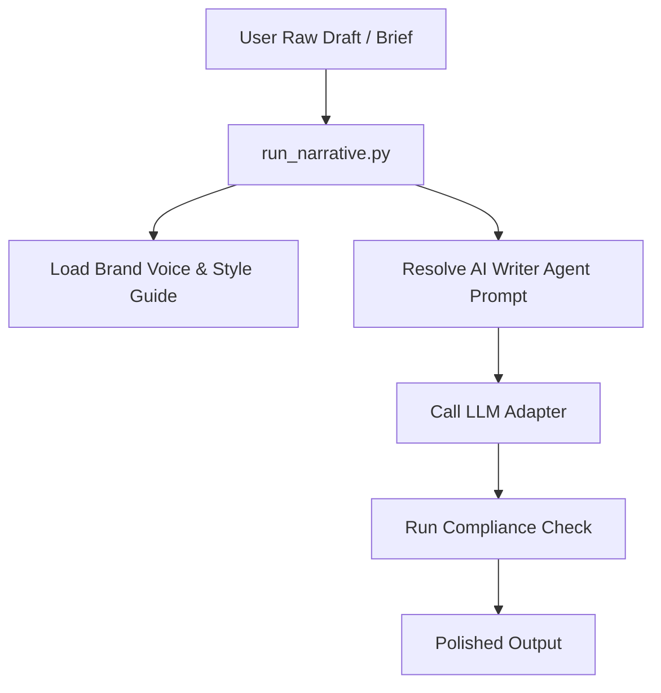

# Writing Engine - System Design

The WRITING-ENGINE operates as a standardized subsystem within the AI-BOSS-OS. It connects AI agents to templates, style guidelines, and compliance rules.

## Core Interaction Flow

## Agent Mappings

- **Copywriter Agent**: Executes with `07-AI-WRITER-AGENTS/COPYWRITER-AGENT.md` system prompt and targets landing pages or emails.
- **Editor Agent**: Processes draft through `07-AI-WRITER-AGENTS/EDITOR-AGENT.md` guidelines for styling and grammatical checks.
- **SEO Agent**: Infuses keyword target mappings from `11-STRATEGY-DOCS/KEYWORD-MAP.md`.
- **Compliance Agent**: Validates output against checklists in `12-APPROVAL-WORKFLOWS/COMPLIANCE-CHECKLIST.md`.
