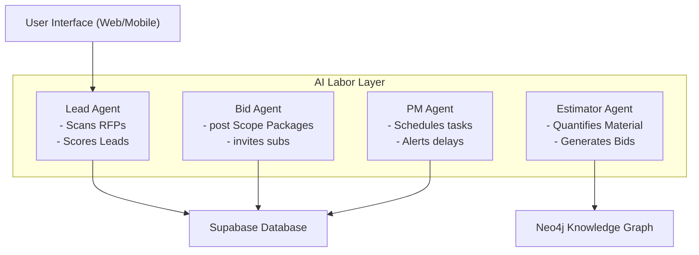

# General Contractor Website & OS Architecture Map

This document defines the architecture of the **General Contractor Company Website** (the front door) and its integration with the **Construction Operating System (ConstructionOS)** (the brain).

---

## 1. Directory & Routing Architecture

The website is divided into public-facing pages, private portals (Clients, Contractors, Vendors), the CRM backend, Content Management, and the cognitive AI layer:

```text
GC-COMPANY-WEBSITE (Next.js Application)
├── src/
│   ├── app/                                 # PUBLIC WEBSITE & ROUTING
│   │   ├── page.tsx                         # Home (Hero, Value Prop, CTAs)
│   │   ├── about/                           # Story, Leadership, Values
│   │   ├── services/                        # GC, CM, Design-Build, Estimating
│   │   ├── projects/                        # Case studies & Project database
│   │   │   └── [id]/page.tsx                # Dynamic Project pages (charlotte-medical-center)
│   │   ├── contact/                         # Estimate Requests & Form capture
│   │   │
│   │   ├── portal/                          # CLIENT PORTAL (Timelines, photos, RFIs)
│   │   ├── onboarding/
│   │   │   └── contractor/                  # SUBCONTRACTOR REGISTRATION FUNNEL
│   │   │
│   │   └── dashboard/                       # ROLE-BASED DASHBOARD LAYER
│   │       ├── client/                      # Customer Portal (milestones, budgets, change orders)
│   │       └── contractor/                  # Trade Partner Portal (bid-invites, schedule, payouts)
│   │
│   ├── components/                          # UI, Brand elements, and MRRDashboard
│   ├── lib/                                 # Database, Stripe, and Email Integrations
│   └── styles/                              # CSS Brand System (Tailwind tokens)
```

---

## 2. Brand & Design System Core Tokens

The styling system (`/src/styles/globals.css`) matches premium SaaS and design aesthetics:
* **Backgrounds:** Smooth deep dark modes (`bg-brand-dark` / `bg-black`) utilizing backdrop-filters and glassmorphism.
* **Accents:** High-vibrancy gold, coral, and amber (`#FF6B35` / `text-amber-500` / `text-emerald-400`) representing status highlights and clear callouts.
* **Gradients:** Dynamic transition dividers (`gradient-divider-coral-purple`) giving pages scroll-based visual depth.

---

## 3. Database Integrations (The Operations Brain)

The Next.js front-door UI interacts dynamically with the relational **Supabase** backend to run the contracting loop:

```
           [ FRONT-END UI ]
                  │
                  ▼
         [ SUPABASE DATABASE ]
                  │
      ┌───────────┼───────────┐
      ▼           ▼           ▼
  [PEOPLE]    [PROJECTS]   [MONEY]
  - users     - projects   - payments
  - profiles  - steps      - change_orders
```

* **Client Onboarding & Intake:** Submissions via `/contact` insert records into `contact_submissions` and create a pipeline ticket in `venture_leads`.
* **Subcontractor Recruitment:** Registrations via `/onboarding/contractor` write credentials directly to `contractor_profiles` with rating metrics and license checkmarks.
* **Change Order Checkout:** Client dashboards query the `change_orders` table. When approved, a Stripe checkout session is generated, updating the ledger via Stripe webhooks.

---

## 4. The Cognitive AI Labor Layer

AI agents manage workflows across the CRM, Bidding, Estimating, and Project Management layers:



* **Lead Agent:** Runs `agent-browser` and `Last30days` to track county permits and new commercial RFPs.
* **Estimator Agent:** Evaluates design specifications to generate material takeoffs.
* **Bid Agent:** Coordinates with the subcontractor database to dispatch bid invites.
* **PM Agent:** Evaluates daily log submissions and highlights timeline bottlenecks in the Vex Command Center.
