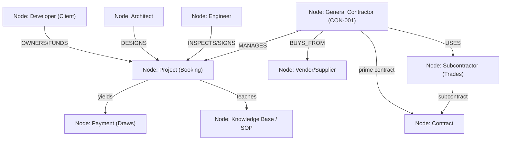

# CONSTRUCTION-OS: The General Contractor Platform Model

This playbook maps the **General Contractor (GC) Platform Model** within the **Worldwidebro Holdings AI Operating System**, defining the relationships, document stores, schemas, and AI agent workloads.

---

## 1. The Relationship & Entity Ontology

For a high-level general contracting firm, the business is a network of **relationships + documents + workflows**:

```
People ──► Companies ──► Projects ──► Contracts ──► Money ──► Knowledge
```

We represent this in the **Neo4j Knowledge Graph** via specific nodes and edges:



### Node Data & Schema Definitions

#### 1. Companies & Contacts (Twenty CRM & Neo4j)
* **`Developer`**: Company name, CEO, Development Director, Construction Manager.
* **`Architect`**: Architecture Firm, Principal Architect, BIM Manager, Specification Writer.
* **`Engineer`**: Engineering Firm, Specialty (Civil, Structural, MEP), Lead Engineer.
* **`Subcontractor`**: Company Info, License #, insurance verification (GL, WC), Trades, W-9, Performance Score.
* **`Vendor/Supplier`**: Material category, Delivery Area, pricing terms.

#### 2. Documents & Financials (Supabase)
* **`Contract`**: Mapped to Supabase `projects` status and `stripe_payment_intent_id`.
* **`Payment`**: Mapped to `payments` (status: `deposit`, `draw`, `remainder`).
* **`Change Order`**: Mapped to `change_orders` (amount_cents, status: `pending`/`approved`).

---

## 2. Directory & Knowledge Base Blueprint

To support project management and compliance auditing, the GC's file structure is mapped as a standardized system under `/AI-BOSS-OS/ventures/con-001-ace-construction/`:

```text
con-001-ace-construction/
├── 00_COMPANY_OS/             # Mission, Strategy, SOPs, Policies, Org Chart
├── 01_CORPORATE/              # Formation Docs, Licenses, Insurances, Tax, Banking
├── 02_PEOPLE/                 # Employees, Subcontractors, Vendors, Clients, Contacts DB
├── 03_BUSINESS_DEVELOPMENT/   # Leads, Opportunities, Marketing, Proposals, Sales Pipeline
├── 04_ESTIMATING/             # Templates, Cost DB, Takeoffs, Historical Bids
├── 05_PROJECTS/               # Active project directories (e.g., Hotel Build 2026)
│   └── TEMPLATE_PROJECT/      # Project-specific subfolders (01_Contract to 15_Closeout)
├── 06_OPERATIONS/             # Scheduling, Procurement, Quality Control, Safety
├── 07_FINANCE/                # Accounting, A/P, A/R, Payroll, Budgets
├── 08_LEGAL/                  # Contracts, Claims, Disputes, Compliance
├── 09_TECHNOLOGY/             # Software, Integrations, AI Agents, Automation
└── 10_KNOWLEDGE_BASE/         # Lessons Learned, Best Practices, Pricing Intelligence
```

---

## 3. AI Agent Matrix (The Cognitive Labor Layer)

Eight dedicated AI agents run the core bidding and contracting loop:

| Agent | Target Function | Mapped Skills (AAS Catalog) |
| :--- | :--- | :--- |
| **Lead Agent** | Monitors permits, scans county RFPs, scores leads. | `Last30days`, `agent-browser` |
| **Estimator Agent** | Reads drawings/blueprints, calculates quantity takeoffs. | `superpowers`, `taste-skill` |
| **Bid Agent** | Groups scope packages, invites subcontractors, reviews sub-bids. | `find-skills`, `ops-agent` |
| **Vendor Agent** | Manages supplier catalogs, compares lumber/steel prices. | `twenty-crm`, `quickbooks` |
| **PM Agent** | Sequences milestones, monitors daily logs, alerts scheduling delays. | `n8n-workflow-patterns` |
| **Finance Agent** | Manages Stripe draws, QuickBooks billing, change order payments. | `stripe-billing`, `mrr-forecasting` |
| **Compliance Agent** | Audits subcontractor licenses, check bond and GL/WC insurance. | `legal-contract-generator` |
| **Knowledge Agent** | Indexes post-mortem lessons into the company Second Brain. | `graphify`, `personal-vault` |
