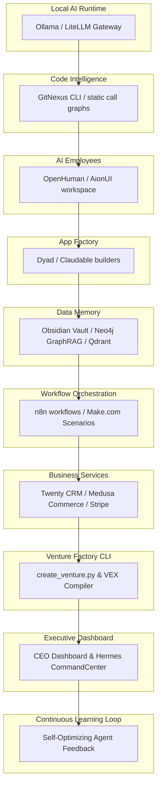
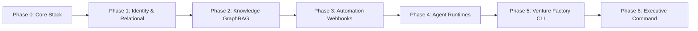

# Civilization OS — System Architecture Blueprint
## Master Enterprise Architecture & Implementation Catalog for WinnersCircleWCLLC

This document serves as the master enterprise architecture blueprint and session starter catalog for the **Civilization OS** ecosystem. The core realization of this architecture is that **IZA OS, Worldwidebro, WinnersCircleWCLLC, AI Boss, and the other engines are not separate companies fighting for attention, but rather different integrated layers of a civilization-scale operating system.**

---

## 1. Master Ecosystem Architecture

```text
                         CIVILIZATION OS
                              |
                              |
                    WinnersCircleWCLLC
                    (Ownership Layer)
                              |
        ------------------------------------------------
        |                      |                       |
   AI Boss Holdings        Worldwidebro            Family/Capital
   (Enterprise AI)          (Network Brand)         (Wealth Engine)
        |
        |
     IZA OS
     (Digital Operating System)
        |
        |
========================================================
                    ENGINE LAYER
========================================================

Knowledge Engine       | Venture Factory Engine | Goal Engine
AI Agent Engine        | Automation Engine      | Finance Engine
Data Engine            | Decision Engine        | Security Engine
Research Engine        | Marketing Engine       | Sales Engine
Learning Engine        | Infrastructure Engine

========================================================

                 OPERATING COMPANIES (OPCOs)

Technology OPCO | Finance OPCO | Agriculture OPCO | Healthcare OPCO
Media OPCO      | Real Estate OPCO | Marketplace OPCO | Manufacturing OPCO

========================================================

                     712 VENTURES

Startup 001, Startup 002, Startup 003 ... Startup 712
```

---

## 2. Civilization OS Layers & Roles

### 1. WinnersCircleWCLLC (The Ownership Layer)
* **Role**: Owner / Berkshire Hathaway-style allocation layer. Controls ownership, equity, acquisitions, capital allocation, board governance, and long-term strategy.
* **Directory**: `WinnersCircleWCLLC/`
* **Key Questions Answered**: What do we own? Where should capital go? Which companies do we acquire? Which ventures get funded?

### 2. AI Boss Holdings (The Executive Intelligence Layer)
* **Role**: Executive AI / "CEO Brain". Controls executive AI workspaces, company brain, agent workforce decisions, goal planning, and commands.
* **Directory**: `AI-BOSS/`
* **Key Questions Answered**: What should we build? What is working/failing? Where should resources move?

### 3. IZA OS (The Digital Operating System Layer)
* **Role**: Digital OS and Infrastructure runtime. Powers applications, databases, identity systems, permissions, agent runtime execution, and integration hub.
* **Directory**: `IZA-OS/`
* **Key Questions Answered**: How do the machines run? Are systems online? Are security gates passed?

### 4. Worldwidebro (The Network Brand & Public Layer)
* **Role**: Public-facing brand, network, audience distribution, media, creator networks, newsletters, and marketplace portals.
* **Directory**: `Worldwidebro/`
* **Key Questions Answered**: How do we capture attention? How do we build trust? Where are our customers?

### 5. Venture Factory & Engine Layer (The Production Layer)
* **Role**: Business generation engines that turn ideas into revenue-producing machines. Includes Goal Engine, Financial Engine, Automation Engine, etc.
* **Directory**: `VENTURE-FACTORY/`
* **Key Questions Answered**: How do we spawn new startups? How do we scale ventures to exit?

---

## 3. Layered System Architecture (10-Layer Map)

The operating system runs inside IZA OS, structured into ten dependency-driven layers, from physical LLM endpoints to continuous cross-venture learning.



---

## 2. Infrastructure & Service Map (Mac Studio Node: 100.87.214.70)

The native and Docker-backed infrastructure running on the Mac Studio serves as the unified shared backend:

| Layer Name | Technology | Endpoint / Port | Active Configuration / Volume |
|---|---|---|---|
| **Core Models** | LiteLLM Gateway | Port `4000` | Configured with Ollama fallback routers |
| **Knowledge Graph** | Neo4j Community | Port `7687` (Bolt) | APOC plugins enabled, authenticates with `neo4j/ventures2026` |
| **Vector DB** | Qdrant | Port `6333` | Hosts collections for RAG repositories |
| **Relational DB** | PostgreSQL | Port `5432` | Hosts `iza_os_ventures`, `iza_os_core`, and `twenty` |
| **Vector Search** | Chroma | In-memory / Python | Indexed by DuckDB analytics pipeline |
| **Automation** | n8n / Make.com | Port `5678` | Executes workflow logic |
| **CRM** | Twenty CRM | Port `3004` | Main customer/lead database |
| **Observability** | Langfuse | Port `3003` | Captures trace graphs & token costs |
| **Storage** | MinIO | Port `9000` / `9001` | S3-compatible asset and PDF report storage |

---

## 3. The Dependency Planner (Phase 0 to Production DAG)

To build and scale the system, implementation must follow a strict build-order sequence:



### Phase 0: Local AI & Code Intelligence Foundation
*   **Prerequisites:** Docker Desktop on Mac Studio, Tailscale VPN.
*   **Deliverables:** LiteLLM proxying Ollama models, GitNexus CLI indexing repository call graphs.
*   **Exit Criteria:** Model routing completes within `<2s` latency, GitNexus exports call graphs.

### Phase 1: Database & Identity Federation
*   **Prerequisites:** PostgreSQL native runtime, Neo4j container.
*   **Deliverables:** Supabase schemas initialized, APOC plugin enabled inside Neo4j.
*   **Exit Criteria:** Valid RLS policies applied to `agent_executions` and `policy_decisions` tables.

### Phase 2: Knowledge Graph & Vector Store (GraphRAG)
*   **Prerequisites:** Qdrant collections generated, Neo4j organization tree loaded.
*   **Deliverables:** Indexing pipeline parsing markdown files to vectors and nodes.
*   **Exit Criteria:** Hybrid search returning combined Cypher nodes and vector chunks.

### Phase 3: Automation & Integrations
*   **Prerequisites:** n8n active, Make.com webhook endpoints listening.
*   **Deliverables:** Webhook routing scenario templates.
*   **Exit Criteria:** Webhook payloads successfully parsed and ingested into Twenty CRM.

### Phase 4: Agent Runtimes
*   **Prerequisites:** Policy engine tables loaded.
*   **Deliverables:** Hermes Chief Intelligence agent initialized.
*   **Exit Criteria:** Hermes routes decisions based on capital limit constraints.

### Phase 5: Venture Factory
*   **Prerequisites:** `create_venture.py` CLI script, VEX site builder.
*   **Deliverables:** Automatic provisioning script generating directories, writing DB records, and rebuilding VEX templates.
*   **Exit Criteria:** One shell command initializes a venture from a single template directory.

### Phase 6: Executive CommandCenter
*   **Prerequisites:** Grafana dashboards, Prometheus collectors.
*   **Deliverables:** Real-time metrics panels.
*   **Exit Criteria:** Dashboard gauges reflecting live YTD revenue.

---

## 4. Venture Factory Spawner & Inheritance Model

The **Venture Factory** (`create_venture.py`) spawns new businesses or configures existing ones by inheriting from the platform core.

```
                    ┌────────────────────────┐
                    │  Platform Core (Base)   │
                    │  - Supabase/Postgres   │
                    │  - LiteLLM Router      │
                    │  - n8n Core Webhooks   │
                    └───────────┬────────────┘
                                │ (Inherited)
                                ▼
                    ┌────────────────────────┐
                    │  Sector Registry       │
                    │  - Default Agents      │
                    │  - Required Repos      │
                    └───────────┬────────────┘
                                │ (Extended)
                                ▼
          ┌─────────────────────┴─────────────────────┐
          ▼                                           ▼
┌──────────────────┐                        ┌──────────────────┐
│  CON-022 Venture  │                        │  ECOM-005 Venture │
│  - Estimator PM  │                        │  - Medusa Shop   │
│  - VEX Website   │                        │  - Stripe Pay    │
└──────────────────┘                        └──────────────────┘
```

*   **Platform Core:** Standardized database models, shared Vector memories, unified OAuth flow.
*   **Sector Templates:** Defined in `sector_registry.yaml` mapping defaults (e.g., Construction requires `construction`, `analytics`, `forms` capabilities).
*   **Upgrade Strategy:** Editing a capability folder under `06-TECHNOLOGY/` dynamically updates references in Neo4j, making upgrades seamless.
*   **Rollback Strategy:** Database migration files are versioned; VEX site compiles to static JS bundles allowing immediate reverts.

---

## 5. Enterprise Knowledge Platform (GraphRAG Ingestion Pipeline)

```
[Markdown / Git Repo] ──► [GitNexus Indexer] ──┬──► [Vector Embeddings] ──► [Qdrant DB]
                                               │
                                               └──► [Entities / Relations] ──► [Neo4j Graph]
```

*   **Ingestion Pipeline:** Reads repository code using `gitnexus-cli` and Obsidian markdown folders.
*   **Vector Pipeline:** Embeds chunks using `nomic-embed-text` into Qdrant.
*   **Graph Pipeline:** Extracts relations (e.g., `(Venture)-[:USES]->(Capability)`) into Neo4j.
*   **Retrieval:** The `neo4j-graphrag-skill` performs Hybrid Search: retrieving semantic matching chunks alongside structural Cypher details.

---

## 6. AI Agent Platform & Governance Runtime

*   **Registry Map:** Every agent is listed under `agent_registry.yaml` matching their required role, capabilities, and department.
*   **Policy Engine:**
    *   `< $5K:` Auto-approved by the agent runtime.
    *   `$5K - $25K:` Escalates to Department Director approval.
    *   `> $25K:` Escales to human-in-the-loop review.
*   **Audit Logging:** Every decision is signed and appended to the `agent_call_log` database table with token counts and execution costs tracked in Langfuse.

---

## 7. Master Session Starter Prompts

### Master System Architecture Prompt (Chief Architect)
```text
You are the Chief Systems Architect for AI Boss Holdings.
Your task is to review the active state of our 10-layer platform (Ollama/LiteLLM, GitNexus, n8n, Twenty CRM, Neo4j, Qdrant, and Postgres databases).
For any proposed component design, compile the:
1. Why it exists
2. Dependencies
3. Inputs/Outputs
4. Database Schemas
5. Security & Observability metrics using Langfuse
Always favor reusable platform engineering templates over per-venture custom scripts.
```

### Dependency Planner Prompt
```text
Act as the Build Planner. Given the 10-layer platform map, produce the DAG for this component's build-order.
Ensure prerequisites are initialized (e.g. Postgres tables, Neo4j labels) before writing agent logic or dashboards.
```

### Venture Factory Spawner Prompt
```text
Act as the Venture Factory Spawner. Use create_venture.py CLI guidelines to provision a venture, merging it into Neo4j and writing to the Postgres ventures registry. Inherit core platform services.
```

### Knowledge Platform Prompt
```text
Act as the Knowledge Platform Designer. Query Neo4j and Qdrant using the neo4j-graphrag-skill and gitnexus-cli metadata to extract the exact dependency path.
```

### Agent Governance Prompt
```text
Act as the Agent Runtime Governor. Enforce policy limits (<$5k auto-approve, >$5k escalate) and verify audit records are logged to postgres and Langfuse.
```

### The "Meta Prompt"
```text
Act as the Fortune 100 Enterprise Architecture Board for Worldwidebro Holdings.
Maintain single-source truth across databases (PostgreSQL), knowledge graphs (Neo4j), vector search (Qdrant), and monitoring panels (Grafana).
For every design recommendation, align with our existing ecosystem tools (Twenty CRM, n8n, LiteLLM) to maximize reuse and maintainability.
```
