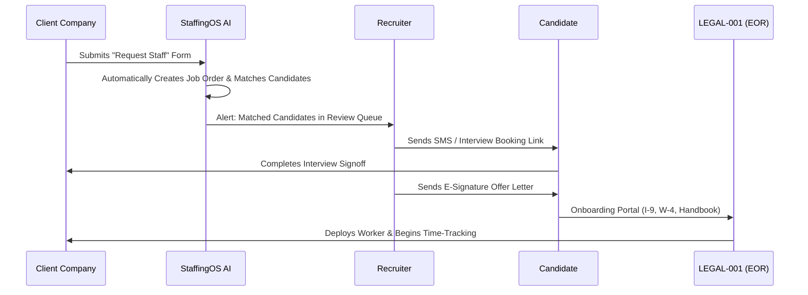

# 👥 StaffingOS Enterprise Master Specification

This document maps the **13-Level Enterprise Software Platform Framework** for **StaffingOS (STA-001)**, serving as the master engineering and design standard for compiling the platform's multi-tenant portals, automated workflow engines, and AI agents.

---

## 🔗 System Integration Map
This spec connects to:
* **Parent Constitution:** [[GEMINI.md]]
* **Sector Interconnections:** [[DELEGATION-NETWORK.md]]
* **Sub-Venture Repository Codebase:** [STAFFING-OS-ARCHITECTURE.md](../../ops-staff-001-staffing/STAFFING-OS-ARCHITECTURE.md)

---

## 🏗 The 13 Levels of Enterprise Platform Design

### Level 1: Product Vision
> **Mission:** Build an AI-native enterprise StaffingOS platform that enables staffing agencies to acquire clients, recruit candidates, manage employees, automate scheduling, process payroll, track time, enforce compliance, and scale into multi-branch organizations. The platform consolidates ATS, CRM, HRIS, Payroll, Scheduling, Compliance, Billing, and Analytics into a single multi-tenant workspace.

### Level 2: Product Personality
StaffingOS must feel like a premium, state-of-the-art developer tool built for operational speed:
* **Clean & Minimal:** High data density, low visual clutter (inspired by *Ashby*, *Linear*, and *Ramp*).
* **AI-First:** Copilots embedded in every viewport to summarize activity, suggest candidates, or flags compliance anomalies.
* **Highly Trustworthy:** Solid enterprise aesthetics, clear permission tags, and audit trails.

### Level 3: Design Language
* **Grid:** Rigid 8-point layout grid.
* **Contrast:** Curved border cards, dark/light modes, subtle backdrop-filter blurs.
* **Typography:** Inter or Outfit, clean typographic hierarchies.
* **Accessibility:** WCAG AAA-compliant color contrasts, keyboard navigation shortcuts, screen-reader semantic HTML labels.

### Level 4: User Experience (UX) Guidelines
* **Minimal Clicks:** Zero redundant screen steps. Key actions (like *Deploy Candidate* or *Review Timesheet*) must be accessible in a single primary click.
* **Global Search:** Command Palette (`Cmd + K`) accessible anywhere to jump to any page, account, worker, or job record.
* **Contextual Actions:** Interactive side drawers for editing files without leaving context.

### Level 5: Information Architecture
We reject the notion of a simple "staffing website." StaffingOS consists of 5 distinct portals:
1. **Public Marketing Site:** Attracts candidates (SEO pages) and generates B2B client request forms.
2. **Candidate Portal:** Workers manage availability, verify time-clocks, inspect pay stubs, and complete training.
3. **Employer Portal:** Client companies request staff, approve digital timesheets, and pay invoices.
4. **Recruiter Portal (ATS):** Talent sourcing pipelines, SMS campaigns, phone pre-screens, and offer managers.
5. **Admin Console:** Branch allocations, custom pricing markups, API tokens, and systems health audits.

### Level 6: Screen Specifications
Every dashboard and detail screen must serve production-ready layouts:
* **Standard Viewport:** Left navigation panel, main dashboard workspace, contextual right drawer.
* **Dynamic Elements:** Interactive data grids (exportable as CSV/JSON), custom filters (save queries), and skeleton loading states.

### Level 7: Component Library Matrix
The design system enforces a unified component library. Standardized components are declared in:
`[components/ui/](../../ops-staff-001-staffing/assets/index-Cj9fFcUP.js)`
* *Atomic:* Buttons, inputs, dropdowns, badges, tags, avatars.
* *Structural:* Sidebars, timeline logs, step indicators, accordions.
* *Interactive:* Kanban deal cards, signature pad inputs, calendar dispatch views.

### Level 8: AI Copilot System
Each core functional module operates with a specific AI assistant:
* **Recruiter AI:** Auto-parses resumes, matches vectors to active `job_orders`, and drafts interview summaries.
* **Sales AI:** Enriches cold prospect accounts and qualifies inbound employer request payloads.
* **Compliance AI:** Scans licenses and certifications via OCR to verify expiration details.
* **Payroll AI:** Detects abnormal hours logs or double-bookings.

### Level 9: Dashboard Philosophy
Every dashboard viewport must answer four primary operational questions:
1. **What happened?** (Placement rates, margin totals, active headcount graphs).
2. **What requires attention?** (Timesheets awaiting approval, expiring worker certifications).
3. **What should I do next?** (Next interview scheduled, client bids to approve).
4. **What opportunities exist?** (Qualified candidates sitting unplaced).

### Level 10: Unified Workflow Sequences

### Level 11: Enterprise Branding
* **Brand Voice:** Professional, confident, and metrics-driven.
* **Color System:** Sleek slate dark background (`#0a0a0a`), warm amber accent (`#f59e0b`), emerald success (`#10b981`), and muted borders.

### Level 12: Design Tokens
Token configurations are enforced in root styles:
* **Spacing:** 4px, 8px, 16px, 24px, 32px padding parameters.
* **Elevation:** Custom shadows for nested modals and drop menus.

### Level 13: Scalable Multi-Tenant Foundations
Architected from day one to handle high load volumes:
* **Database Isolation:** Row-Level Security (RLS) policies based on `organization_id`.
* **White-Label Support:** Custom assets and branding paths mapped dynamically per tenant request.
* **Multi-Currency:** Financial sums saved in integer cents with currency keys (e.g. `USD`, `CAD`).
