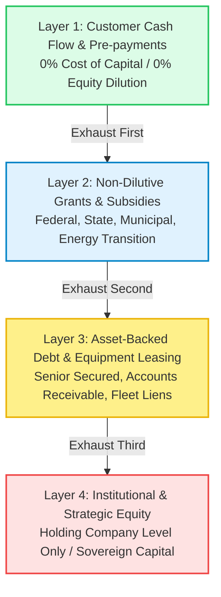

[[STARTHERE]] | [[REALITY]] | [[00-CONSTITUTION/master-private-firm-ontology|MASTER-ONTOLOGY]] | [[24-FINANCE]] | [[INDEX]]

# The 4-Layer Capital Cascade

The **4-Layer Capital Cascade** is WorldwideBro’s non-dilutive capital structuring discipline. It governs how ventures fund operations, acquire assets, scale software, and return liquidity to the Master Trust.

---

## The Four Layers Explained

### Layer 1: Customer Cash Flow & Working Capital
- **Mandate:** Ventures must fund daily burn through customer receipts, milestone deposits, retainer pre-payments, and platform transaction fees.
- **Rule:** Never take debt or sell equity to fund payroll or basic software operating expenses.

### Layer 2: Non-Dilutive Grants & Public Funding
- **Mandate:** Federal grants (SBIR, STTR, DOT, DOE, ARPA), state innovation vouchers, and municipal workforce training subsidies.
- **Registries:** Tracked in `_REGISTRIES/CANONICAL/GRANT_OPPORTUNITY_REGISTRY.yaml`.

### Layer 3: Asset-Backed Debt & Equipment Facilities
- **Mandate:** Heavy equipment, fleet vehicles, and datacenter hardware are financed via collateralized senior debt or equipment lease lines.
- **Protection:** Debt is strictly siloed in Asset Holding LLCs with no recourse to the Master Trust or Operating Company IP.

### Layer 4: Holding Company Equity & Sovereign Capital
- **Mandate:** Permanent capital and minority strategic equity only at the Holdings or parent vehicle level.
- **Rule:** Operating subsidiaries remain 100% owned or controlled by WorldwideBro.
