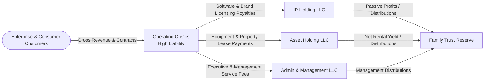

[[STARTHERE]] | [[REALITY]] | [[00_RESPECT/RESPECT|RESPECT]] | [[00-CONSTITUTION/4-LAYER-CAPITAL-CASCADE|CAPITAL-CASCADE]] | [[INDEX]]

# 🏛️ Master Private Firm Ontology & Family Enterprise Blueprint

This blueprint outlines the sovereign, institutional-grade asset segregation, family office structure, and operational feedback loop of the WorldwideBro enterprise. The primary objective is **risk isolation**, **tax efficiency**, **legacy preservation**, and **continuous wealth compounding**.

By strictly separating high-risk customer-facing operations (the C-Corp / Operating Units) from asset reservoirs (Real Estate, Equipment, IP, Reserve Capital), a catastrophic liability in any operating unit cannot impair accumulated assets.

---

## 1. Entity Ownership & Structural Map

The Master Trust acts as the ultimate sovereign owner and wealth preservation vehicle.

```mermaid
graph TD
    %% Sovereign Level
    Fam([Family / Principal / Grantor])
    Trust{Family Trust <br/> Master Sovereign Holding Entity}
    Found((Family Foundation <br/> 501c3 / Charitable Vehicle))
    
    %% Asset Preservation Layer
    Invest[Investment Portfolio<br/>Equities, Liquid Reserves, Alternatives]
    IP_LLC[IP Holding LLC<br/>Software, Codebases, Trademarks, Patents]
    Asset_LLC[Asset Holding LLC<br/>Real Estate, Fleet, Hardware, Datacenter Nodes]
    Admin_LLC[Collection & Management LLC<br/>Shared Services, Back-Office, Billing]
    
    %% Operating Layer
    Op_Corp[Operating OpCos<br/>C-Corps / Venture Units (High Liability)]

    %% Ownership Flows
    Fam -->|Settles / Funds| Trust
    Fam -->|Governs / Donates| Found
    Trust -.->|Pledges / Distributions| Found
    
    Trust ==>|100% Owner| Invest
    Trust ==>|100% Member| IP_LLC
    Trust ==>|100% Member| Asset_LLC
    Trust ==>|100% Member| Admin_LLC
    Trust ==>|Majority Shareholder| Op_Corp

    classDef highRisk fill:#fee2e2,stroke:#ef4444,stroke-width:2px;
    classDef lowRisk fill:#dcfce7,stroke:#22c55e,stroke-width:2px;
    classDef core fill:#fef08a,stroke:#eab308,stroke-width:3px;
    
    class Op_Corp highRisk;
    class IP_LLC,Asset_LLC,Admin_LLC,Invest,Found lowRisk;
    class Trust core;
```

---

## 2. Operational Interactions & Money Flow (Profit Stripping)

Customer-facing entities assume operating liabilities. Legitimate, arm's-length contractual relationships systematically route revenues into safe holding entities before exposing capital to double taxation or external operational judgment:



---

## 3. The 34-Layer Private Firm Architecture

The entire company operating system operates as a unified 34-layer continuum:

1. **Layer 01: Sovereign Principal Intent** (Values, long-term directives)
2. **Layer 02: Family Trust Charter** (Perpetual ownership, succession)
3. **Layer 03: Constitutional Governance** (`00-CONSTITUTION`)
4. **Layer 04: Respect & Behavioral Boundaries** (`00_RESPECT`)
5. **Layer 05: Master Control Plane** (`50-MASTER-CONTROL`)
6. **Layer 06: Regulatory & Legal Safeguards** (`31-LEGAL`)
7. **Layer 07: Entity Resolution & Cap Table** (`04-OWNERSHIP`, `06-ENTITY-RESOLUTION`)
8. **Layer 08: Universal Memory OS** (`10-MEMORY`, `_MEMORY`)
9. **Layer 09: System Ontology & Schema** (`07-ONTOLOGY`)
10. **Layer 10: Relational Knowledge Graph** (`08-KNOWLEDGE-GRAPH`, Neo4j)
11. **Layer 11: Vector & Semantic Space** (`Qdrant`, Local Embeddings)
12. **Layer 12: Canonical Registries** (`_REGISTRIES/CANONICAL`)
13. **Layer 13: 35-Sector Economic Taxonomy** (`SECTORS/`, `SEC-001` - `SEC-035`)
14. **Layer 14: Venture Data Rooms** (`BUSINESS-CAPITAL-DATA-ROOM/`)
15. **Layer 15: Code Repositories** (`repos/`)
16. **Layer 16: Software Capabilities** (`14-CAPABILITIES`, `CAP-001` - `CAP-300`)
17. **Layer 17: Local & Cloud Infrastructure** (`_INFRASTRUCTURE`, Studio M4, Mesh)
18. **Layer 18: Model Routing & Inference** (`OmniRoute`, LiteLLM, Ollama)
19. **Layer 19: Autonomous Agent Swarms** (`16-AGENTS`, `AGT-001` - `AGT-016`)
20. **Layer 20: Skills & Tooling Toolboxes** (`15-SKILLS`, `_TOOLS`)
21. **Layer 21: Orchestration Pipelines** (`19-ORCHESTRATION`)
22. **Layer 22: Context & State Store** (`12-CONTEXT`, PGLite)
23. **Layer 23: Human & Machine Teams** (`52-PEOPLE`, `53-TEAMS`)
24. **Layer 24: Operational Procedures (SOPs)** (`29-OPERATIONS`)
25. **Layer 25: Commercial Go-To-Market** (`25-SALES`, `26-MARKETING`)
26. **Layer 26: Customer Engagement & Retention** (`27-CUSTOMERS`)
27. **Layer 27: Cash Flow Execution** (`08-REVENUE`)
28. **Layer 28: 4-Layer Capital Cascade** (`00-CONSTITUTION/4-LAYER-CAPITAL-CASCADE`)
29. **Layer 29: Financial Accounting & Ledger** (`24-FINANCE`)
30. **Layer 30: Risk & Compliance Auditing** (`32-SECURITY`, `33-COMPLIANCE`, `34-RISK`)
31. **Layer 31: Observability & Telemetry** (`41-OBSERVABILITY`, Prometheus, Grafana)
32. **Layer 32: Evaluation & Truth Gates** (`42-EVALUATION`, Reality Verification)
33. **Layer 33: Evolution & Self-Improvement** (`45-EVOLUTION`)
34. **Layer 34: Sovereign Capital Compounding** (Returns flow back to Layer 02)

---

## 4. Cross-System Consistency

All software code, database records, graph nodes, and business documents are projections of this master ontology. No database or repo exists outside this framework.
