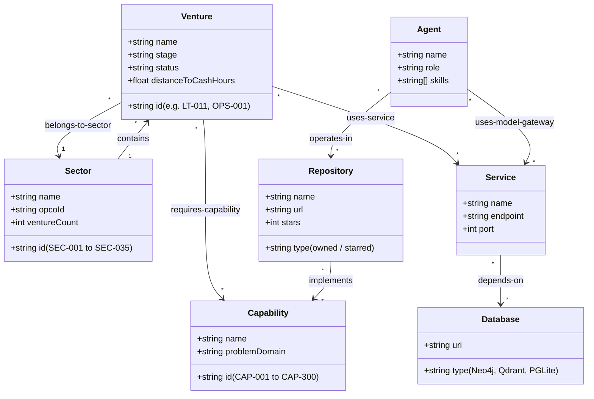

[[STARTHERE]] | [[INDEX]] | [[REALITY]] | [[ANTIGRAVITY]]

# KNOWLEDGE-GRAPH-MAPPING.md — Corporate Knowledge Graph Entity & Relationship Schema

**Authority:** Knowledge Graph & Ontology Control Plane (CP-003)  
**Engines:** Neo4j Community (`:7687`), Qdrant Vector Engine (`:6333`), Graphify AST Graph (`graphify-out/graph.json`), gbrain PGLite  
**Standard:** Typed Bidirectional Wikilinks (`relationship::[[Target]]`) & RDF/XML Ontology  

---

## 1. Graph Entity Types

---

## 2. Canonical Relationship Vocabulary (15 Families)

| Relationship Predicate | Source Entity | Target Entity | Example Typed Wikilink |
|---|---|---|---|
| `belongs-to-sector` | Venture | Sector | `belongs-to-sector::[[SECTORS/SEC-017-logistics-transportation]]` |
| `contains-venture` | Sector | Venture | `contains-venture::[[23-VENTURES/LT-011]]` |
| `requires-capability` | Venture | Capability | `requires-capability::[[14-CAPABILITIES/solutions/CAP-045]]` |
| `implements` | Repository | Capability | `implements::[[14-CAPABILITIES/solutions/CAP-286]]` |
| `depends-on` | Service | Database | `depends-on::[[_INFRASTRUCTURE/neo4j]]` |
| `exposes-api` | Service | API | `exposes-api::[[_API/omniroute-chat-completions]]` |
| `uses-tool` | Agent | Tool / MCP | `uses-tool::[[_TOOLS/make-pdf]]` |
| `delegates-to` | Agent | Agent | `delegates-to::[[16-AGENTS/research-agent]]` |
| `governed-by-rule` | System | Rule | `governed-by-rule::[[.agents/rules/REVENUE_GATE.md]]` |
| `generates-revenue` | Venture | Revenue Stream | `generates-revenue::[[38-OPPORTUNITIES/REVENUE_MODELS/LT-011_TMS_SaaS]]` |

---

## 3. Knowledge Layer Implementation Matrix

1. **Relational / Topology Layer (Neo4j):**
   - 35 Sector nodes, 789 Venture nodes, 300 Capability nodes, 1,815 Repository nodes.
   - Wired via `_MCP/fastmcp_server.py` (`neo4j_wire_ontology()`).
2. **Vector / Semantic Layer (Qdrant):**
   - Ingests Markdown prospectuses, SOPs, and capability solutions with dense vector embeddings for semantic retrieval.
3. **AST Codebase Layer (Graphify):**
   - 90.9 MB graph (`graphify-out/graph.json`) indexing functions, classes, markdown headings, and rules across 48 community clusters.
4. **Local Document Graph (Obsidian / gbrain):**
   - In-document markdown wikilinks parsed dynamically by `gbrain` and rendered interactively in VEX (`/knowledge-graph`).
