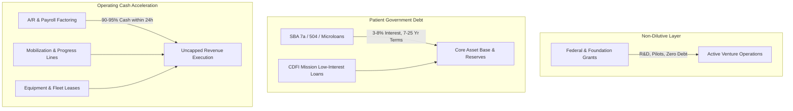

[[STARTHERE]] | [[INDEX]] | [[CAPITAL-READINESS-ENGINE]] | [[BUSINESS-CAPITAL-DATA-ROOM/5-VENTURE-INTEGRATED-SUMMARY|5-Venture Summary]] | [[_REGISTRIES/CANONICAL/CAPITAL_FACILITIES_REGISTRY.yaml|Facilities Registry]] | [[_REGISTRIES/CANONICAL/DISPATCH_OS_CANONICAL_CONTRACT|DispatchOS Contract]]

# 🏛️ Sovereign Capital Stack: Loans, Credit Facilities & Working Capital

> *"Capital is the fuel of operational velocity. Grants provide the equity-free foundation for R&D; government-backed patient debt builds the physical balance sheet; asset-backed working capital unlocks infinite scaling without cash-flow chokepoints."*  
> — **Executive Finance & System Architecture (CP-006 / CP-008)**

---

## 1. Master Capital Stack Architecture

This directory houses the complete underwriting dossiers, financial pro formas, SBA application packages, and working capital credit facility structures across our five focus operating ventures.

---

## 2. Venture Capital Facilities Index

| Venture ID | Brand & Legal Entity | Target Loan / Facility Type | Facility Size | Target Lender / Program | Underwriting Pack Link |
| :--- | :--- | :--- | :--- | :--- | :--- |
| **CON-001** | **ACE Construction** ACE Construction & Contracting LLC | **SBA 7(a) + SBA Surety Bond + Mobilization Draw** | **\$350,000 Loan** (\$9M Bonding Cap) | Live Oak Bank / SBA Preferred Lender (PLP) & SBA SBG | [[38-OPPORTUNITIES/CAPITAL_STACK/CON-001_SBA_Surety_Bond_Draw_Line|CON-001 Capital Pack]] |
| **LT-011** | **CarrierDispatch** WorldwideBro Fleet OS LLC | **Embedded Freight Factoring + SBA Express** | **\$500,000 SBA** (\$250K A/R Revolver) | Apex Capital / Triumph Financial & Huntington Bank | [[38-OPPORTUNITIES/CAPITAL_STACK/LT-011_Freight_Factoring_SBA_Express|LT-011 Capital Pack]] |
| **LT-005** | **HealthRoute** HealthRoute Logistics LLC | **Healthcare CDFI Loan + Reefer Van Fleet Lease** | **\$250,000 CDFI** (\$120K Vehicle Lease) | Primary Care Development Corp (PCDC) & Ally Commercial | [[38-OPPORTUNITIES/CAPITAL_STACK/LT-005_Healthcare_CDFI_Vehicle_Lease|LT-005 Capital Pack]] |
| **OPS-001** | **CareerOps** WorldwideBro Staffing Ops LLC | **Staffing Payroll Factoring + SBA Community Adv.** | **\$500,000 Payroll Line** (\$350K SBA Loan) | Advance Partners / eCapital & Self-Help Credit Union | [[38-OPPORTUNITIES/CAPITAL_STACK/OPS-001_Staffing_Payroll_Funding_Facility|OPS-001 Capital Pack]] |
| **RE-001** | **WorldwideBro Holdings** WorldwideBro Holdings LLC | **CDFI Acquisition Bridge + 30-Yr DSCR Rental Loan** | **\$750,000 Acquisition** (\$1.5M Portfolio DSCR) | LISC / Enterprise Community Loan Fund & Kiavi | [[38-OPPORTUNITIES/CAPITAL_STACK/RE-001_CDFI_Acquisition_Debt_DSCR_Packet|RE-001 Capital Pack]] |
| **TOTALS** | **5 Operating Entities** | **Diversified Capital Facilities** | **\$2.35M Credit** (\$9M Bonding Capacity) | **SBA PLP, CDFI & Commercial Factoring** | — |

---

## 3. Statutory & Underwriting Application Requirements

All credit and loan readiness packs include:
1. **Executive Underwriting Summary:** Business model, management experience, and credit justification.
2. **Sources & Uses of Funds Table:** Exact itemized allocation of capital proceeds.
3. **3-Year Pro Forma Financial Projection:** Income Statement, Cash Flow, and Balance Sheet modeling.
4. **Debt Service Coverage Ratio (DSCR):** Verifying minimum required cash flow cushion ($\text{DSCR} \ge 1.25\times$).
5. **Required Forms & Checklist:** SBA Form 1919, Form 413, business tax returns, and operating agreements.

---

## 4. Connected Ecosystem Registries & Wiki Links

- **Canonical Operating Contract:** [[_REGISTRIES/CANONICAL/DISPATCH_OS_CANONICAL_CONTRACT|DISPATCH_OS_CANONICAL_CONTRACT.md]]
- **Master Domain Gateway:** [[58-LOGISTICS/58-LOGISTICS|58-LOGISTICS Master Domain Gateway]]
- **Capital Readiness Engine:** [[CAPITAL-READINESS-ENGINE|CAPITAL-READINESS-ENGINE.md]]
- **Multi-Venture Corporate Summary:** [[BUSINESS-CAPITAL-DATA-ROOM/5-VENTURE-INTEGRATED-SUMMARY|5-Venture Integrated Legal + Financial Summary]]
- **Canonical Facilities Registry:** [[_REGISTRIES/CANONICAL/CAPITAL_FACILITIES_REGISTRY.yaml]]
- **Canonical Grants Registry:** [[_REGISTRIES/CANONICAL/GRANT_OPPORTUNITY_REGISTRY.yaml]]
- **Data Room Blueprint:** [[BUSINESS-CAPITAL-DATA-ROOM/00_ENTERPRISE_BLUEPRINT|Enterprise Blueprint]]
- **Financial Ecosystem Mapping:** [[BUSINESS-CAPITAL-DATA-ROOM/FINANCIAL-ECOSYSTEM-MAPPING|Financial Ecosystem Mapping]]

