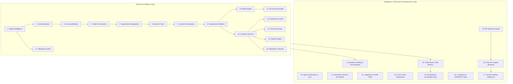

# Universal Company Income Loop Architecture: From 4,343 Workflows to an Autonomous Revenue Engine

> **Scope:** Enterprise Operating Blueprint for Autonomous Revenue Generation  
> **Master Directive:** State belongs to Company Brain; Action belongs to n8n; Decision belongs to Agents; Exception belongs to Humans.  
> **Target:** 16-Stage Conveyor Belt, 27 Closed-Loop Feedback Circuits, and the HealthRoute (`LT-005`) Concrete Implementation.

---

## 1. Architectural Thesis: Separation of State, Action, Decision & Exception

A catastrophic failure pattern in automation-heavy companies is treating workflow engines (like n8n, Zapier, or Make) as the **Source of Truth**. When business logic, customer state, and transaction history are trapped inside ephemeral workflow executions, the company becomes an untestable, brittle web of disconnected JSON files.

In the **WorldwideBro / Company Brain Mathematical OS**, we enforce strict 4-tier separation:

```
┌────────────────────────────────────────────────────────────────────────┐
│                              COMPANY OS                                │
│   ┌───────────────────────────────────┬────────────────────────────┐   │
│   │           EVENT BUS               │          DATABASE          │   │
│   │ (Redis Streams / Postgres Notify) │ (Supabase / Neo4j / Qdrant)│   │
│   └─────────────────┬─────────────────┴─────────────┬──────────────┘   │
└─────────────────────┼───────────────────────────────┼──────────────────┘
                      │                               │
                      ▼                               ▼
        ┌───────────────────────────┐   ┌───────────────────────────┐
        │     AUTONOMOUS AGENTS     │   │      HUMAN EXCEPTION      │
        │    (OmniRoute / Claude)   │   │     ESCALATION LAYER      │
        │    * Decisions & Strategy │   │     * Unresolved Errors   │
        │    * Intent & Routing     │   │     * Strategic Overrides │
        └─────────────┬─────────────┘   └─────────────▲─────────────┘
                      │                               │ Dead-Letter Queue
                      ▼                               │ & Circuit Breaker
        ┌─────────────────────────────────────────────┴─────────────┐
        │                 n8n WORKFLOW EXECUTION LAYER              │
        │   ┌───────────────────┬───────────────────┬───────────┐   │
        │   │    SALES LOOPS    │  OPERATION LOOPS  │  FINANCE  │   │
        │   │   (Workflows)     │    (Workflows)    │ (Workflows│   │
        │   └─────────┬─────────┴─────────┬─────────┴─────┬─────┘   │
        └─────────────┼───────────────────┼───────────────┼─────────┘
                      │                   │               │
                      └───────────────────┼───────────────┘
                                          ▼
                                 EVENT / EXECUTION RESULT
                                          ▼
                                    COMPANY BRAIN
```

### The 4 Cardinal Axioms:
1. **The Database & Company Brain Own State:** Customer profiles, order lifecycles, ledger balances, and audit records reside in canonical relational tables (PostgreSQL/Supabase) and knowledge graphs (Neo4j).
2. **n8n Performs Actions:** Workflows are stateless workers. They ingest an event payload, call third-party APIs (Stripe, Twilio, SendGrid, Google Maps, EHR/LIMS), transform data, and emit a structured completion or failure event.
3. **Autonomous Agents Make Decisions:** Agents (orchestrated via OmniRoute) evaluate unstructured data, score leads, classify emails, match drivers to orders, and determine the next-best action.
4. **Humans Handle Exceptions:** The moment an automated step fails its retry budget, experiences an SLA breach, or flags a compliance hazard, it drops into the **Human Escalation Dead-Letter Queue** with full context, logs, and one-click resolution actions.

---

## 2. The Company Income Loop Stack (The Linear Conveyor Belt)

The enterprise converts market energy into sustained enterprise value through a continuous, forward-driving 16-stage conveyor belt:

```
┌─────────────────────────────────────────────────────────────────────────────────────────────────┐
│                               THE COMPANY INCOME CONVEYOR BELT                                  │
│                                                                                                 │
│  [0. MARKET SIGNAL] ──► [1. PROSPECTING]   ──► [2. LEAD CAPTURE]  ──► [3. QUALIFICATION]       │
│          ▲                                                                       │              │
│          │                                                                       ▼              │
│  [15. REINVESTMENT] ◄── [14. CASH/PROFIT]  ◄── [13. REFERRAL]     ◄── [4. SALES CONVERSATION]   │
│          ▲                                                                       │              │
│          │                                                                       ▼              │
│  [12. EXPANSION]    ◄── [11. RETENTION]    ◄── [10. COLLECTION]   ◄── [5. QUOTE / PROPOSAL]     │
│          ▲                                                                       │              │
│          │                                                                       ▼              │
│  [9. BILLING]       ◄── [8. FULFILLMENT]   ◄── [7. ONBOARDING]    ◄── [6. CLOSE / CONTRACT]     │
└─────────────────────────────────────────────────────────────────────────────────────────────────┘
```

| Stage | Name | Core Objective | HealthRoute (`LT-005`) Translation |
|---|---|---|---|
| **0** | **Market Signal** | Detect demand, regulatory shifts, competitor gaps | Charlotte hospital outpatient expansions, STAT lab delays |
| **1** | **Prospecting** | Identify target accounts and key buyers | Independent laboratories, surgical centers, compounding pharmacies |
| **2** | **Lead Capture** | Record contact info and ingestion source | Inbound quote form, scraped CLIA registry, cold outreach reply |
| **3** | **Qualification** | Filter for budget, authority, volume, urgent need | Minimum 5 runs/wk, CAP/CLIA compliance requirement, budget authority |
| **4** | **Sales Conversation**| Extract clinical transport pains and SLA targets | Discovery call with Lab Director, objection handling, route analysis |
| **5** | **Quote / Proposal** | Output deterministic multi-factor pricing | STAT delivery ($45-$125), daily dedicated route retainer ($1,200/mo) |
| **6** | **Close / Contract** | Execute Master Services Agreement & BAA | HIPAA Business Associate Agreement (BAA) + digital MSA signature |
| **7** | **Onboarding** | Provision client portal, pickup schedules, training | Client dispatch portal credentials, facility access protocols, container kit |
| **8** | **Fulfillment** | Execute physical logistics under strict SLA | Vehicle dispatch, digital chain of custody, temp telemetry, delivery |
| **9** | **Billing** | Transform proof of delivery into compliant invoice | Auto-generate electronic invoice with attached POD, signature, & temp log |
| **10** | **Collection** | Convert accounts receivable into bank deposits | Credit card auto-debit on delivery or Net-15 ACH direct debit |
| **11** | **Retention** | Protect recurring route contracts | Zero temperature excursions, 99.8% on-time delivery rate, monthly review |
| **12** | **Expansion** | Increase account revenue density | Add weekend emergency STAT coverage, satellite clinic route expansion |
| **13** | **Referral** | Turn satisfied clinical directors into advocates | Warm introductions to regional pathology networks and health systems |
| **14** | **Cash / Profit** | Reconcile net operating margin | Net cash collected minus driver payout, fuel, insurance, SaaS overhead |
| **15** | **Reinvestment** | Reallocate capital into scale | Fund additional hybrid delivery vehicles, cold-chain sensor inventory |

---

## 3. The 27 Closed-Loop Feedback Circuits

Underneath the linear conveyor belt operate **27 Closed-Loop Feedback Circuits**. Unlike one-way pipelines, feedback loops constantly measure outcomes, self-correct anomalies, and reinforce institutional learning.



### Detailed Loop Specifications

#### 1. Market Intelligence Loop
- **Purpose:** Continuously detect who needs logistics/staffing/construction services and where capital is moving.
- **Circuit:** Market → Signal Scraper → Entity Extraction → Decision Maker Discovery → ICP Scoring → Target Account List.
- **Automated Workflows:** CLIA laboratory database scrapers, hospital news alerts, commercial real estate lease permits.

#### 2. Lead Acquisition Loop
- **Purpose:** Convert raw target accounts into active conversations.
- **Circuit:** Target Account → Contact Discovery → Email/Phone Enrichment → Validation → Sequence Multi-channel (Call/Email/SMS) → Reply → CRM.
- **Automated Workflows:** Apollo/Hunter/SendGrid sequence runners, incoming webhook handlers for replies.

#### 3. Lead Qualification Loop
- **Purpose:** Weed out low-value inquiries instantly; escalate high-probability buyers.
- **Circuit:** Inbound Response → Intent Classification → Validation Criteria (Company Legitimacy, Volume, Authority, Budget) → Stage Routing: `UNQUALIFIED (Nurture)` | `QUALIFIED (Pipeline)` | `HOT (Human Call Alert)`.

#### 4. Sales Conversation Loop
- **Purpose:** Convert raw audio/text conversations into structured enterprise intelligence.
- **Circuit:** Meeting/Call → Audio Transcription (Whisper) → Requirement & Objection Extraction → CRM Deal Updates → Follow-up Drafting → Next Action Scheduled.

#### 5. Opportunity Loop
- **Purpose:** Move qualified deals through disciplined stages to measurable commitments.
- **Circuit:** Deal Opened → Requirements Captured → Service Configuration Selected → Multi-factor Pricing Generated → Formal Proposal Delivered → Negotiation Tracking → Won/Lost Analysis.

#### 6. Quote-to-Cash Loop (The Core Money Loop)
- **Purpose:** Maximize dollar velocity from quote acceptance to verified bank deposit.
- **Circuit:** Proposal Accepted → Master Agreement / BAA e-Signed → Initial Payment / Retainer Captured → Operating Profile Created → Service Initiated → Invoiced → Collected.
- **Primary North Star KPI:** Days from Initial Quote to Cleared Funds in Bank Account.

#### 7. Customer Onboarding Loop
- **Purpose:** Prevent post-close stall; bring newly won accounts to their first billable run within 48 hours.
- **Circuit:** Won Deal → Automated Portal Account Provisioning → Key Personnel Notified → Pickup Protocol Questionnaire Sent → Driver Route Scheduled → First Specimen Dispatched.

#### 8. Fulfillment Loop
- **Purpose:** Deliver contracted services with zero SLA violations.
- **Circuit:** Client Order → Dispatch Queue → Driver Route Assignment → Pickup Confirmation → Digital Chain of Custody (Barcodes/Photos) → Live Telemetry Tracking → Delivery Verification (Signature/Timestamp/Temp Confirmation).

#### 9. Exception Loop (The Universal Circuit Breaker)
- **Purpose:** Convert operational, technical, or compliance failures into immediate structured resolutions.
- **Circuit:** Error Event Triggered (Payment Failed / Temp Excursion / Driver Late / API 500) → Execution Halt → Circuit Breaker Logged → Alert to Operations Slack/SMS → Human Action Assigned → Resolution Verified → Resume.

#### 10. Billing Loop
- **Purpose:** Automatically translate operational milestones into pristine commercial invoices.
- **Circuit:** Service Completion Event → Pricing Calculation (Base + Mileage + Waiting + After-Hours + Biohazard) → PDF Invoice Generation → Client Notification → ERP/Accounting Ledger Sync.

#### 11. Accounts Receivable Loop
- **Purpose:** Protect liquidity through disciplined collection cadences.
- **Circuit:** Invoice Emitted → Due Date Tracking (Net-15/30) → Payment Check: `PAID (Reconcile)` | `UNPAID (Cadence Reminder at T-3, T+1, T+7) → Human Escalation at T+14 → Account Suspension at T+30`.

#### 12. Customer Success Loop
- **Purpose:** Maintain high account health and preempt dissatisfaction before it produces churn.
- **Circuit:** Weekly Usage Metrics → Delivery SLA Performance Audit → Net Promoter Check → Health Score Calculation → Warning Trigger on Inactivity.

#### 13. Expansion Loop
- **Purpose:** Systematically grow Monthly Recurring Revenue (MRR) per existing account.
- **Circuit:** Account Delivery Volume Monitored → Threshold Exceeded (e.g., >15 ad-hoc runs/mo) → Automated Recommendation: Upgrade to Dedicated Route Retainer ($1,200/mo) → Client Director Review → Contract Amendment.

#### 14. Churn Prevention Loop
- **Purpose:** Protect baseline recurring revenue.
- **Circuit:** Order Frequency Drop (>30% drop over 14 days) → Risk Flag Raised → Automated Check-In Email → Clinical Director Outbound Phone Task Assigned → Retention Offer Provided.

#### 15. Referral Loop
- **Purpose:** Drive organic viral acquisition across healthcare networks.
- **Circuit:** 50th Flawless Delivery / High NPS Event → Automated Peer Referral Invitation → Unique Tracking Code Emitted → New Clinic Referral Bonus Triggered.

#### 16. Reputation Loop
- **Purpose:** Build institutional moat and Google Local / B2B credibility.
- **Circuit:** Successful Critical Run Completed → Automated 5-Star Feedback Request → Review Posted → Amplified to Social/Website Evidence Engine.

#### 17. Marketing Content Loop
- **Purpose:** Turn daily operational excellence into top-of-funnel inbound authority.
- **Circuit:** Compliance Case Studies / Cold-Chain Whitepapers → Automated Micro-Content Creation (LinkedIn, Twitter, Whitepaper PDF) → Distribution → Inbound Lead Capture.

#### 18. Data / CRM Loop (The Enterprise Memory)
- **Purpose:** Ensure no customer interaction, invoice, or route event is lost.
- **Circuit:** External Event Ingested → Normalized into Canonical Schema → Relational DB Updated → Historical Vectorization into Qdrant → Context Available for Future Agent Decisions.

#### 19. KPI Telemetry Loop
- **Purpose:** Real-time visibility into financial and operational vitals.
- **Circuit:** Raw Transaction Stream → Hourly Aggregate Rollups → Executive Dashboard Update → Anomaly Alerts Emitted when Metrics Breach Thresholds.

#### 20. Agent Performance Loop
- **Purpose:** Continuously audit AI decisions against ground-truth evidence.
- **Circuit:** Agent Action Assigned → Tool Calls Executed → Output Artifact Produced → Quality Score Evaluated → Prompt/Routing Adjusted.

#### 21. Automation Health Loop
- **Purpose:** Ensure n8n execution nodes never fail silently.
- **Circuit:** Workflow Invoked → Execution Monitored → Success Event Logged; on Failure → Exponential Backoff Retry (Max 3) → Sentry/Telegram Alert → Human Engineer Notification.

#### 22. Integration Health Loop
- **Purpose:** Proactively test external API connections and credentials.
- **Circuit:** Hourly Automated Synthetic Pings to Stripe, SendGrid, Twilio, Google Maps, EHR Endpoints → Latency & Status Monitored → Failover Activated if Degraded.

#### 23. Cost / AI Token Loop
- **Purpose:** Enforce local-first inference; minimize cloud token expenditure.
- **Circuit:** Incoming Agent Prompt → Complexity Evaluator → Routing: `Tier 0/1 (Local exo MLX / Llama 3.2 on Mac Studio)` | `Tier 2 (Claude 3.5 Sonnet / GPT-4o for complex legal/clinical reasoning)` → Cost Logged to Ledger.

#### 24. Knowledge Graph Loop
- **Purpose:** Link entities across ventures, sectors, contracts, and facilities in Neo4j.
- **Circuit:** New Company/Deal/Driver Created → Entity Node Merged → Semantic Relationships Bound (`(Clinic)-[:NEEDS_COLD_CHAIN]->(Specimen)`) → Cross-Sector Synergies Detected.

#### 25. Compliance & Audit Loop
- **Purpose:** Strict adherence to HIPAA, OSHA, DOT, and CLIA chain-of-custody standards.
- **Circuit:** Completed Route → Chain-of-Custody Manifest Signed → Temperature Logs Checked → Immutable Audit Hash Stored in Postgres → Daily Compliance Summary Emitted.

#### 26. Finance & Capital Allocation Loop
- **Purpose:** Executive cash-flow reconciliation and reinvestment modeling.
- **Circuit:** Revenue Collected minus Direct Operating Costs → Gross Margin Calculated → Debt Service & Reserve Allocation → Retained Earnings Determined → Capital Deployed.

#### 27. Venture Portfolio Loop
- **Purpose:** Holding company governance across all 700+ ventures.
- **Circuit:** Venture Performance Evaluated → Capital Efficiency Scored → Category Decision: `Scale` | `Optimize` | `Harvest` | `Hold` | `Divest`.

---

## 4. Implementation Priority: The 25-Stage Rollout Matrix

To maximize cash generation velocity without operational overwhelm, build and activate loops in this precise sequence:

| Priority | Loop Name | Category | Primary Rationale |
|---|---|---|---|
| **1** | **Lead Acquisition** | Revenue | Without prospective accounts, no revenue can occur. |
| **2** | **Lead Qualification** | Revenue | Eliminates wasted agent and human labor on non-buyers. |
| **3** | **Sales Conversation** | Revenue | Transforms inquiries into structured pipeline and deal terms. |
| **4** | **Opportunity Management** | Revenue | Manages proposals, quotes, and contract progression. |
| **5** | **Quote-to-Cash** | Revenue | Direct monetization; converts agreement into bank deposit. |
| **6** | **Customer Onboarding** | Operations | Moves new clients from signature to first paid pickup within 48h. |
| **7** | **Operational Fulfillment** | Operations | Executes physical logistics and captures immutable proof. |
| **8** | **Billing Engine** | Revenue | Generates legally compliant invoices immediately upon delivery. |
| **9** | **Accounts Receivable** | Revenue | Enforces collection cycles; protects cash flow and prevents bad debt. |
| **10** | **Unified Data / CRM** | Intelligence | Single source of truth for accounts, orders, and contacts. |
| **11** | **Exception Handling** | Governance | Circuit breaker preventing silent system failures and SLA breaches. |
| **12** | **Customer Success** | Operations | Maintains service satisfaction and protects recurring contracts. |
| **13** | **Expansion & Upsell** | Revenue | High-margin revenue growth from existing account relationships. |
| **14** | **Referral Engine** | Revenue | Near-zero CAC client acquisition via peer healthcare introductions. |
| **15** | **Marketing Content** | Revenue | Amplifies proofs of performance into inbound industry authority. |
| **16** | **Market Intelligence** | Intelligence | Systematizes discovery of new clinics, labs, and market shifts. |
| **17** | **KPI Telemetry Engine**| Governance | Provides executives with live unit economics and SLA metrics. |
| **18** | **Automation Health** | Infrastructure| Monitors n8n workflows and auto-heals failed executions. |
| **19** | **Integration Health**| Infrastructure| Protects API credentials, webhook endpoints, and network mesh. |
| **20** | **Agent Performance** | Intelligence | Audits AI worker accuracy, tool execution, and token output. |
| **21** | **Cost & Token Loop** | Infrastructure| Enforces local-first AI routing to keep unit costs near zero. |
| **22** | **Compliance & Audit** | Governance | Eliminates regulatory exposure under HIPAA, OSHA, and DOT. |
| **23** | **Knowledge Graph** | Intelligence | Connects multi-venture relationships and intelligence in Neo4j. |
| **24** | **Finance & Capital** | Governance | Governs treasury management, debt covenants, and cash flows. |
| **25** | **Venture Portfolio** | Governance | Holding company orchestration across all subsidiary ventures. |

---

## 5. Decomposing 4,343 Workflows into Reusable Functional Modules

Rather than treating the `Zie619/n8n-workflows` library as 4,343 isolated automations, we organize them into **Reusable Sub-Modules** mapped directly to the 27 Loops:

```
4,343 RAW n8n WORKFLOWS (Component Library)
                     │
                     ▼
  ~120 STANDARDIZED REUSABLE MODULES
  ├── Inbound Webhook Ingestion Adapters
  ├── Lead Scrapers & Data Enrichment Pipes
  ├── AI Extraction & Intent Classifier Prompts
  ├── Notification & Multi-Channel Dispatchers (Email/SMS/Slack)
  ├── PDF Document & Invoice Compilers
  ├── Payment Gateway Connectors (Stripe/QuickBooks/ACH)
  └── Health Check & Dead-Letter Circuit Breakers
                     │
                     ▼
        27 CLOSED-LOOP BUSINESS CIRCUITS
                     │
                     ▼
       AUTONOMOUS REVENUE ENGINE (Company OS)
```

### Module Mapping Sample for Top 10 Priority Loops:

```
[Loop 01: Lead Acquisition]
  ├── Module 1.1: Webhook Ingest (Typeform, Web Forms, Inbound Webhook)
  ├── Module 1.2: B2B Contact Enrichment (Apollo, Hunter.io, Clearbit API)
  └── Module 1.3: Multi-Channel Sequence Runner (SendGrid, Twilio SMS)

[Loop 02: Lead Qualification]
  ├── Module 2.1: Intent & Authority Classification (OmniRoute LLM Prompt)
  ├── Module 2.2: Healthcare Registry Verification (NPI / CLIA Lookup)
  └── Module 2.3: Stage Router & Pipeline Injector (Supabase CRM Mutation)

[Loop 04: Opportunity & Proposal]
  ├── Module 4.1: Multi-Factor Route Pricing Calculator (Pricing Engine API)
  ├── Module 4.2: Automated Proposal Generator (HTML-to-PDF / gstack Engine)
  └── Module 4.3: Digital Signature Dispatch (DocuSign / PandaDoc / SignWell)

[Loop 06: Quote-to-Cash]
  ├── Module 6.1: Contract Signature Webhook Listener
  ├── Module 6.2: Customer Billing Profile Creation (Stripe Customer API)
  └── Module 6.3: Initial Deposit / Retainer Capture (Stripe PaymentIntent)

[Loop 08: Fulfillment & Dispatch]
  ├── Module 8.1: Order Ingestion & Routing (Postgres Order Queue)
  ├── Module 8.2: Driver Dispatch Notification (SMS / Push Notification)
  ├── Module 8.3: Digital Chain of Custody & Temp Telemetry Validator
  └── Module 8.4: Proof of Delivery (POD) Receipt Generator

[Loop 10: Billing Engine]
  ├── Module 10.1: Delivery Completion Webhook Trigger
  ├── Module 10.2: Itemized Invoice Generator (Base + Surcharge + Waiting)
  └── Module 10.3: Accounting Ledger Sync (QuickBooks Online / Xero / Postgres)

[Loop 11: Accounts Receivable]
  ├── Module 11.1: Aging Balance Monitor (Daily Cron Trigger)
  ├── Module 11.2: Escalating Payment Reminder Sequence (Dunning Engine)
  └── Module 11.3: Delinquency Lockout & Human Escalation Dispatcher
```

---

## 6. Case Study: HealthRoute (`LT-005`) Medical Courier OS

### Concrete 13-Step Money Loop:
```
[1. Target Clinic/Lab] (CLIA Directory: Charlotte, NC)
       │
[2. Enrichment] (Extract Lab Director: Dr. Sarah Jenkins, Email & Direct Phone)
       │
[3. Multi-Channel Touch] (Personalized Cold Call Card + STAT Logistics Brief)
       │
[4. Discovery Conversation] (Pain: Current courier late 18% of time; no temp logging)
       │
[5. Qualification] (Need: 4 STAT runs/wk + 1 daily scheduled afternoon route)
       │
[6. Quote Generated] ($85 STAT + $1,200/mo Dedicated Route Retainer)
       │
[7. BAA & Contract Signed] (Executed digital MSA & HIPAA Agreement)
       │
[8. Onboarding] (Clinic portal user created; container kit delivered)
       │
[9. First Dispatch] (Order #HR-7821 assigned to certified biohazard driver)
       │
[10. Chain of Custody & POD] (Barcode scan, specimen photo, +4°C temp verified, digital signature)
       │
[11. Auto-Invoice] (Invoice #INV-2026-089 emitted with attached POD & temp certificate)
       │
[12. Payment Collected] ($1,285 settled via automated ACH direct debit)
       │
[13. Recurring Retainer & Expansion] (Account converted to permanent $1,200/mo contract + referral request)
```

### The 5 Sub-Circuit Protections Required for Every Stage:
Every step in the HealthRoute conveyor stack implements 5 mandatory circuit handlers:
1. **Success Circuit:** Advance record state, log audit trace in Postgres, emit downstream event.
2. **Failure Circuit:** Capture specific error payload (e.g., `PAYMENT_DECLINED`, `TEMP_EXCURSION_DETECTED`, `ADDRESS_NOT_FOUND`).
3. **Retry Circuit:** Apply exponential backoff with jitter for network/transient failures (Max 3 attempts).
4. **Telemetry Circuit:** Emit execution duration, API status codes, and unit cost to OpenTelemetry / Grafana.
5. **Human Escalation Circuit:** Alert operational dispatch console via high-priority channel if SLA breached or compliance risk detected.

---

## 7. Execution CLI & Automation Query Interface

Operators and agents query workflows mapped to these 27 loops directly via the Company Brain CLI:

```bash
# Query production workflows for Quote-to-Cash loop
python3 _ENGINE/search_n8n_workflows.py --loop "Quote to Cash" -l 10

# Search lead qualification workflows integrating Supabase and OpenAI
python3 _ENGINE/search_n8n_workflows.py --loop "Lead Qualification" -i "OpenAI"

# Inspect concrete HealthRoute fulfillment automations
python3 _ENGINE/search_n8n_workflows.py "dispatch delivery proof"
```

---
*Verified against Company Brain Architectural Standards (CP-002, CP-027, Rule 1-3).*
