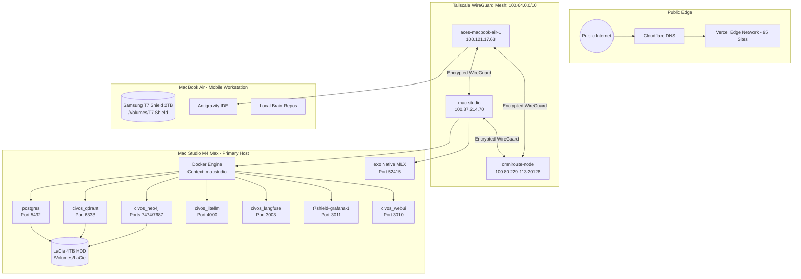

[[STARTHERE]] | [[56-ENGINEERING/56-ENGINEERING|56-ENGINEERING]] | [[56-ENGINEERING/INFRASTRUCTURE/INFRASTRUCTURE|INFRASTRUCTURE]] | [[56-ENGINEERING/INFRASTRUCTURE/01_CORE/INFRASTRUCTURE|01_CORE]] | [[_REGISTRIES/infrastructure_registry.json|infrastructure_registry.json]]

# Infrastructure Topology

> **Authority:** CP-027  
> **Status:** LIVE  
> **Updated:** 2026-09-05

## 1. Physical & Network Topology Diagram

## Connected Documents & Registries
- Core Subsystem Hub: [[56-ENGINEERING/INFRASTRUCTURE/01_CORE/INFRASTRUCTURE|01_CORE]]
- Master Infrastructure: [[56-ENGINEERING/INFRASTRUCTURE/INFRASTRUCTURE|INFRASTRUCTURE]]
- Reality Verification: [[56-ENGINEERING/INFRASTRUCTURE/01_CORE/INFRASTRUCTURE-REALITY|INFRASTRUCTURE-REALITY.md]]
- Infrastructure Registry: [[_REGISTRIES/infrastructure_registry.json|infrastructure_registry.json]]
- Compute Architecture: [[56-ENGINEERING/INFRASTRUCTURE/02_COMPUTE/COMPUTE|COMPUTE]]
- Storage Architecture: [[56-ENGINEERING/INFRASTRUCTURE/03_STORAGE/STORAGE|STORAGE]]
- Network Architecture: [[56-ENGINEERING/INFRASTRUCTURE/04_NETWORK/NETWORK|NETWORK]]
