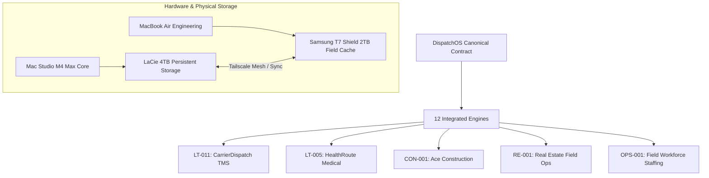

[[STARTHERE]] | [[INDEX]] | [[REALITY]] | [[ANTIGRAVITY]] | [[SECTORS/SEC-017-logistics-transportation|SEC-017 Logistics]] | [[35-ASSETS/35-ASSETS|35-ASSETS]]

# 58-LOGISTICS — Supply Chain, Fleet Logistics & Hardware Operations Gateway

> **Authority:** Logistics & Supply Chain Control Plane ([[50-MASTER-CONTROL/50-MASTER-CONTROL|CP-017]])  
> **Master Operating Contract:** [[ANTIGRAVITY.md]]  
> **System Architecture State:** [[CLAUDE.md]] & [[AGENTS.md]]  
> **Sector Alignment:** [[SECTORS/SEC-017-logistics-transportation|SEC-017 (Logistics & Transportation)]]  
> **Domain Overview:** [[58-LOGISTICS/README|README.md]]  
> **Status:** 🟢 ACTIVE — Institutional Dispatch & Hardware Logistics Hub

---

## 1. Domain Architecture & Canonical Contract

The **Logistics Domain** (`58-LOGISTICS`) coordinates both **digital fleet dispatching** and **physical hardware asset movements**. All dispatch, route optimization, telematics, and field operations across WorldwideBro operating companies are governed by the canonical contract:

👉 **[[_REGISTRIES/CANONICAL/DISPATCH_OS_CANONICAL_CONTRACT|DISPATCH_OS_CANONICAL_CONTRACT.md]]** — Sovereign 12-Engine Operating System for Mobile Work & Fleet Operations (`CAP-DISP-001` through `CAP-DISP-044`).

---

## 2. Active Core Operating Ventures

### 1. Motor Carrier Freight & TMS Platform Core
- **Venture:** [[23-VENTURES/LT-011|LT-011 — CarrierDispatch / DispatchOS]] (`INCOME_READY`)
- **Codebase:** `OWN-PRIV-0007` ([`Worldwidebro/lt-011-dispatch-software`](https://github.com/Worldwidebro/lt-011-dispatch-software)) — Commit `d2523fd`
- **Live Service:** `https://lt-011-dispatch-software.vercel.app`
- **Active Tiers:** $49/mo Starter, $149/mo Pro, $250 Shipper Escrow deposit (Stripe active)
- **Data Room Prospectus:** [[BUSINESS-CAPITAL-DATA-ROOM/LT-011/COMPILED-MASTER-PROSPECTUS|LT-011 Master Prospectus]]
- **Operational Reality:** [[BUSINESS-CAPITAL-DATA-ROOM/LT-011/OPERATIONAL-REALITY|LT-011 Operational Reality]]

### 2. Medical Courier & Specimen Logistics
- **Venture:** [[23-VENTURES/LT-005|LT-005 — HealthRoute Logistics LLC]] (`INCOME_READY`)
- **Codebase:** `OWN-PRIV-0002` ([`Worldwidebro/lt-005-medical-courier-dispatch`](https://github.com/Worldwidebro/lt-005-medical-courier-dispatch)) — Commit `bdb61fb`
- **Focus:** Cold-chain specimen transport, HIPAA compliance, BBP-certified couriers
- **OSS Integration Roadmap:** [[LT-005-OSS-INTEGRATION-ROADMAP|LT-005 Open Source Integration Roadmap]]
- **Data Room Prospectus:** [[BUSINESS-CAPITAL-DATA-ROOM/LT-005/COMPILED-MASTER-PROSPECTUS|LT-005 Master Prospectus]]

### 3. Construction Fleet & Equipment Mobilization
- **Venture:** [[23-VENTURES/CON-001|CON-001 — ACE Construction & Contracting LLC]] (`INCOME_READY`)
- **Codebase:** `OWN-PRIV-0004` ([`Worldwidebro/con-001-ace-construction`](https://github.com/Worldwidebro/con-001-ace-construction)) — Commit `67e7b82`
- **Data Room Prospectus:** [[BUSINESS-CAPITAL-DATA-ROOM/CON-001/COMPILED-MASTER-PROSPECTUS|CON-001 Master Prospectus]]

### 4. Real Estate Field Inspection & Property Operations
- **Venture:** [[23-VENTURES/RE-001|RE-001 — WorldwideBro Holdings LLC]] (`INCOME_READY`)
- **Codebase:** `OWN-PRIV-0001` ([`Worldwidebro/re-001-worldwidebro-holdings`](https://github.com/Worldwidebro/re-001-worldwidebro-holdings)) — Commit `a761e80`
- **Data Room Prospectus:** [[BUSINESS-CAPITAL-DATA-ROOM/RE-001/COMPILED-MASTER-PROSPECTUS|RE-001 Master Prospectus]]

---

## 3. Sovereign Capital Stack & Credit Facilities

- **Master Capital Index:** [[38-OPPORTUNITIES/CAPITAL_STACK/README|38-OPPORTUNITIES/CAPITAL_STACK/README.md]]
- **Portfolio Readiness Engine:** [[CAPITAL-READINESS-ENGINE|CAPITAL-READINESS-ENGINE.md]]
- **LT-011 Freight Factoring & SBA Express:** [[38-OPPORTUNITIES/CAPITAL_STACK/LT-011_Freight_Factoring_SBA_Express|LT-011 Capital Stack Dossier]] ($500K SBA + $1M Embedded Factoring Facility)
- **LT-005 Healthcare CDFI Loan & Reefer Van Lease:** [[38-OPPORTUNITIES/CAPITAL_STACK/LT-005_Healthcare_CDFI_Vehicle_Lease|LT-005 Capital Stack Dossier]] ($250K CDFI + $120K Vehicle Lease)
- **CON-001 SBA 7(a) & Surety Bond:** [[38-OPPORTUNITIES/CAPITAL_STACK/CON-001_SBA_Surety_Bond_Draw_Line|CON-001 Capital Stack Dossier]] ($350K Loan + $9M Bonding Cap)
- **Integrated Legal + Financial Summary:** [[BUSINESS-CAPITAL-DATA-ROOM/5-VENTURE-INTEGRATED-SUMMARY|5-Venture Integrated Summary]]
- **Canonical Capital Facilities Registry:** [[_REGISTRIES/CANONICAL/CAPITAL_FACILITIES_REGISTRY.yaml]]
- **Canonical Grant Registry:** [[_REGISTRIES/CANONICAL/GRANT_OPPORTUNITY_REGISTRY.yaml]] (featuring [[38-OPPORTUNITIES/GRANTS/LT-011_DOT_EPA_CarrierDispatch|USDOT / EPA SBIR Phase I Action Pack]])

---

## 4. Sales Pipelines & Commercial Execution

- **Commercial Pipeline Master Index:** [[20-DECISIONS/SALES-PIPELINE-MASTER-INDEX|SALES-PIPELINE-MASTER-INDEX.md]]
- **LT-011 Fleet TMS Sales Pipeline:** [[20-DECISIONS/LT-011-SALES-PIPELINE|LT-011 Sales Pipeline]] (Targeting Carolina Logistics & 10+ truck fleets)
- **LT-011 Cold Calling & Demo Script:** [[scripts/LT-011-SALES-COACH|LT-011 Sales Coach]]
- **LT-011 Marketing & Social Calendar:** [[VENTURE-SOCIAL-EXECUTION-LT-011|LT-011 Social Media & Email Execution Plan]]
- **LT-005 Medical Courier Sales Pipeline:** [[20-DECISIONS/LT-005-SALES-PIPELINE|LT-005 Sales Pipeline]]
- **LT-005 Healthcare Cold Call Script:** [[scripts/LT-005-SALES-COACH|LT-005 Sales Coach]]
- **CON-001 Commercial Sales Pipeline:** [[20-DECISIONS/CON-001-SALES-PIPELINE|CON-001 Sales Pipeline]]

---

## 5. Physical Hardware & Storage Logistics

Hardware asset custody and secure backup rotation are cataloged in:
- **Physical Assets Catalog:** [[35-ASSETS/35-ASSETS|35-ASSETS.md]]
- **Storage Infrastructure:** [[_INFRASTRUCTURE/storage/README|Storage Mounts & Drive Mappings]]
- **Primary Studio Hub:** Mac Studio M4 Max (`100.87.214.70`) + LaCie 4TB External Array (`/Volumes/LaCie/`)
- **Field Engineering Node:** MacBook Air M-Series (`100.121.17.63`) + Samsung T7 Shield 2TB Rugged SSD
- **Encrypted Interconnect:** Tailscale Mesh Network (`tailscale0` overlay)

---

## 6. External Capabilities & Telematics Integrations

- **External Capabilities Registry:** [[_REGISTRIES/external-capabilities-by-sector.yaml]]
- **OSINT Flight & Fleet Tracking:** `BigBodyCobain/Shadowbroker` (11K★)
- **GPS Telematics Engine:** Traccar Open Source GPS Tracking Platform
- **Automated Workflow Routing:** n8n Workflow Automation (`ENG-AUTOMATION`)

---

## 7. Master Domain Wiki Links & Navigation

- System Orientation: [[STARTHERE]]
- Operational Reality: [[REALITY]]
- System Constitution & Agents: [[AGENTS.md]]
- Sector Taxonomy: [[SECTORS/SEC-017-logistics-transportation|SEC-017 Logistics & Transportation]]
- Canonical Capabilities: [[_REGISTRIES/CANONICAL/CAPABILITY_REGISTRY.yaml]]
- Deployed Web Surfaces: [[_REGISTRIES/CANONICAL/SITES_REGISTRY.yaml]]
- Multi-Venture Blueprint: [[BUSINESS-CAPITAL-DATA-ROOM/00_ENTERPRISE_BLUEPRINT|Enterprise Blueprint]]

