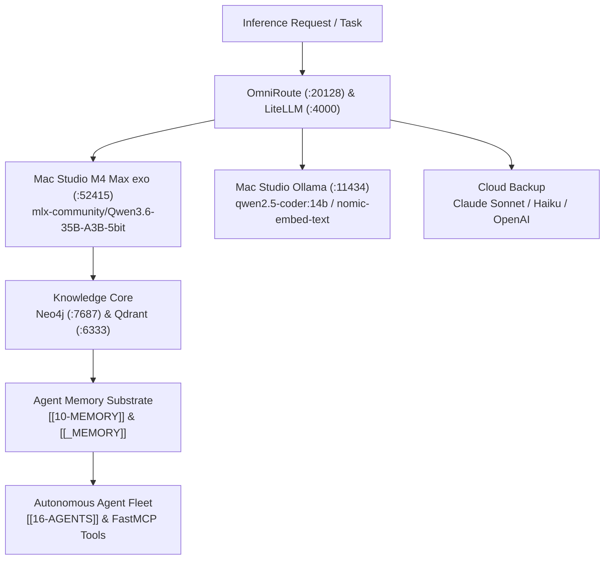

[[STARTHERE]] | [[CLAUDE]] | [[16-AGENTS]] | [[17-MODELS]] | [[08-KNOWLEDGE-GRAPH]] | [[10-MEMORY]]

# AI-BRAIN — Company Brain Artificial Intelligence Core Portal

> **Authority:** Model Control Plane (CP-007) & Agent Control Plane (CP-006)  
> **Purpose:** Master gateway for autonomous intelligence, neural routing, knowledge persistence, and continuous multi-agent execution.

---

## 1. AI Subsystem Architecture

---

## 2. Core AI Subsystems

### Inference & Model Routing
- [[17-MODELS/17-MODELS|17-MODELS]]: Unified model catalog and runtime profiles.
- [LLM Hardware Compatibility Registry](file:///Users/acebless/Documents/The%20Company/Company%20Brain/_REGISTRIES/LLM_HARDWARE_COMPATIBILITY_REGISTRY.yaml): Measured benchmarks and 4-tier model fallback rules.
- [[_INFRASTRUCTURE/omniroute/README|OmniRoute Gateway]]: Multi-provider traffic routing, token budget guards, and Tailscale mesh gateway.

### Knowledge, Graph & Vectors
- [[08-KNOWLEDGE-GRAPH/08-KNOWLEDGE-GRAPH|08-KNOWLEDGE-GRAPH]]: Neo4j graph database hosting 3,308 Repos, 722 Ventures, and 20,363 edges (`bolt://100.87.214.70:7687`).
- [[11-INDEXING/11-INDEXING|11-INDEXING]]: Qdrant vector database (`:6333`) providing semantic embeddings via `nomic-embed-text`.
- `graphify-out/`: AST-level deterministic code and documentation knowledge graph.

### Agents & Tools
- [[16-AGENTS/16-AGENTS|16-AGENTS]]: Autonomous routing agents (`AGT-001` through `AGT-005`, plus specialized subagents).
- [[.agents/agents/engineering-database-optimizer|Database Optimizer Agent]]: Query plan and schema tuning specialist.
- [Company Brain FastMCP Server](file:///Users/acebless/Documents/The%20Company/Company%20Brain/_MCP/fastmcp_server.py): 9 native infrastructure and control plane tools.

### Memory & Learning
- [[10-MEMORY/10-MEMORY|10-MEMORY]]: Layer 10 cognitive memory substrate.
- [[_MEMORY/MEMORY-POLICY|MEMORY-POLICY]]: Epistemic retention and token compaction governance.
- [[44-LEARNING/44-LEARNING|44-LEARNING]]: Continuous evaluation and learning loops.
