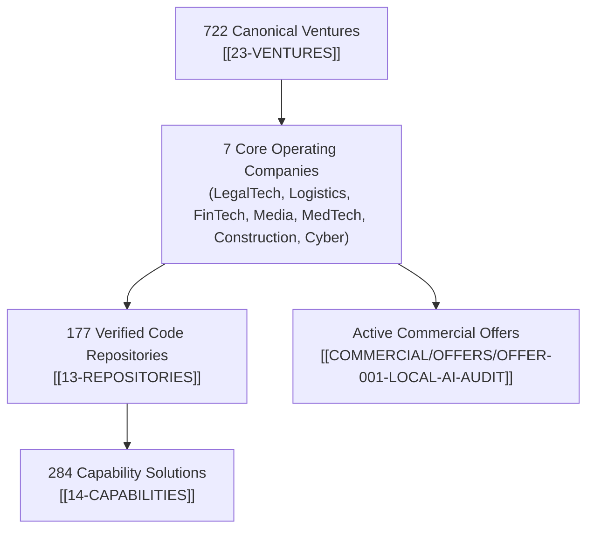

[[STARTHERE]] | [[23-VENTURES]] | [[13-REPOSITORIES]] | [[14-CAPABILITIES]] | [[COMMERCIAL]]

# AI-PROJECTS — Company Brain AI Projects & Ventures Portal

> **Authority:** Venture Control Plane (CP-003) & Infrastructure Control Plane (CP-027)  
> **Purpose:** Master gateway aggregating AI-enabled software ventures, code repositories, capability components, and commercial initiatives across all 35 economic sectors.

---

## 1. Project & Venture Hierarchy

---

## 2. Key AI Initiatives & Operating Ventures

### 7 Core Operating Ventures (Live Frontrunners)
1. **LT-011 / OpCo-017 (Logistics):** Medical Courier & Dynamic Freight Dispatch (Vercel-hosted SaaS).
2. **EC-001 / OpCo-021 (E-Commerce):** Multi-Store Autonomous Inventory & Pricing Engine.
3. **FIN-037 / OpCo-008 (FinTech):** Micro-Lending Risk Engine & Underwriting Pipeline.
4. **MED-004 / OpCo-020 (Healthcare):** Clinical Documentation & HIPAA-Compliant Workflow Automation.
5. **CON-002 / OpCo-002 (Construction):** Heavy Equipment Dispatch & Jobsite Telemetry.
6. **SEC-024 / OpCo-024 (Technology):** Local-First AI Corporate Operating System (Company Brain).
7. **OPS-001 / OpCo-014 (Professional Services):** CareerOps Automated Staffing Screener.

### Repositories & Capabilities
- [[13-REPOSITORIES/13-REPOSITORIES|13-REPOSITORIES]]: 887 owned repositories and 910 starred repositories mapped in Neo4j.
- [[14-CAPABILITIES/14-CAPABILITIES|14-CAPABILITIES]]: 284 modular capability solutions (`CAP-001` through `CAP-284`).
- [[COMMERCIAL/OFFERS/OFFER-001-LOCAL-AI-AUDIT|B2B Local AI Audit Offer]]: $7,500 turnkey code and token audit package running 100% on local Mac Studio infrastructure.
- [[CAMPAIGNS/CAMPAIGN-OS|CAMPAIGN-OS]]: Autonomous multi-channel outbound and inbound marketing engine.
