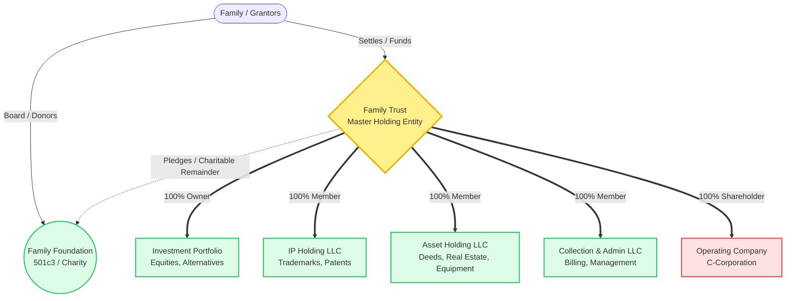
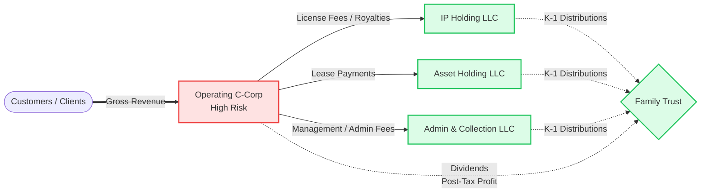

# 🏛️ Family Enterprise & Wealth Architecture Blueprint

This blueprint outlines a sophisticated, institutional-grade asset segregation and family office structure. The primary objective of this architecture is **risk isolation**, **tax efficiency**, **legacy preservation**, and **wealth compounding**.

By separating high-risk operations (the C-Corp) from valuable assets (Real Estate, Equipment, IP), you ensure that a catastrophic liability in the operating business does not wipe out the family's accumulated wealth.

---

## 1. Entity Ownership & Structural Map

This map defines the **Ownership (Equity)** of the enterprise. The Family Trust acts as the master holding vehicle.

---

## 2. Operational Interactions & Money Flow (Profit Stripping)

The C-Corporation takes on all the public risk and customer liability. However, through legitimate arm's-length contracts, the C-Corp's profits are systematically "stripped" and moved to the safe, low-risk holding LLCs before double-taxation occurs at the C-Corp level.

---

## 3. Entity Breakdown: Ownership, Control & Taxation

### A. The Master Level (Wealth & Legacy)

| Entity | Purpose | Ownership (Equity) | Control (Management) | Tax Classification |
| :--- | :--- | :--- | :--- | :--- |
| **Family Trust** | Master vehicle holding all business interests, preventing probate, dictating succession. | Held for the benefit of the **Beneficiaries** (Family). | Controlled by the **Trustee(s)** (Grantors while alive, Successor Trustees later). | **Grantor Trust** (Pass-through to founders) OR **Non-Grantor Trust** (Files own 1041). *See Section 4.* |
| **Family Foundation** | Philanthropic legacy. Receives tax-deductible wealth transfers from the Trust or C-Corp. | N/A (Public/Charitable asset). | Controlled by a **Board of Directors** (Family members). | **501(c)(3)** (Tax Exempt). |
| **Investment Portfolio** | Stocks, bonds, LPs, alternative investments generating passive yield. | Owned by the **Family Trust**. | Managed by the **Trustee / Family Office CIO**. | Taxed at Trust or Grantor level. |

### B. The Asset Holding Layer (Low Risk, High Value)
*These entities own everything but do nothing. They do not interact with the general public.*

| Entity | Asset Profile | Ownership | Control | Income Stream | Tax Status |
| :--- | :--- | :--- | :--- | :--- | :--- |
| **Asset Holding LLC** | Deeds, real estate, heavy equipment, vehicle fleets. | 100% Family Trust. | Manager-Managed (Family). | **Lease payments** from the C-Corp. | Disregarded Entity / Pass-through to Trust. |
| **IP Holding LLC** | Trademarks, patents, proprietary software, brand assets. | 100% Family Trust. | Manager-Managed (Family). | **Royalties/Licensing fees** from the C-Corp. | Disregarded Entity / Pass-through to Trust. |
| **Collection & Admin LLC** | Employment contracts, billing systems, back-office infra. | 100% Family Trust. | Manager-Managed (Family). | **Admin/Management fees** from the C-Corp. | Disregarded Entity / Pass-through to Trust. |

### C. The Operating Layer (High Risk, Zero Assets)
*This entity does everything but owns nothing. If sued, there are no hard assets to seize.*

| Entity | Operations | Ownership | Control | Liability Profile | Tax Status |
| :--- | :--- | :--- | :--- | :--- | :--- |
| **Operating C-Corp** | Signs client contracts, delivers services, faces the public. | 100% Family Trust (Shareholder). | Board of Directors & Officers (CEO, President). | **Maximum.** First line of defense against lawsuits. | **Subchapter C** (Subject to 21% corporate tax, but mitigated via expense deductions to LLCs). |

---

## 4. Trust Taxation & Design: Grantor vs. Separate Trust

The exact structure of the **Family Trust** is the linchpin of this architecture. It dictates asset protection, estate taxes, and income taxes.

### Option 1: Grantor Trust (Revocable Living Trust / Intentionally Defective Grantor Trust - IDGT)
* **How it works:** The creators (Grantors) retain certain powers (e.g., power to swap assets, power to revoke).
* **Taxation:** The trust is ignored for income tax purposes. All income from the LLCs flows through the trust directly onto the Grantors' personal Form 1040.
* **Pros:** Highly tax-efficient during life, simple tax filing, total control.
* **Cons (if Revocable):** Minimal asset protection against the Grantor's personal creditors. The assets remain in the Grantor's taxable estate.

### Option 2: Separate / Non-Grantor Trust (Irrevocable Asset Protection Trust)
* **How it works:** The Grantors completely sever ownership and control. The trust acts as an entirely separate legal person.
* **Taxation:** The trust files its own tax return (Form 1041). Trust tax brackets are highly compressed (hitting the maximum 37% federal rate at around $15,200 of retained income). 
* **Pros:** Ultimate asset protection. Assets are completely shielded from personal creditors, divorces, and estate taxes upon death.
* **Cons:** Loss of direct control. Requires formal distributions to avoid heavy taxation at the trust level.

---

## 5. Implementation Roadmap (Venture OS Integration)

To ground this in the Company Brain operating system, this architecture maps perfectly to the 22-Domain Data Room:
- `03_LEGAL`: Master agreements between the entities (Operating Agreements for LLCs, Bylaws for C-Corp).
- `04_OWNERSHIP`: The cap tables linking everything back to the Family Trust.
- `18_CONTRACTS`: The critical "Arm's Length" agreements:
  - **Master Equipment/Facility Lease** (Asset LLC $\leftrightarrow$ C-Corp)
  - **Master IP Licensing Agreement** (IP LLC $\leftrightarrow$ C-Corp)
  - **Master Administrative Services Agreement** (Admin LLC $\leftrightarrow$ C-Corp)

## 6. Graph & Wiki Connections
This blueprint connects directly to the following operating entities in the knowledge graph:
- [[CON-001/BUSINESS-CAPITAL-PROSPECTUS.md|CON-001 - Construction & Public Works]]
- [[LT-011/BUSINESS-CAPITAL-PROSPECTUS.md|LT-011 - Logistics & Fleet Dispatch]]
- [[LT-005/BUSINESS-CAPITAL-PROSPECTUS.md|LT-005 - Healthcare Cold Chain Transit]]
- [[OPS-001/BUSINESS-CAPITAL-PROSPECTUS.md|OPS-001 - Specialized Staffing Operations]]
- [[RE-001/BUSINESS-CAPITAL-PROSPECTUS.md|RE-001 - Real Estate Asset Holding]]
