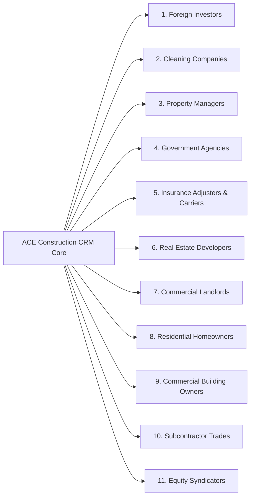
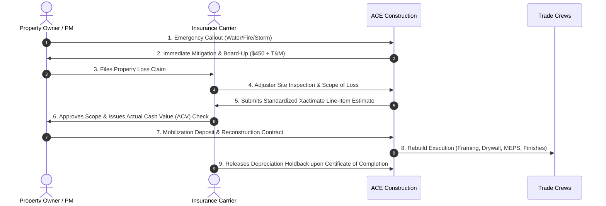

# CON-001: The 12 Money Pools & Construction-Property-Platform Ecosystem

**Venture:** `CON-001` (ACE Construction & Contracting LLC)  
**Sector:** `SEC-002: Construction & Infrastructure` | **OpCo:** `OpCo-002`  
**Domain:** `08_REVENUE` | **Authority:** System Architecture & Infrastructure Control Plane (`CP-027`)  
**Implementation Engine:** [`src/lib/finance/payment-engine.ts`](file:///Users/acebless/Documents/The%20Company/Company%20Brain/repos/con-001-ace-construction/src/lib/finance/payment-engine.ts)  
**TypeScript Schemas:** [`src/types/payment-business-logic.ts`](file:///Users/acebless/Documents/The%20Company/Company%20Brain/repos/con-001-ace-construction/src/types/payment-business-logic.ts)  
**Automated Unit Tests:** [`src/__tests__/payment-business-logic.test.ts`](file:///Users/acebless/Documents/The%20Company/Company%20Brain/repos/con-001-ace-construction/src/__tests__/payment-business-logic.test.ts) (46 Passing Tests, 109 Project-Wide)

---

## 1. Executive Architecture: The Ecosystem Transformation

ACE Construction & Contracting transitions from a transactional **"contractor getting paid for labor"** into a multi-tier **Construction + Property + Procurement + Compliance + Hospitality + Investment Ecosystem**.

```text
                                ACE
                                 │
     ┌───────────────────────────┼───────────────────────────┐
     │                           │                           │
CONSTRUCTION                  PROPERTY                    PLATFORM
     │                           │                           │
General Contracting           Acquisition                 CRM & Leads
Specialty Trades              Turnkey Renovation          Subcontractor Marketplace
Tenant Improvements           Furnished Rentals / STR*    Contractor Compliance OS
Emergency Premium Dispatch    Facility Maintenance MSAs   Merchant Interchange (35 bps)
Government Contracts          Account Turnovers           CSI Pricing Engine & API
Insurance Restoration         Cleaning Assembly Line      Financing & Bond Referrals
     │                           │                           │
     └───────────────────────────┼───────────────────────────┘
                                 ↓
                          INVESTOR LAYER
                                 │
                     Domestic & Foreign Capital
                                 │
                                 ↓
                          ASSET OWNERSHIP
                          (Flywheel BRRRR)
                                 │
                    ┌────────────┴────────────┐
                    ↓                         ↓
                  RENT                      SELL
                    ↓                         ↓
                CASH FLOW                 CAPITAL GAIN
```
*\*Subject to verified landlord lease addendums, local municipal zoning, HOA bylaws, and STR licensing.*

---

## 2. The 12 Canonical Money Pools

| # | Money Pool | Mechanism Description | Typical Gross Margin | Cash Velocity & Frequency |
| :--- | :--- | :--- | :--- | :--- |
| **01** | **Construction Margin** | Lump Sum, Cost-Plus %, and GMP construction prime contracts. | **15% – 30%** | Monthly AIA G702 progress draws (Net-30). |
| **02** | **Labor Spread** | Arbitrage between client billing rates (\$100/hr) and burdened craft wages (\$65/hr). | **20% – 35%** | Weekly timesheet draw cycles. |
| **03** | **Trade-Package Margin** | Packaging, scoping, and executing turnkey specialty scopes (framing, drywall, MEP). | **18% – 28%** | Milestone and trade package draws. |
| **04** | **Pre-Construction Fees** | \$299 intake audits, \$1,500 CSI takeoffs, \$2,500 permit expediting, and 4.5% CMa fees. | **85% – 95%** | Instant Stripe checkout (<= 48 hours). |
| **05** | **Emergency Premiums** | 2-hour dispatch fees (\$450), after-hours multipliers (1.5x–2.5x), and rush material fees. | **35% – 50%** | Immediate card charge / emergency invoice. |
| **06** | **Procurement Margin** | Wholesale distributor discounts (15–20%) plus client markup on materials and logistics. | **15% – 25%** | Milestone purchase draw upon material delivery. |
| **07** | **Recurring Maintenance** | Commercial Facility Maintenance MSAs (\$750, \$1,500, \$3,000/mo) with guaranteed SLAs. | **40% – 60%** | Recurring monthly credit card / ACH subscription. |
| **08** | **Property-Manager Services**| Preferred vendor account capture for turns, repairs, make-ready, and inspections. | **22% – 32%** | High-frequency Net-30 bulk invoicing. |
| **09** | **Government Contracts** | Federal, state, county, municipal public works, and IDIQ task orders with prevailing wages. | **12% – 20%** | Certified payroll monthly draws (Statutory prompt pay). |
| **10** | **Insurance Restoration** | Xactimate damage estimation, carrier-approved rebuilds, and depreciation holdback release. | **20% – 35%** | Two-party insurance settlement checks. |
| **11** | **Platform SaaS Revenue** | Subcontractor directory tiers (\$99–\$499/mo), Compliance OS (\$350/yr), seat licenses. | **85% – 92%** | Monthly recurring SaaS subscriptions. |
| **12** | **Property Ownership** | BRRRR equity creation, sweat-equity JV carry (20–35%), BTR rentals, and asset sales. | **30% – 100%+** | Quarterly distributions, refinance proceeds, sale equity. |

---

## 3. The 11 Buyer & Partner CRM Channels



1. **Foreign Investors:** Remote owners needing turn-key acquisition due diligence, renovation oversight, and monthly executive asset reports.
2. **Cleaning Companies:** Subcontract partners executing rough, final, and turnover cleans integrated into turnkey make-ready packages.
3. **Property Managers:** High-volume commercial and multifamily asset managers managing 50–500+ doors needing a single point of accountability.
4. **Government Agencies:** NCDOT, municipal public housing, school districts, and federal small business set-asides.
5. **Insurance Carriers & Adjusters:** Property loss adjusters requiring factual Xactimate estimates and code-compliant reconstruction.
6. **Real Estate Developers:** Ground-up and adaptive reuse builders seeking GMP contracts and value engineering splits.
7. **Commercial Landlords:** Shopping centers, office parks, and flex-warehouses needing rapid white-box tenant turnover.
8. **Homeowners:** High-end residential addition and whole-home remodel clients requiring transparent cost-plus or lump-sum delivery.
9. **Commercial Business Owners:** Medical clinics, franchise restaurants, and fitness centers needing fast-track tenant improvements.
10. **Trade Subcontractors:** Qualified craft crews utilizing ACE Compliance OS, quick-pay early factoring, and bid invitations.
11. **Real Estate Syndicators:** GP/LP syndication groups seeking GC sweat-equity partners with preferred returns.

---

## 4. Conversion Engineering: The Buyer Psychology Matrix

Rather than psychological manipulation, ACE builds around **legitimate buyer anxiety reduction through contractual assurances and technological proof**:

| Buyer Anxiety | Primary Customer Concern | ACE Contractual Assurance | Platform Technology Proof | Revenue Tie-In |
| :--- | :--- | :--- | :--- | :--- |
| **Unknown Cost** | *"I don't know what this should cost."* | Upfront \$299 Feasibility Audit with 100% credit toward contract. | Parametric AI MasterFormat Cost Model (P10/P50/P90). | Pool 04: Pre-Con Fees |
| **Contractor Distrust**| *"I don't trust contractors; they disappear."* | AIA G702/G703 verified billing, unconditional lien waivers, licensed & insured guarantee. | Real-time Supabase Lien Waiver & COI Compliance Tracker. | Pool 01: Prime Contract |
| **Lack of Visibility** | *"I don't know what is happening on my site."* | Daily site logs with timestamped photographs and superintendent weather notes. | Client Portal Daily Activity Feed & Milestone Checklist. | Pool 01: Construction Margin |
| **Vendor Chaos** | *"I can't manage 10 different trade vendors."* | Single Prime General Contractor accountability with turnkey package delivery. | Unified Trade Schedule & Gantt Critical Path Engine. | Pool 03: Trade Package |
| **Time Urgency** | *"I need emergency repairs right now."* | Guaranteed 2-hour emergency dispatch SLA with dedicated on-call superintendent. | SMS/Twilio Automated Emergency Dispatch Dispatcher. | Pool 05: Emergency Premium |
| **Remote Distance** | *"I don't live near the property."* | Dedicated Remote-Owner Monthly Executive Reporting & Video Walkthroughs. | Cloud Document Room & Drone Aerial Progress Video. | Pool 08: Property Services |
| **Cost Overruns** | *"I'm terrified of runaway change orders."* | Guaranteed Maximum Price (GMP) with 30% contractor shared savings split. | AIA Schedule of Values & Variance Tracking System. | Pool 01: GMP Savings |
| **Capital Shortage** | *"I need financing to bridge construction."* | Pre-cleared lending partner network (50–100 bps origination referral). | Embedded Loan Application & Draw Schedule API. | Pool 06: Financing Rev |
| **Deferred Upkeep** | *"My building is falling apart between tenants."*| Preventive Commercial Facility Maintenance MSA with quarterly audits. | Automated Preventive Maintenance Dispatch Calendar. | Pool 07: Recurring MSA |
| **Portfolio Scale** | *"I manage 300 units and can't handle turns."* | 72-Hour Make-Ready Turnover Package Guarantee with single-invoice billing. | Bulk Work Order Management & Dispatch Matrix. | Pool 08: PM Turnovers |
| **Overseas Execution**| *"I am an overseas investor who needs local execution."*| Complete "Owner owns asset, ACE operates physical side" asset management. | Multi-Currency Investor Reporting Dashboard & CapEx Logs. | Pool 12: Ownership / Advisory |

---

## 5. Government Contracting Vertical Architecture

Government contracting operates as an institutional vertical within ACE Construction OS, managing the full public sector procurement pipeline:

```text
OPPORTUNITY IDENTIFICATION (SAM.gov / NC IPS)
                    ↓
ELIGIBILITY & REGISTRATION (CAGE, UEI, NC HUB, Small Business)
                    ↓
BID / NO-BID DECISION MATRIX (Capacity, Prevailing Wage, Bonding)
                    ↓
PROPOSAL AUTHORSHIP & ESTIMATING (RSMeans / MasterFormat)
                    ↓
COMPLIANCE VALIDATION (FAR clauses, Davis-Bacon Wages, OSHA)
                    ↓
CONTRACT AWARD & SURETY BONDING (100% P&P Bond)
                    ↓
CERTIFIED PAYROLL & PROGRESS BILLING (WH-347 Reporting)
                    ↓
FINAL AUDIT & CLOSEOUT (Statutory retainage release)
```

### 12 Public Sector Contract Vehicles
1. **Federal Prime Contracts:** Direct bidding on federal civil and defense agency solicitations.
2. **State Agency Contracts:** North Carolina state university and administrative facility renovations.
3. **County Building Contracts:** Courthouses, detention centers, and social service facility upkeep.
4. **Municipal Public Works:** City utility, stormwater, sidewalk, and administrative repairs.
5. **School & College Facilities:** K-12 school districts and community college capital improvement programs.
6. **Public Housing Authorities:** Fast-track apartment rehabilitation and modernization programs.
7. **Government Subcontracting:** Operating as specialized tier-1 sub under national mega-primes (e.g., Whiting-Turner, Skanska).
8. **IDIQ / Task-Order Vehicles:** Indefinite Delivery / Indefinite Quantity umbrella contracts with pre-priced task orders.
9. **Emergency Procurement:** Expedited sole-source emergency response for natural disasters and structural failures.
10. **Public Sector Facilities Maintenance:** Long-term multi-year maintenance retainers for public facilities.
11. **Small Business / HUB Set-Asides:** Capturing mandated minority and small business enterprise quotas.
12. **Public Infrastructure:** Water treatment access roads, erosion control, and municipal site grading.

---

## 6. Insurance Restoration Channel: Factual Loss & Reconstruction

### Ethical & Legal Operating Boundary
> [!IMPORTANT]
> **Strict Regulatory Constraint:** ACE Construction & Contracting operates strictly as an independent general contractor and estimator. ACE **never** holds itself out as a licensed public insurance adjuster, never negotiates claim settlements on behalf of the insured, and never manufactures artificial damage. ACE’s role is to provide **factual photographic documentation, standardized Xactimate line-item estimates, and code-compliant physical reconstruction**.

### The 9-Stage Restoration Lifecycle


---

## 7. The 4 Construction Arbitrage Models

### 1. Labor Arbitrage
Capturing the margin between client market billing rates and fully burdened craft payroll:
$$\text{Customer Billed: } 40\text{ hrs} \times \$100/\text{hr} = \$4,000$$
$$\text{Direct Trade Labor: } 40\text{ hrs} \times \$65/\text{hr} = \$2,600$$
$$\text{Taxes, Insurance \& Workers Comp (15\%): } \$390$$
$$\text{Supervision (5\%) \& Overhead (8\%): } \$338$$
$$\text{Net Spread Margin: } \$4,000 - \$3,328 = \$672\text{ (16.8\% net profit)}$$

### 2. Geographic Arbitrage
Deploying mobile trade crews sourced from regional lower-cost NC counties into high-demand metro markets (Raleigh, Charlotte, RTP) where commercial TI rates command a 30%–45% premium.

### 3. Procurement Arbitrage
Leveraging tier-1 volume wholesale accounts (Ferguson, ABC Supply, 84 Lumber) to acquire materials at 20% below retail list, capturing \$4,500 on a \$13,000 commercial order while saving the client 5% against big-box store retail.

### 4. Information Arbitrage
The \$299 Pre-Con Scope Audit transforms asymmetric construction knowledge into monetizable advisory. The client discovers \$15,000+ in potential architectural clash errors and scope overruns before signing a prime contract, creating instant trust that converts into a 6-figure general contracting award.

---

## 8. Property Manager Account Capture Strategy

Rather than acquiring individual homeowners one at a time with high customer acquisition cost (CAC), ACE secures **Property Manager Master Agreements**:

$$\text{1 Property Manager} \longrightarrow 10 \text{ Properties} \longrightarrow 50 \text{ Properties} \longrightarrow 300 \text{ Properties} \longrightarrow \text{Thousands of Work Orders}$$

### The 72-Hour Turnkey Make-Ready Package
Single-invoice bundled delivery for property managers:
- **Phase 1: Rough Clean & Debris Out**
- **Phase 2: Full Inspection & Rekeying**
- **Phase 3: Drywall Patch & Standardized Commercial Enamel Painting**
- **Phase 4: Luxury Vinyl Plank (LVP) Flooring Refurbishment**
- **Phase 5: White-Glove Final Clean**
- **SLA:** Guaranteed 72-hour turnaround between tenant move-out and new tenant lease start.

---

## 9. Short-Term Rental (STR) & Furnished Hospitality Framework

ACE operates across three distinct hospitality verticals:
1. **STR Setup Package:** Turnkey renovation, commercial furnishing procurement, photography, and listing staging (\$32,000 typical project budget with \$3,500 GC coordination fee).
2. **STR Ongoing Management:** Monthly turnover cleaning (\$150/turn), emergency maintenance retainer (\$200/mo), and 18% monthly gross revenue management fee.
3. **Legally Permitted Rental Arbitrage:** Master-leasing properties only where:
   - Written landlord lease addendum explicitly authorizing corporate short-term subleasing is signed.
   - Local municipal zoning permits short-term residential rentals.
   - Active municipal STR permit and lodging tax compliance are verified.
   - HOA covenants do not prohibit transient rentals.

---

## 10. The Asset Ownership Flywheel (BRRRR)

Construction profits fund direct asset ownership, turning operating cash into compounding wealth:

```text
ACE GENERAL CONTRACTING CASH
             ↓
FINDS DISTRESSED COMMERCIAL / MULTIFAMILY PROPERTY
             ↓
ACQUIRES AT SUBMARKET BASIS ($180,000)
             ↓
RENOVATES USING IN-HOUSE CAPTIVE TRADE CREWS ($60,000)
             ↓
APPRAISED AFTER-REPAIR VALUE (ARV: $360,000)
             ↓
75% LTV CASH-OUT BANK REFINANCE ($270,000)
             ↓
PULLS OUT $250,000 BASIS + $20,000 TAX-FREE CASH PROFIT
             ↓
RETAINS $90,000 PERMANENT EQUITY + $900/MO NET CASH FLOW
             ↓
RECYCLES $270,000 RECAPITALIZED CASH INTO NEXT ASSET
```

---

## 11. Contractor Compliance OS (SaaS Revenue)

Continuous credentialing and risk management for general contractors and subcontractor networks:
- **Continuous Monitoring:** Automatic expiration tracking for General Liability, Workers' Comp, State Licenses, and W-9s.
- **Safety Documentation:** OSHA 1926 digital toolbox talks and jobsite hazard analysis.
- **Pricing:** \$350/year per monitored subcontractor + \$500 per scheduled on-site safety audit visit.
- **Economics:** 40 active network subcontractors = **\$20,000/year recurring revenue** at 90% software gross margin.

---

## 12. Verification & Automated Test Status

All 12 Money Pools and ecosystem calculation models are fully implemented and verified in the automated test suite:
- **Test Suite:** [`src/__tests__/payment-business-logic.test.ts`](file:///Users/acebless/Documents/The%20Company/Company%20Brain/repos/con-001-ace-construction/src/__tests__/payment-business-logic.test.ts)
- **Unit Test Coverage:** **46/46 unit tests passing** (109/109 tests passing across all suites project-wide).
- **TypeScript Engine:** [`src/lib/finance/payment-engine.ts`](file:///Users/acebless/Documents/The%20Company/Company%20Brain/repos/con-001-ace-construction/src/lib/finance/payment-engine.ts)
- **Next.js Production Build:** 127/127 static and dynamic routes compiled successfully with 0 errors.
