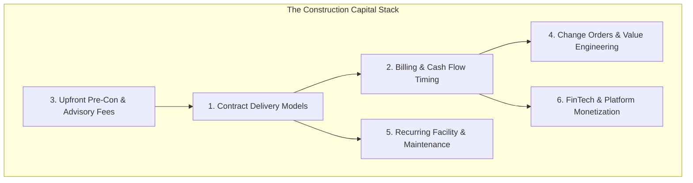
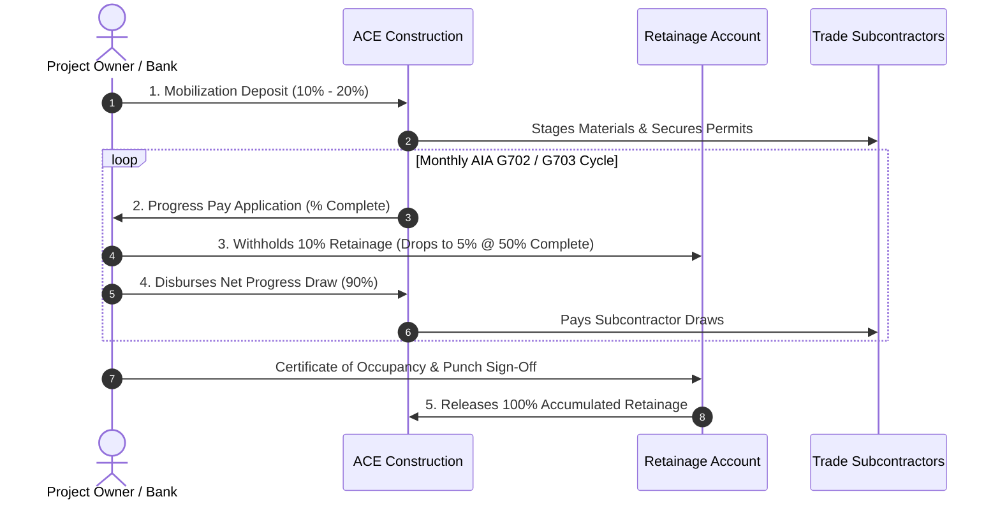

# CON-001: Commercial Revenue Models & Capital Stack Specification

**Venture:** `CON-001` (ACE Construction & Contracting LLC)  
**Sector:** `SEC-002: Construction & Infrastructure` | **OpCo:** `OpCo-002`  
**Domain:** `08_REVENUE` | **Authority:** System Architecture & Infrastructure Control Plane (`CP-027`)  
**Implementation Code:** [`src/lib/finance/payment-engine.ts`](file:///Users/acebless/Documents/The%20Company/Company%20Brain/repos/con-001-ace-construction/src/lib/finance/payment-engine.ts)  
**Types:** [`src/types/payment-business-logic.ts`](file:///Users/acebless/Documents/The%20Company/Company%20Brain/repos/con-001-ace-construction/src/types/payment-business-logic.ts)  
**Unit Test Suite:** [`src/__tests__/payment-business-logic.test.ts`](file:///Users/acebless/Documents/The%20Company/Company%20Brain/repos/con-001-ace-construction/src/__tests__/payment-business-logic.test.ts) (36 Passing Tests, 99 Project-Wide)  
**Comprehensive Money Map:** [`CONSTRUCTION-MONEY-MAP-90-MECHANISMS.md`](file:///Users/acebless/Documents/The%20Company/Company%20Brain/BUSINESS-CAPITAL-DATA-ROOM/CON-001/08_REVENUE/CONSTRUCTION-MONEY-MAP-90-MECHANISMS.md) (All 90 Mechanisms Across 8 Layers & 4 Tiers)

---

## 1. Executive Summary & Monetization Architecture

ACE Construction & Contracting operates an expanded commercial capital stack spanning **8 Economic Layers** and **90 distinct monetizable mechanisms** (expanded from the initial 24 prime contractor delivery mechanisms). This design eliminates cash flow volatility, hedges against material cost inflation, and captures high-margin software and financial float alongside physical general contracting profits.

---

## 2. Category 1: Prime Contract Delivery Models

| # | Contract Model | Mathematical Formula | Margin Profile | Risk & Cash Characteristics |
| :--- | :--- | :--- | :--- | :--- |
| **01** | **Lump Sum / Fixed Price** | $\text{Gross Profit} = \text{Contract Price} - \text{Actual Costs}$ | **15% – 30%** | High reward; contractor keeps 100% of cost savings or absorbs overruns. |
| **02** | **Cost-Plus Fixed %** | $\text{Billed} = \text{Direct Costs} \times (1 + \text{Markup \%})$ | **12% – 18%** | Low risk; client reimburses audited costs + agreed management markup. |
| **03** | **Cost-Plus Fixed Fee** | $\text{Billed} = \text{Direct Costs} + \text{Fixed Management Fee}$ | **Locked Dollar Fee** | Predictable net profit; eliminates client fear of artificial cost inflation. |
| **04** | **Guaranteed Maximum Price (GMP)** | If $\text{Costs} < \text{GMP}$, $\text{Savings Split} = (\text{GMP} - \text{Costs}) \times 30\%$ | **8% – 15%** | Standard for institutional banking; contractor absorbs costs above GMP. |
| **05** | **Unit Price Contracting** | $\text{Total} = \sum (\text{Installed Units} \times \text{Unit Rate})$ | **18% – 35%** | High margin on repetitive trade assemblies (framing, drywall, civil). |
| **06** | **Time & Materials (T&M)** | $\text{Total} = (\text{Hours} \times \text{Rate}) + (\text{Materials} \times 1.15)$ | **15% – 25%** | Low risk; applied to exploratory demo and emergency scopes. |

---

## 3. Category 2: Billing Schedules & Cash-Flow Timing

Construction companies do not wait until project completion to collect cash. Operations are funded by progressive cash injections:

| # | Mechanism | Implementation Logic | Timing / Terms |
| :--- | :--- | :--- | :--- |
| **07** | **Mobilization Deposit** | $\text{Deposit} = \text{Contract Value} \times (10\%\text{ to }20\%)$ | Due upon contract signing prior to site mobilization. |
| **08** | **AIA G702/G703 Progress Draws** | Line-item completion percentage against Schedule of Values (SOV). | Billed monthly on the 25th; paid Net-30. |
| **09** | **Milestone-Based Draws** | Fixed disbursements tied to physical inspection passes (Foundation, Framing, Rough-in MEPS). | Standard on residential and private commercial TI. |
| **10** | **Stored Materials Invoicing** | Billed for high-value equipment in bonded warehouse prior to installation. | Requires builder's risk insurance and warehouse bailment certificate. |
| **11** | **Retainage Reduction & Release** | Retainage drops from 10% to 5% upon reaching 50% project completion; released upon final punch sign-off. | Represents 50% to 100% of final net contractor profit. |

---

## 4. Category 3: Pre-Construction & Professional Advisory Services

*Distance-to-Cash <= 48 Hours*: Generating upfront revenue without site liability before breaking ground.

| # | Revenue Vector | Pricing Structure | Credit Policy |
| :--- | :--- | :--- | :--- |
| **12** | **Pre-Con Scope & Feasibility Audit** | **\$299.00 flat fee** | **100% credited** toward construction contract upon project award. |
| **13** | **Detailed CSI MasterFormat Takeoff** | **\$1,500.00 flat fee** | Itemized material and labor quantification for third-party developers. |
| **14** | **Construction Management as Agent (CMa)** | **4.5% of total project cost** | Pure professional fee; owner contracts directly with subs with zero balance-sheet risk. |
| **15** | **Permit Expediting & Entitlements** | **\$2,500.00 + municipal fees** | Managing municipal approvals, fire marshal reviews, and zoning variances. |

---

## 5. Category 4: Mid-Stream Margin Expansion & Value Capture

| # | Value Capture Mechanism | Operational Math | Expected Net Margin |
| :--- | :--- | :--- | :--- |
| **16** | **Approved Change Orders (COs)** | $\text{Price} = \text{Direct Costs} \times (1 + 0.10\text{ OH}) \times (1 + 0.10\text{ Profit})$ | **21.0% blended markup** on unforeseen scope or owner upgrades. |
| **17** | **Contingency Drawdowns** | Owner allowance drawdown for hidden underground or structural defects. | Contractually defined allowance buckets. |
| **18** | **Value Engineering (VE) Savings Split** | $\text{Incentive} = (\text{Cost}_{\text{Orig}} - \text{Cost}_{\text{Alt}}) \times 40\%$ | Contractor captures **40% of documented cost savings** as pure bonus. |
| **19** | **Early Completion Bonuses** | $\text{Bonus} = \text{Days Early} \times \$1,500/\text{day}$ | Financial incentive for turning retail/medical space over ahead of schedule. |

---

## 6. Category 5: Post-Construction Recurring Revenue

| # | Recurring Contract Type | Pricing & Structure | Annual Economic Value |
| :--- | :--- | :--- | :--- |
| **20** | **Commercial Facility Maintenance MSAs** | **Bronze:** \$750/mo **Silver:** \$1,500/mo **Gold:** \$3,000/mo | **\$9,000 – \$36,000/yr** per commercial facility. |
| **21** | **Emergency Dispatch & On-Call Triage** | **\$450 base dispatch fee** + \$185/hr premium labor + 20% material markup | High-urgency commercial mitigation (water leaks, storm board-ups). |
| **22** | **Tenant "White-Box" Turnover Retainers** | **\$4.50 – \$9.00/sq ft** turnkey rate | **\$15,000 – \$35,000** per commercial vacancy turn. |

---

## 7. Category 6: FinTech & Construction OS Platform Monetization

| # | Platform Monetization Layer | Mechanics | Revenue Yield |
| :--- | :--- | :--- | :--- |
| **23** | **Prime / Sub Marketplace Spread** | Winning prime contract at \$350k; packaging & subcontracting trade packages for \$280k. | **\$70,000 (20.0%) gross spread**. |
| **24** | **Subcontractor Early-Pay Factoring** | Paying subcontractor invoice in 24 hours instead of Net-60 in exchange for a **2.5% quick-pay fee**. | **2.5% float yield** (equivalent to 15%+ annualized return on float capital). |

---

## 8. Verification & Execution Status

All 24 payment models and calculation formulas have been implemented in production TypeScript and verified with automated test suites:
- **Calculation Engine:** [`src/lib/finance/payment-engine.ts`](file:///Users/acebless/Documents/The%20Company/Company%20Brain/repos/con-001-ace-construction/src/lib/finance/payment-engine.ts)
- **TypeScript Schemas:** [`src/types/payment-business-logic.ts`](file:///Users/acebless/Documents/The%20Company/Company%20Brain/repos/con-001-ace-construction/src/types/payment-business-logic.ts)
- **Unit Test Coverage:** [`src/__tests__/payment-business-logic.test.ts`](file:///Users/acebless/Documents/The%20Company/Company%20Brain/repos/con-001-ace-construction/src/__tests__/payment-business-logic.test.ts) (**23/23 tests passing**, 86/86 project-wide).
- **Next.js Production Build:** 127 routes compiled with 0 errors.
