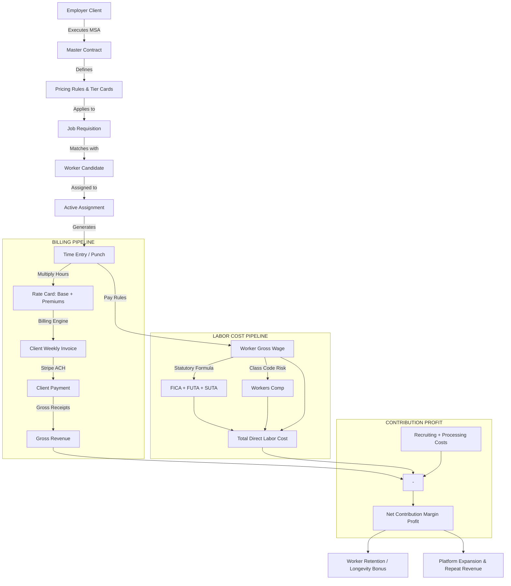

# OPS-001 Labor Transaction Economics Engine
## Canonical Institutional Specification & Architecture

> **Venture:** WorldwideBro Staffing Ops LLC (`OPS-001`)  
> **Classification:** Labor Transaction Operating System & Multi-Model Monetization Engine  
> **Master Operating Contract:** `ANTIGRAVITY.md` · `AGENTS.md`  
> **Core Pipeline:** `Demand → Candidate Supply → Match → Placement/Hours → Billing → Collections → Margin → Retention → Repeat Revenue`  
> **Version:** 1.0.0 (Institutional Canonical)  
> **Date:** September 2026

---

## Executive Summary

OPS-001 does not merely "charge employers a staffing fee." It operates as a full-stack **Labor Transaction Economics Engine** that monetizes the entire lifecycle of enterprise labor allocation: from demand aggregation and rapid credentialing to contingent hourly spread, direct hire warranties, early conversion buyouts, shift/urgency premiums, compliance pass-throughs, and cash-flow financing arbitrage.

At the core of the engine is an architectural principle: **never represent commercial pricing with a static `price` column.** Instead, the platform drives two simultaneous deterministic pipelines:
1. **The Billing Pipeline** (Client contract rules, rate cards, multipliers, time entries, invoices, collections)
2. **The Cost Pipeline** (Pay rules, gross wages, statutory taxes, workers' compensation, direct recruiting allocations)

The delta between these pipelines yields **Contribution Profit** across every granular dimension: worker, shift, requisition, client, contract, and recruiter.

---

## 1. Core Staffing Revenue Models

| Model | Commercial & Economic Logic | Typical Multiplier / Spread |
|---|---|---|
| **Temporary Staffing** | Client pays hourly bill rate; worker receives pay rate; OPS retains gross spread after statutory tax & insurance burden. | $35.00 bill / $22.00 pay = ~37% gross margin |
| **Temp-to-Hire** | Hourly staffing revenue during evaluation period (typically 520 to 1,040 hours) followed by a prorated conversion buyout fee. | Hourly margin + $2,500–$7,500 conversion buyout |
| **Direct Hire (Contingency)** | Fee earned upon candidate start date; 100% replacement warranty (30 days) and prorated credit warranty (90 days). | 18.0%–25.0% of first-year base salary |
| **Contract Staffing** | Fixed-term project-based hourly or monthly billing with weekly automated reconciliation. | 35%–45% gross margin spread |
| **Contract-to-Hire** | High-skill professional contracting with structured conversion clauses after milestone hours. | 35% spread + declining buyout schedule |
| **Permanent Placement** | Executive or niche placement invoiced Net 15 from candidate start date. | 20.0%–30.0% of annual compensation |
| **Executive Search (Retained)** | Retainer-based search with milestones: 1/3 at engagement, 1/3 at shortlist, 1/3 at candidate start. | 25.0%–33.3% of total compensation |
| **High-Volume Staffing** | Tiered volume pricing for multi-headcount deployments (>15 workers) with minimum hour commitments. | 28%–32% gross margin (volume compensated) |
| **On-Demand Staffing** | Rapid dispatch for same-day labor requests (<4 hours notice) with automatic surge multiplier. | 1.25x–1.50x base bill rate |
| **Emergency Staffing** | 24/7 disaster, crisis, or industrial outage fulfillment dispatched within 120 minutes. | 1.50x–2.00x base bill rate |
| **Overtime Staffing** | Client pays 1.5x bill rate for hours worked > 40 hours/week; worker receives 1.5x pay rate. | Constant or expanding dollar spread |
| **Holiday Staffing** | Statutory holidays billed at 1.5x–2.0x client bill rate; worker paid statutory holiday rate. | Enhanced dollar spread |
| **Night / Weekend Staffing** | Shift differential applied to 2nd shift (swing) and 3rd shift (graveyard) and weekend rosters. | +$2.50 to +$6.00/hr differential markup |
| **Seasonal Staffing** | Scheduled peak volume surges (e.g. Q4 distribution, agricultural harvest, construction season). | Tiered commitments with early reservation deposits |

---

## 2. The Fundamental Staffing Spread Formula

The core unit-economic equation evaluated on every billable hour:

$$\text{Contribution Margin} = \text{Client Bill Rate} - \text{Worker Pay Rate} - \text{Employer Payroll Tax} - \text{Workers' Comp} - \text{Benefits} - \text{Payment Processing} - \text{Recruiting Cost} - \text{Other Direct Cost}$$

### Canonical Concrete Example:
```text
Client Bill Rate:         $35.00 / hr
Worker Wage:              $22.00 / hr
Payroll Burden (FICA/SUTA):$2.41 / hr  (10.95%)
Workers' Comp:             $0.77 / hr  (3.50%)
Payment Processing (ACH):  $0.35 / hr  (1.00%)
Allocated Recruiting Cost: $1.00 / hr
Other Direct PPE/Badging:  $0.50 / hr
─────────────────────────────────────────────
Total Direct Labor Cost:  $27.03 / hr
Contribution Margin:       $7.97 / hr  (22.8% Contribution Margin / 37.1% Gross Margin)
```

At 160 monthly billable hours:
$$\$7.97 \times 160 = \$1,275.20 \text{ Net Contribution per Worker / Month}$$

A cohort of 50 active field workers generates **$63,760 monthly net contribution profit** ($765,120 annualized).

---

## 3. Direct-Hire Monetization Structures

OPS-001 supports four distinct direct-hire commercial structures:

1. **Percentage Model:**
   $$\text{Fee} = \text{Annual Base Salary} \times \text{Fee Percentage}$$
   *Example:* $\$65,000 \text{ salary} \times 20\% = \$13,000 \text{ placement fee}$.
2. **Flat Fee Model:** Pre-negotiated fixed placement fees for standardized entry roles (e.g. $4,500 for Class A CDL Drivers; $6,000 for Certified Welders).
3. **Tiered Fee Model:**
   - Entry Level ($35,000–$50,000): Flat $3,500 or 15%
   - Skilled Trades / Mid-Level ($50,000–$90,000): 20%
   - Management / Specialized ($90,000–$150,000): 22.5%
   - Executive ($150,000+): 25%–30%
4. **Retained Search Milestones:**
   - Retainer / Engagement Fee: 33.3% due upon signing search agreement
   - Qualified Shortlist Presentation: 33.3% due upon presentation of 3 qualified candidates
   - Placement Finalization: 33.4% due upon accepted offer and start date confirmation

---

## 4. Conversion & Buyout Revenue Engine

Temp-to-hire contracts protect agency intellectual property and recruiting investment through structured conversion rules:

### Prorated Threshold Formula:
$$\text{Conversion Fee} = \max\left(0, (H_{\text{threshold}} - H_{\text{worked}}) \times (\text{Bill Rate} - \text{Total Cost}) \times D\right)$$
Where:
- $H_{\text{threshold}} = 1,040 \text{ standard hours}$ (6 months full-time)
- $H_{\text{worked}} = \text{cumulative approved hours worked on assignment}$
- $D = \text{discount factor (typically } 1.0 \text{ to } 0.85\text{)}$

### Policy Alternatives:
1. **Free Conversion Threshold:** After 1,040 continuous billable hours, client may hire worker at $0 fee with 14 days written notice.
2. **Early Conversion Buyout:** Prior to 1,040 hours, client pays either the prorated hours spread formula or 15% of annual salary, whichever is greater.
3. **Flat Liquidation Schedule:**
   - 0–250 hours: 100% of standard placement fee (20% of salary)
   - 251–500 hours: 75% of standard placement fee
   - 501–750 hours: 50% of standard placement fee
   - 751–1,039 hours: 25% of standard placement fee
   - 1,040+ hours: $0 conversion fee

---

## 5. Premium Staffing & Speed Arbitrage

OPS-001 monetizes operational velocity through explicit rate multipliers:

$$\text{Bill Rate}_{\text{effective}} = (\text{Base Bill Rate} \times M_{\text{urgency}} \times M_{\text{shift}} \times M_{\text{specialty}}) + \Delta_{\text{credential}}$$

### Multiplier Schedule:
- **Fulfillment Urgency Multiplier ($M_{\text{urgency}}$):**
  - Standard (>= 48h advance notice): `1.00x`
  - Priority (24h–48h notice): `1.15x`
  - Same-Day (< 24h notice): `1.25x`
  - Rush / Emergency (< 4h notice / disaster response): `1.50x`
- **Shift Differential Multiplier ($M_{\text{shift}}$):**
  - Day Shift (1st): `1.00x`
  - Swing Shift (2nd): `1.10x` (or +$2.50/hr flat spread)
  - Graveyard Shift (3rd): `1.20x` (or +$4.00/hr flat spread)
  - Weekend Day: `1.15x`
  - Weekend Graveyard: `1.25x`
  - Federal / Statutory Holiday: `1.50x` to `2.00x`
- **Specialty Environment Multiplier ($M_{\text{specialty}}$):**
  - Standard Commercial/Industrial: `1.00x`
  - Cleanroom / High-Security: `1.15x`
  - Hazardous / Confined Space / Extreme Cold: `1.25x`

---

## 6. Skills & Credential Premiums

Every verified credential increases both worker wage and client bill rate with protected agency spread:

| Credential / Endorsement | Worker Wage Additive | Client Bill Additive | Agency Gross Spread |
|---|---|---|---|
| **OSHA 10 Certification** | +$1.00 / hr | +$2.00 / hr | +$1.00 / hr |
| **OSHA 30 Supervisor** | +$3.00 / hr | +$5.50 / hr | +$2.50 / hr |
| **Forklift Operator (Class I–VII)** | +$2.50 / hr | +$4.50 / hr | +$2.00 / hr |
| **CDL Class A (Hazmat / Tanker)** | +$6.00 / hr | +$10.50 / hr | +$4.50 / hr |
| **AWS Certified Welder (6G Pipe)** | +$8.00 / hr | +$14.00 / hr | +$6.00 / hr |
| **Journeyman Electrician License** | +$10.00 / hr | +$17.50 / hr | +$7.50 / hr |
| **Active DoD Secret Clearance** | +$12.00 / hr | +$22.00 / hr | +$10.00 / hr |

---

## 7. Managed Workforce Services

For mid-market and enterprise accounts, OPS-001 monetizes administrative infrastructure beyond placements:

- **Workforce Management Fee:** $1.50–$3.50 per billable hour or 5% of gross payroll for on-site check-in coordination, safety briefings, and attendance auditing.
- **Supervisor Portal & Mobile Timekeeping Seat:** $29/seat/month for client job-site superintendents.
- **Dedicated On-Site Account Coordinator:** Billed at cost + 25% administrative fee for facilities with >35 concurrent contingent workers.
- **Automated Compliance & OSHA Reporting Retainer:** $495/month/facility for automated monthly OSHA-300 incident tracking, credential expiration monitoring, and weekly drug-free workplace compliance certificates.

---

## 8. Employer SaaS Platform Tiers

| Feature Tier | Price | Included Capabilities |
|---|---|---|
| **Free / Community** | $0 / mo | 1 Active Requisition, basic job posting, self-serve candidate applications. |
| **Employer Pro** | $299 / mo | Unlimited Requisitions, candidate pipeline triage, automated candidate screening, instant shift booking, geofenced timekeeping console. |
| **Enterprise / Multi-Site** | $995 / mo + $1.50/hr | Multi-location dashboard, ERP/Punch clock webhook sync, custom rate cards, MSA volume tiered discounts, dedicated account agent, custom SLA. |

---

## 9. Recruiter SaaS & Desk Licensing

Monetizing third-party staffing agencies, independent headhunters, and franchise operators:

- **Recruiter Seat License:** $149/recruiter/month for access to candidate search, resume parsing engine, and 6-D pipeline ATS.
- **Candidate Intelligence Unlock Credits:** $25 for 10 verified direct candidate profiles.
- **AI Matching & Sourcing Co-Pilot:** $99/month for automated resume-to-job semantic scoring and automated SMS candidate outreach.
- **Franchise / White-Label Tenant:** $1,500 setup + 3% of processed gross billings for independent staffing firms running on WorldwideBro OS infrastructure.

---

## 10. Worker-Side Ethical Monetization Boundaries

> [!IMPORTANT]
> **Strict Ethical & Legal Moratorium:** OPS-001 will **NEVER** charge workers for job placement, application submission, interview access, or employment matches. Placement fees are 100% employer-paid.

Permissible, opt-in value-added worker services:
- **Instant Trade Resume Vector PDF:** Free generator included on front door.
- **Optional Premium Career Coaching / Interview Preparation:** $49 one-time session with certified trade master.
- **Third-Party Certification Exam Vouchers:** Pass-through group discount rates on OSHA-10, Forklift, and NCCER test fees.
- **Opt-In Tool & PPE Purchase Allowance:** Pre-tax payroll deduction for certified safety boots and helmets at wholesale cost.

---

## 11. Training & Upskilling Revenue

Monetizing the structural skilled-trades talent shortage:

- **Employer-Sponsored Upskilling:** Client finances a 40-hour welding or precision machining bridge program ($1,500/head); worker commits to 1,040 hours of assignment at agreed rate.
- **Workforce Development Grants:** Direct pass-through and administrative grant revenue via NCWorks / WIOA (Workforce Innovation and Opportunity Act) programs ($2,000–$5,000 per certified apprentice placed).
- **Online Trade Academy Partnerships:** 20% affiliate rev-share on third-party HVAC, electrical, and commercial driving certification programs.

---

## 12. Background & Compliance Pass-Through Markup

Compliance costs are billed directly to clients with a standardized handling and verification markup:

| Compliance Product | Direct Vendor Cost | Client Billing | Platform Margin |
|---|---|---|---|
| **County & Federal Criminal Background (7-Year)** | $18.00 | $35.00 | $17.00 (48.6%) |
| **10-Panel Urine Drug Screen (eCup / LabCorp)** | $24.00 | $45.00 | $21.00 (46.7%) |
| **MVR (Motor Vehicle Driving Record)** | $12.00 | $25.00 | $13.00 (52.0%) |
| **E-Verify & I-9 Audit Shield** | $4.00 | $12.00 | $8.00 (66.7%) |
| **Custom Site Security Badging (RFID)** | $6.00 | $15.00 | $9.00 (60.0%) |

---

## 13. Payroll Administration Monetization

For clients utilizing WorldwideBro as Employer of Record (EOR) for pre-identified personnel (Payrolling / Pass-Through Staffing):

- **Payrolling Fee:** 12.0%–16.0% markup on worker gross wages (compared to 35%–45% for full contingent recruiting).
- **Statutory Tax Escrow Management:** Platform manages all W-2 withholding, FICA, FUTA, SUTA, and workers' compensation filings.
- **W-2 Year-End Processing:** $25 per worker annual tax record archiving and distribution fee.

---

## 14. Invoicing, Payment Processing & Financial Arbitrage

- **Credit Card Surcharge:** 3.0% pass-through fee on all card transactions (incentivizing ACH settlement).
- **ACH Settlement:** Free / 0% transaction fee.
- **Weekly Auto-Debit Mandate:** Client agrees to automated Friday Stripe ACH debit upon supervisor timesheet signoff.
- **Late Payment Penalty:** 1.5% per month (18% APR) on invoices overdue past Net 15 terms.
- **Same-Day QuickPay / Daily Pay for Workers:** Optional $2.50 flat fee per daily wage drawdown (absorbed by worker or employer benefit package).

---

## 15. The 10 Highest-Margin Monetization Items (Ranked)

1. **Direct Hire Executive Search:** 85%–92% Contribution Margin (Zero payroll burden, purely intellectual capital).
2. **Early Conversion Buyouts:** 80%–90% Contribution Margin (Pre-recruited candidate, zero incremental cost).
3. **Non-Circumvention Penalties:** 95% Contribution Margin (Compensatory damages under legally binding MSA).
4. **Software Subscriptions (Employer Pro / Recruiter Seats):** 82% Contribution Margin (Pure digital platform leverage).
5. **Emergency Rush Fulfillment Multipliers (+50%):** 55%–65% Contribution Margin.
6. **Background & Credential Pass-Through Markups:** 45%–52% Contribution Margin.
7. **Shift Differential Spread Retentions:** 42%–48% Contribution Margin.
8. **Specialty Credential Spread Expansion (CDL / Welder):** 40%–45% Contribution Margin.
9. **Contingent Light Industrial Temporary Staffing:** 35%–38% Gross Margin.
10. **Pass-Through Payrolling (EOR):** 14%–16% Gross Margin (High volume, low risk).

---

## 16. The 5 Fastest Cash-in-the-Door Models

1. **Retained Search Engagement Deposit:** 33% collected on Day 1 upon signing contract ($3,000–$10,000 upfront).
2. **Weekly Friday Auto-ACH Payroll Billing:** Cash collected within 48 hours of weekly shift punch completion.
3. **Emergency Dispatch Advance Deposit:** 50% upfront retainer prior to dispatching emergency crews ($2,500–$5,000).
4. **Direct Hire Placement Invoicing:** Invoiced on candidate start date, payable Net 15 ($7,500–$15,000).
5. **Employer Pro SaaS Subscriptions:** Billed immediately on 1st of every month via recurring Stripe billing.

---

## 17. The 5 Most Defensible Long-Term Models

1. **Enterprise Master Services Agreements (MSAs):** Multi-year exclusive vendor contracts with locked rate cards and automated billing.
2. **Managed Service Provider (MSP) Vendor Consolidations:** Positioning OPS-001 as the sole gateway managing all sub-tier staffing suppliers.
3. **Vetted Trade Credential Repository:** Proprietary database of pre-verified, drug-tested, skill-certified trade talent ready for instant dispatch.
4. **Automated Geofenced Timekeeping & Escrow Rails:** Zero-dispute timesheets tied to cryptographic GPS check-ins and immutable tax escrow deposits.
5. **Localized Labor Market Pricing Intelligence:** Machine-learning models predicting exact clearing wages for specialty occupations across North Carolina and regional markets.

---

## 18. Customer Packaging by Segment

```text
TIER 1: Small Specialty Subcontractor (<10 employees)
├── Model: On-Demand Temporary Staffing & Direct Hire
├── Pricing: Standard Rate Card (38% Gross Margin)
├── Terms: Weekly Credit Card / ACH Auto-Debit
└── Protection: Standard 1-Click MSA with 12-Month Non-Circumvention

TIER 2: Mid-Sized General Contractor / Production Facility (10–100 employees)
├── Model: Temp-to-Hire Roster + Overflow Contingent Labor
├── Pricing: Preferred Rate Card (35% Margin Floor, 1,040h Conversion Buyout)
├── Terms: Net 15 Days with ACH Guarantee
└── Add-ons: Employer Pro Dashboard ($299/mo) + Compliance Badging

TIER 3: Enterprise Regional Industrial / Infrastructure (>100 employees)
├── Model: Dedicated Account MSP / High-Volume Staffing
├── Pricing: Tiered Volume Matrix (30%–32% Margin, Volume Rebates)
├── Terms: Net 30 Days backed by Factoring Credit Line
└── Add-ons: Dedicated On-Site Coordinator + Custom Webhook / Punch Clock Sync
```

---

## 19. Markup Method vs. Margin Method (Pricing Mathematics)

A fatal flaw in novice staffing agencies is confusing **Markup** with **Gross Margin**:

$$\text{Markup \%} = \frac{\text{Bill Rate} - \text{Total Cost}}{\text{Total Cost}} \times 100$$
$$\text{Gross Margin \%} = \frac{\text{Bill Rate} - \text{Total Cost}}{\text{Bill Rate}} \times 100$$

### The Mathematical Proof:
If Worker Pay is $20.00/hr and Total Labor Cost (burdened at 14.45%) is $22.89/hr:
- Applying a **35% Markup**:  
  $$\text{Bill Rate} = \$22.89 \times 1.35 = \$30.90$$  
  $$\text{Actual Margin} = \frac{\$30.90 - \$22.89}{\$30.90} = 25.92\% \quad \text{\bf [VIOLATES 35\% MARGIN FLOOR!]}$$
- Enforcing a **35% Platform Margin Floor**:  
  $$\text{Bill Rate} = \frac{\text{Total Cost}}{1 - \text{Margin Floor}} = \frac{\$22.89}{1 - 0.35} = \frac{\$22.89}{0.65} = \$35.22 / \text{hr}$$  
  $$\text{Required Markup} = \frac{\$35.22 - \$22.89}{\$22.89} = 53.86\%$$

> [!IMPORTANT]
> To achieve a **35.0% Gross Margin**, the agency must apply a **53.85% Markup** over burdened labor cost. OPS-001 calculates required bill rates using the Margin Divisor method (`cost / (1 - margin)`).

---

## 20. Automated Revenue Workflows (10 System Triggers)

```mermaid
flowchart TD
    T1[Shift Punch Clock-Out] --> W1[Generate Unbilled Timecard Record]
    T2[Supervisor Approves Timesheet] --> W2[Compile Weekly Client Invoice & Lock Pay Stub]
    T3[Friday 18:00 UTC] --> W3[Trigger Stripe ACH Direct Debit Batch]
    T4[Candidate Starts Direct Hire Role] --> W4[Generate Direct Hire Invoice Net 15]
    T5[Candidate Completes 1,040 Hours] --> W5[Notify Client: Free Conversion Unlocked]
    T6[Client Requests Early Conversion] --> W6[Compute Buyout Formula & Generate Buyout Invoice]
    T7[Client Hires Candidate Off-Platform] --> W7[Trigger Non-Circumvention Audit & Liquidated Claim]
    T8[Invoice 15 Days Overdue] --> W8[Apply 1.5% Late Penalty & Dispatch Collections Agent]
    T9[Shift Requested < 4h Notice] --> W9[Apply 1.50x Emergency Surge Multiplier]
    T10[Background Check Ordered] --> W10[Create Pass-Through Line Item with 45% Markup]
```



---

## 21. Conversion Fee Calculation Engine

The platform provides a programmatic calculator supporting three distinct conversion methodologies:

1. **Prorated Hours Spread Model (Default):**
   ```javascript
   const hoursRemaining = Math.max(0, thresholdHours - hoursWorked);
   const hourlySpread = (billRateCents - totalCostCents) / 100;
   const fee = Math.round(hoursRemaining * hourlySpread * discountRate);
   ```
2. **Salary Percentage Minus Credit Model:**
   ```javascript
   const fullPlacementFee = annualSalary * (feePct / 100);
   const hoursCredit = (hoursWorked / thresholdHours) * fullPlacementFee;
   const fee = Math.round(Math.max(0, fullPlacementFee - hoursCredit));
   ```
3. **Flat Buyout Schedule:**
   Pre-agreed contract tiers based on completed quarter hours.

---

## 22. Non-Circumvention Legal Mechanics

Every client publishing job orders or receiving candidate introductions is bound by the **1-Click MSA Shield** (`post-a-job.html`):

- **Introduction Protection Window:** 12 Months from initial resume presentation or interview timestamp.
- **Cryptographic Audit Trail:** Candidate dossiers dispatched to clients log SHA-256 introduction hashes with immutable timestamp and client IP.
- **Liquidated Damages:** If a client directly or indirectly engages, contracts, or employs an introduced candidate within 12 months without settling through WorldwideBro, the client is contractually liable for liquidated damages equal to:
  $$\text{Damages} = \max\left(\$10,000, 30.0\% \times \text{Candidate Annualized Compensation}\right)$$
- Plus all legal fees, collection costs, and 1.5% monthly commercial interest from the date of engagement.

---

## 23. Financial Reconciliation & Payroll-to-Billing Ledger

Every billing cycle executes an automated dual-sided journal entry:

```text
ACCOUNTS RECEIVABLE (Client Invoice Total):    $1,400.00 (Debit)
  ├── CASH / STRIPE IN-FLIGHT:                 $1,400.00 (Debit on Payment)
  └── ACCRUED BILLING REVENUE:                 $1,400.00 (Credit)

DIRECT LABOR EXPENSE & LIABILITIES:
  ├── GROSS WORKER PAYABLE:                      $880.00 (Credit Liability)
  ├── STATUTORY TAX ESCROW (FICA/FUTA/SUTA):      $96.36 (Credit Liability)
  ├── WORKERS' COMPENSATION ACCRUAL:              $30.80 (Credit Liability)
  ├── STRIPE PROCESSING FEE ACCRUAL:              $14.00 (Credit Liability)
  └── NET CONTRIBUTION MARGIN PROFIT:            $378.84 (Equity / Earnings)
```

---

## 24. Cash Flow Arbitrage & Capital Efficiency

- **Billing Cycle:** Shift completed Sunday $\rightarrow$ Timesheet approved Tuesday $\rightarrow$ Stripe ACH debited Wednesday $\rightarrow$ Funds settle Friday.
- **Payroll Cycle:** Weekly Friday Direct Deposit to workers.
- **Working Capital Float:** Under automated ACH debiting, cash collection synchronizes directly with payroll release, eliminating external factoring debt.
- **Factoring Spread Option:** For Tier-3 enterprise clients requiring Net 60 payment terms, invoices are factored at 97.0% advance rate (3.0% discount fee), passing the factoring spread directly into the contract rate card.

---

## 25. Business Intelligence & Monetizable KPI Dashboard

OPS-001 continuously calculates 5 core clusters of unit economics:

```text
1. ACQUISITION KPIS:
   • Client CAC (Customer Acquisition Cost)
   • Worker Acquisition Cost (WAC)
   • Lead-to-MSA Conversion Rate (%)
   • Cost per Qualified Candidate

2. RECRUITING VELOCITY KPIS:
   • Time-to-Fill (Hours from job order to confirmed placement)
   • Sourcing Match Rate (% candidates >= 80 score)
   • Interview-to-Offer Ratio
   • Offer Acceptance Rate (%)

3. WORKFORCE PERFORMANCE KPIS:
   • Shift Fill Rate (%)
   • On-Time Attendance Rate (%)
   • Worker Utilization Rate (Active billable hours / available hours)
   • 90-Day Assignment Retention Rate (%)

4. FINANCIAL & COMMERCIAL KPIS:
   • Platform Gross Margin % (Floor: >= 35.0%)
   • Net Contribution Margin / Billable Hour ($/hr)
   • Days Sales Outstanding (DSO Target: < 14 Days)
   • Average Worker Monthly Contribution ($/worker/mo)
   • Client Lifetime Value (LTV)

5. RECRUITER DESK PRODUCTIVITY KPIS:
   • Placements per Recruiter / Month
   • Gross Margin Generated per Recruiter Desk
   • Active Deployed Headcount per Account Manager
```

---

## 26. The OPS-001 Monetization Graph



---

## 27. The Core Architecture Shift: Dynamic Pricing & Dual-Pipeline Engine

OPS-001 rejects static, single-field pricing representations (`price`). The database models commercial reality through the **Dual-Pipeline State Machine**:

```text
======================= BILLING PIPELINE =======================
CLIENT (id, credit_terms, msa_signed_at)
  └── CONTRACT (id, client_id, start_date, non_circumvention_months)
        └── PRICING_RULE (id, tier, base_markup_pct, margin_floor_pct)
              └── REQUISITION (id, job_code, location_id, urgency_level)
                    └── WORKER (id, trade_code, credential_level)
                          └── ASSIGNMENT (id, worker_id, requisition_id)
                                └── RATE_CARD (id, base_bill_cents, shift_diff_cents, ot_multiplier)
                                      └── TIME_ENTRY (id, shift_id, verified_hours, ot_hours)
                                            └── BILLING_RULE (id, rounding_minutes, meal_break_deduct)
                                                  └── INVOICE (id, invoice_number, total_billed_cents)
                                                        └── PAYMENT (id, stripe_charge_id, settled_at)
                                                              └── REVENUE ($)

========================= COST PIPELINE =========================
TIME_ENTRY (id, shift_id, verified_hours, ot_hours)
  └── PAY_RULE (id, base_pay_cents, ot_pay_cents, shift_differential_cents)
        └── GROSS_PAY (hours × pay_rate + ot_pay)
              └── EMPLOYER_BURDEN (FICA 7.65% + FUTA 0.6% + SUTA 2.7% + WC 3.5%)
                    └── TOTAL_LABOR_COST ($)

==================== CONTRIBUTION PROFIT QUERY ====================
CONTRIBUTION_PROFIT = REVENUE - TOTAL_LABOR_COST - OTHER_DIRECT_COSTS
```

### Deterministic Profitability Resolution:
This dual pipeline guarantees that for every transaction:
> **Worker, Shift, Assignment, Client, Requisition, Recruiter, and Contract**
the platform can instantly compute exact gross revenue, burdened direct labor costs, external processing allocations, and net contribution profit.
