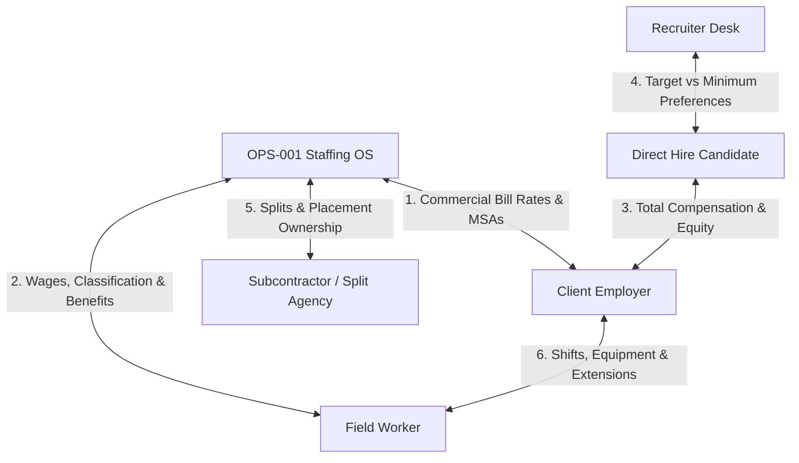
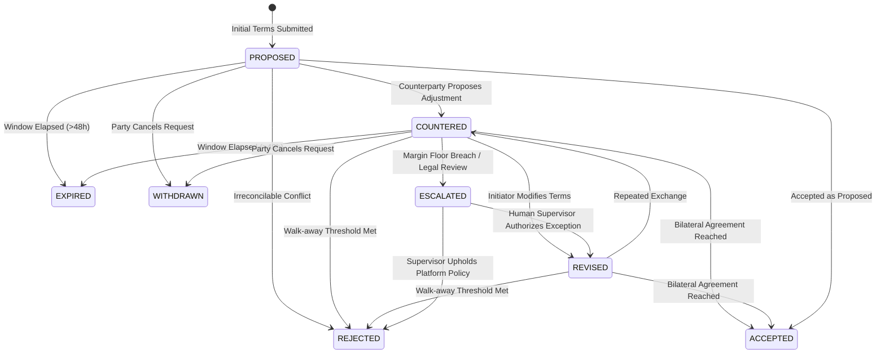

# OPS-001 Multi-Party Negotiation Engine
## Canonical Institutional Specification & Feasibility Architecture

> **Venture:** WorldwideBro Staffing Ops LLC (`OPS-001`)  
> **Classification:** Labor Economics Decision Support & Multi-Party Negotiation State Machine  
> **Master Operating Contract:** `ANTIGRAVITY.md` · `AGENTS.md` · `LABOR-TRANSACTION-ECONOMICS-ENGINE.md`  
> **Core Tenet:** *"Given the worker, employer, market, contract, and economics, show me the feasible negotiation space and the financial/operational consequences of each proposed change."*  
> **Version:** 1.0.0 (Institutional Canonical)  
> **Date:** September 2026

---

## Executive Summary

Negotiations in enterprise staffing extend far beyond basic base wage discussions. A commercial staffing firm operates at the intersection of six distinct negotiating relationships: **Employer ↔ Staffing Agency**, **Worker ↔ Staffing Agency**, **Candidate ↔ Employer**, **Recruiter ↔ Candidate**, **Agency ↔ Partner Agency**, and **Client ↔ Worker**.

The **OPS-001 Negotiation Engine** does not merely compose counteroffer emails. It is a deterministic mathematical, operational, and legal state machine that:
1. **Evaluates Requisition Feasibility:** Quantifies whether requested bill rates, wage rates, shifts, and credentials can clear the local labor market while honoring the **35.0% platform gross margin floor**.
2. **Detects Constraint Conflicts:** Identifies mutually incompatible employer demands (e.g. 5 years experience + 10 certifications + night shift + $18/hr bill rate + immediate availability).
3. **Models Economic Tradeoffs:** Simulates margin, spread, and monthly dollar contribution shifts under competing proposals.
4. **Governs State Machine Progression:** Enforces a formal lifecycle (`PROPOSED → COUNTERED → REVISED → ACCEPTED / REJECTED / ESCALATED`) with immutable audit logging.
5. **Guards Human-in-the-Loop Authority:** Strictly prevents autonomous AI agents from binding the company to legally sensitive employment terms or statutory liabilities without licensed human signoff.

---

## 1. Multi-Party Negotiation Matrix (The 6 Relational Axis)



### Axis 1: Employer ↔ Staffing Agency (Commercial Terms)
- **Bill Rate ($/hr):** Straight-time hourly invoice rate.
- **Agency Markup (%):** Spread over worker wage to cover taxes, insurance, and profit.
- **Direct Placement Fee (% / Flat):** 18%–25% first-year base compensation.
- **Conversion Buyout Fee:** Prorated spread or 15% salary buyout prior to 1,040 hours.
- **Guarantee Window:** 30-day 100% replacement warranty; 90-day 50% prorated credit.
- **Payment Terms:** Weekly Stripe ACH Auto-Debit, Net 15, Net 30, or Net 60.
- **Minimum Hours Guarantee:** 4-hour daily or 32-hour weekly minimum show-up terms.
- **Volume Rebate Schedule:** 1%–3% annual rebate clawback on billings exceeding $250k.
- **Overtime & Holiday Billing:** 1.5x to 2.0x client billing multiplier.
- **Shift & Urgency Differentials:** 2nd shift (+10%), 3rd shift (+20%), Emergency surge (+50%).
- **Cancellation & No-Show Fees:** 2–4 hours show-up pay if canceled <2 hours before shift start.
- **Compliance & Credential Costs:** Background checks, drug screens, and badging (pass-through + 45% markup).
- **Non-Circumvention Window:** 12–24 month candidate ownership protection.

### Axis 2: Worker ↔ Staffing Agency (Employment Terms)
- **Compensation Breakdown:** Base wage, overtime rate, shift differential, per diem, and travel.
- **Employment Classification:** W-2 Contingent Employee vs. permitted 1099 IC (strictly audited).
- **Work Schedule & Commitment:** Temporary, temp-to-hire, part-time, full-time, guaranteed hours.
- **Benefits Package:** Minimum Essential Coverage (MEC), major medical, dental, vision, PTO, holiday pay.
- **PPE & Tooling Allowance:** Pre-tax payroll deduction for certified boots and gear at wholesale cost.

> [!CAUTION]
> **Human Approval Hard-Stop:** AI agents are strictly prohibited from independently agreeing to or altering worker legal classification (W-2 vs. 1099), statutory overtime exemptions, workers' comp waivers, or medical benefit terms. All such transitions require licensed Human Resources / Operations Director authorization.

### Axis 3: Candidate ↔ Employer (Direct Hire Offers)
- **Total Compensation Package:** Base salary, performance bonus, sign-on bonus, relocation assistance.
- **Working Modality:** On-site, hybrid, or remote parameters with equipment stipends.
- **Executive Elements:** Equity grants, vesting cliffs, title/reporting structure, severance clauses.

### Axis 4: Recruiter ↔ Candidate (Preference Triage)
- **Candidate Target:** Aspirational compensation and role scope.
- **Candidate Minimum Floor:** Hard walk-away compensation threshold.
- **Negotiable Dimensions:** Commute distance, shift schedule, start date, title flexibility.
- **Non-Negotiable Dimensions:** Relocation limits, childcare scheduling windows, minimum wage floor.

### Axis 5: Staffing Agency ↔ Staffing Agency (Split & Subcontracting)
- **Revenue Split:** 50/50, 60/40 (Candidate Owner vs. Client Owner).
- **Candidate Ownership Window:** 6–12 months exclusive presentation rights.
- **Payment Timing:** Pass-through upon client invoice collection (paid-when-paid).
- **Replacement Responsibility:** Candidate-sourcing agency must supply warranty replacement.

### Axis 6: Client ↔ Worker (Assignment-Level Alignment)
- Daily shift start/end times, PPE requirements, lunch break schedules, site supervisors, and assignment extensions.

---

## 2. Requisition Feasibility & Constraint Conflict Engine

Novice recruiters accept job orders from employers without validating whether the requested parameters can clear the labor market. The OPS-001 Negotiation Engine runs a continuous feasibility diagnostic on every submitted requisition.

### The Feasibility Diagnostic Formula:
$$\text{Market Clearing Wage} \le \text{Offered Wage} \quad \land \quad \text{Offered Bill Rate} \ge \frac{\text{Offered Wage} \times (1 + \text{Burden} + \text{Comp})}{1 - \text{Margin Floor}}$$

### Canonical Conflict Scenario:
An employer submits an urgent requisition:
```text
Title:                  Forklift Operator / Material Handler
Requested Headcount:    10 Workers
Offered Client Bill:    $18.00 / hr
Requested Shift:        3rd Shift (Graveyard: 23:00 - 07:00)
Location:               Charlotte, NC
Experience Required:    5 Years
Certifications:         OSHA 10 + Class I-VII Forklift + Drug Screen
Start Date:             Immediate (<24 hours)
```

The OPS-001 Engine evaluates local market and economic realities:
```text
Market Clearing Wage (Charlotte):   $21.50 / hr
Night Shift Differential (+10%):    +$2.15 / hr
Scarcity & Urgency Premium (+15%):  +$3.22 / hr
Expected Competitive Worker Wage:   $26.87 / hr
Statutory Tax Burden (10.95%):      $2.94 / hr
Workers' Comp Code 8292 (4.50%):    $1.21 / hr
Total Burdened Labor Cost:          $31.02 / hr
Required Bill Rate (@ 35% Margin):  $47.72 / hr
─────────────────────────────────────────────────────────────────
DIAGNOSTIC VERDICT: CRITICAL CONSTRAINT CONFLICT (FEASIBILITY: 12%)
Deficit: Offered bill rate ($18.00) is $29.72 BELOW required rate ($47.72).
```

### Actionable Negotiation Levers Generated by Engine:
Instead of writing a generic rejection, the system equips the recruiter with **5 viable negotiation levers**:
1. **Increase Bill Rate:** Adjust client bill rate to **$48.00/hr** to attract 5-year veteran operators on graveyard shift.
2. **Relax Shift Constraint:** Move shift to Day Shift (1st Shift), reducing wage expectation from $26.87 to $21.50 (Required bill: **$38.20/hr**).
3. **Relax Experience Constraint:** Accept entry-level operators (0–1 year) certified through our in-house academy at $17.50 pay / **$31.00 bill**.
4. **Volume Commitment Discount:** If employer guarantees 1,040 hours per worker across all 10 headcount, adjust margin floor to 30.0% (Required bill: **$44.31/hr**).
5. **Hybrid Train-to-Hire:** Deploy contingent operators at $21.00 pay / $35.00 bill with a $1,500 employer-sponsored safety training voucher.

---

## 3. The 12 Negotiable Dimensions of a Job Requisition

The engine categorizes all requisition parameters into three operational levels:

```text
               REQUISITION PARAMETER TAXONOMY
┌────────────────────────────────────────────────────────────┐
│ 🔴 HARD REQUIREMENTS (Non-Negotiable)                      │
│    • Drug screen / Background clearance (Safety/Legal)    │
│    • Statutory licenses (e.g. CDL-A, Journeyman License)  │
│    • Maximum Client Budget Cap                             │
├────────────────────────────────────────────────────────────┤
│ 🟡 PREFERRED REQUIREMENTS (Negotiable with Tradeoffs)      │
│    • Years of experience (e.g. 5 years vs 3 years)        │
│    • Exact shift start times (+/- 1 hour flexibility)     │
│    • Non-mandatory tool requirements                      │
├────────────────────────────────────────────────────────────┤
│ 🟢 FULLY NEGOTIABLE LEVERS (Tradeoff Arbitrage)            │
│    • Bill rate vs Worker wage spread                      │
│    • Assignment duration & guaranteed weekly hours         │
│    • Conversion threshold (520h vs 1,040h)                │
│    • Overtime allocation authorization                    │
│    • Payment terms (Net 15 vs Net 30 with 2% discount)    │
└────────────────────────────────────────────────────────────┘
```

The 12 formal evaluation vectors:
1. **COMPENSATION:** Base bill, pay rate, overtime multipliers, shift differentials.
2. **EXPERIENCE:** Years required vs years sufficient with competency testing.
3. **SKILLS:** Mandatory trade competencies vs trainable secondary skills.
4. **CREDENTIALS:** Legally required licenses vs preferred manufacturer badges.
5. **LOCATION:** On-site jobsite radius, remote allowance, travel reimbursement.
6. **SCHEDULE:** 4x10 vs 5x8 workweeks, weekend rotations.
7. **SHIFT:** 1st, 2nd, 3rd, split-shift, on-call standby.
8. **START DATE:** Immediate rush (<24h) vs scheduled pipeline (14 days).
9. **CONTRACT DURATION:** Spot order (1 week) vs long-term contract (>6 months).
10. **HEADCOUNT VOLUME:** Single specialist vs 20-person construction roster.
11. **PAYMENT TERMS:** Friday auto-ACH vs Net 30 corporate invoice.
12. **CONVERSION BUYOUT:** Hours threshold (520 to 1,040h) and buyout schedules.

---

## 4. Staffing Economics Scenario Modeling

The engine provides side-by-side scenario simulation so recruiters can quantify the exact dollar impact of competing proposals:

### Live Scenario Simulation Table:
| Parameter | Baseline Request | Counterproposal A (Rate Increase) | Counterproposal B (Wage Optimization) | Counterproposal C (Volume Concession) |
|---|---|---|---|---|
| **Client Bill Rate** | $32.00 / hr | **$36.00 / hr** | $32.00 / hr | $30.00 / hr |
| **Worker Pay Rate** | $22.00 / hr | $22.00 / hr | **$20.50 / hr** | $19.50 / hr |
| **Burdened Labor Cost** | $25.18 / hr | $25.18 / hr | $23.46 / hr | $22.32 / hr |
| **Recruiting & Allocations** | $1.50 / hr | $1.50 / hr | $1.50 / hr | $1.00 / hr (Volume) |
| **Gross Margin %** | 21.31% ❌ | **30.06%** ⚠️ | **26.69%** ⚠️ | 25.60% ❌ |
| **Net Contribution / Hr** | $5.32 / hr | **$9.32 / hr** | **$7.04 / hr** | $6.68 / hr |
| **Monthly Profit (1 Worker - 160h)**| $851.20 | **$1,491.20** (+$640) | **$1,126.40** (+$275) | $1,068.80 |
| **Monthly Profit (10 Workers - 1,600h)**| $8,512.00 | **$14,912.00** | **$11,264.00** | **$10,688.00** |
| **Recruiter Feasibility Rating**| Unfillable (Low Margin)| High Fill Velocity | Medium Fill Velocity | High Headcount Volume |

Recruiters immediately see that **Counterproposal A** produces **+$6,400 more profit per month** across 10 workers while preserving top candidate fill velocity.

---

## 5. Total Compensation Modeling for Direct Hire Offers

When negotiating direct-hire placements, base salary is only one component of candidate acceptance. The engine quantifies the **Annualized Economic Value Package**:

$$\text{Total Compensation Value} = \text{Base Salary} + \text{Target Bonus} + \text{Sign-On} + \text{PTO Value} + \text{Health Benefits Value} + \text{Remote Flexibility Premium}$$

### Example Offer Package:
```text
Candidate Target:        $80,000 Annualized
Employer Offered Base:   $72,000 Annualized ($8,000 Base Gap)

Engine Package Architecture:
  ├── Base Salary:                     $72,000.00
  ├── Sign-On Retention Bonus:          $4,000.00 (Paid at 90 days)
  ├── 10% Performance Target Bonus:     $7,200.00
  ├── 15 Days Paid Time Off (PTO):      $4,153.85 (Value of 120 hours)
  ├── 100% Employer-Paid Healthcare:    $6,000.00 ($500/mo subsidy)
  └── Hybrid 2-Day Remote Flexibility:  $3,500.00 (Commute savings)
─────────────────────────────────────────────────────────────────
TOTAL ANNUALIZED ECONOMIC PACKAGE:    $96,853.85
CANDIDATE TARGET ALIGNMENT:           121.1% of Target ($80,000)
OUTCOME: Candidate accepts offer with $0 increase to client base budget.
```

---

## 6. The Negotiation State Machine

Every negotiation session across all 6 parties is governed by an immutable state machine:



### Immutable Audit Trail Fields:
Every transition creates an immutable record:
```json
{
  "session_id": "NEG-20260919-0084",
  "transition_id": "TR-004",
  "timestamp": "2026-09-19T20:35:12.441Z",
  "from_state": "COUNTERED",
  "to_state": "ACCEPTED",
  "party": "EMPLOYER",
  "party_id": "CLIENT-ACE-CONSTRUCTION",
  "agent_id": "REC-SARAH-JENKINS",
  "issue": "BILL_RATE_AND_OVERTIME_MULTIPLIER",
  "previous_terms": { "bill_rate_cents": 3200, "ot_multiplier": 1.5 },
  "agreed_terms": { "bill_rate_cents": 3600, "ot_multiplier": 1.5 },
  "financial_impact": {
    "gross_margin_pct": 36.2,
    "net_monthly_contribution_delta_dollars": 640.00
  },
  "authorized_by": "HUMAN_OPERATOR_ACEBLESS",
  "signature_sha256": "e3b0c44298fc1c149afbf4c8996fb92427ae41e4649b934ca495991b7852b855"
}
```

---

## 7. Recruiter Desk Decision Support

The Negotiation Engine surfaces contextual intelligence directly into the Recruiter Console:

> 💡 **Recruiter Desk Alert:**  
> *"Client offered \$32/hr bill rate for Pipe Welder requisition. Current clearing wage is \$28/hr. Burdened cost is \$32.05/hr, yielding a **-0.15% negative gross margin**.  
> **Recommended Counter:** Counter at **\$44.00/hr bill rate** with Net 15 terms. This achieves **36.3% platform gross margin** and delivers **\$1,912 monthly contribution profit** per welder."*
