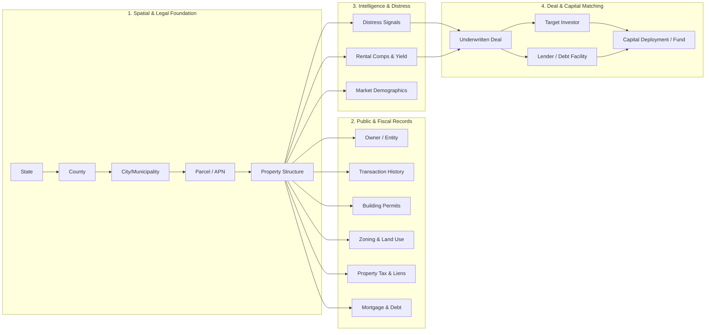

# 50-State Real Estate Intelligence Operating System & Universal Property Knowledge Graph

> **Venture:** WorldwideBro Holdings LLC (`RE-001`)  
> **Classification:** Institutional Real Estate Intelligence & Acquisition Operating System  
> **Master Operating Authority:** System Architecture & Infrastructure Control Plane (`CP-027`)  
> **Master Registries:**  
> - [`_REGISTRIES/CANONICAL/50_STATE_REAL_ESTATE_DATA_REGISTRY.csv`](file:///Users/acebless/Documents/The%20Company/Company%20Brain/_REGISTRIES/CANONICAL/50_STATE_REAL_ESTATE_DATA_REGISTRY.csv)  
> - [`_REGISTRIES/CANONICAL/INVESTOR_SOURCE_REGISTRY.csv`](file:///Users/acebless/Documents/The%20Company/Company%20Brain/_REGISTRIES/CANONICAL/INVESTOR_SOURCE_REGISTRY.csv)  
> - [`supabase/migrations/20260914_50_state_real_estate_intelligence.sql`](file:///Users/acebless/Documents/The%20Company/Company%20Brain/repos/re-001-worldwidebro-holdings/supabase/migrations/20260914_50_state_real_estate_intelligence.sql)

---

## 1. Executive Summary & Strategic Positioning

The commercial and residential real estate investment landscape is fundamentally fragmented. Retail investors rely on forums like **BiggerPockets**, off-market searchers subscribe to **PropStream** or **DealMachine**, commercial brokers list on **LoopNet** or **Crexi**, auction buyers monitor **Auction.com**, and capital syndicators operate separately through **CrowdStreet** or **Juniper Square**.

**RE-001 WorldwideBro Holdings** solves this structural fragmentation by treating real estate as a **50-State Real Estate Intelligence Graph**. Rather than simply scraping external listings, RE-001 establishes an authoritative, normalized, local-first property data layer fed directly by federal macroeconomic feeds, statewide GIS cadastre layers, and county tax assessor/deed recorder REST servers.

Every real estate opportunity is resolved along a 17-step graph traversal:
$$\text{State} \longrightarrow \text{County} \longrightarrow \text{City} \longrightarrow \text{Parcel} \longrightarrow \text{Property} \longrightarrow \text{Owner} \longrightarrow \text{Transaction} \longrightarrow \text{Permit} \longrightarrow \text{Zoning} \longrightarrow \text{Tax} \longrightarrow \text{Mortgage} \longrightarrow \text{Distress} \longrightarrow \text{Rental} \longrightarrow \text{Market} \longrightarrow \text{Investor} \longrightarrow \text{Deal} \longrightarrow \text{Capital}$$

This architecture turns RE-001 into a deterministic acquisition, automated DCF underwriting, property management, and institutional capital routing machine.

---

## 2. The 17-Step Core Graph Traversal



---

## 3. The 50-State Master Registry Structure

Across all 50 US States, property data is governed by county-level tax assessment and deed recording jurisdictions. RE-001 maintains a canonical 50-state registry ([`50_STATE_REAL_ESTATE_DATA_REGISTRY.csv`](file:///Users/acebless/Documents/The%20Company/Company%20Brain/_REGISTRIES/CANONICAL/50_STATE_REAL_ESTATE_DATA_REGISTRY.csv)):

| State | Code | Primary Geographic Unit | Dominant GIS & Assessment Engine | Core Ingestion Records |
| :--- | :--- | :--- | :--- | :--- |
| **Federal** | `US` | Federal Agencies | Census Bureau / HUD / BEA / FRED / FEMA | Macro rates, housing vacancies, TIGER tracts, flood maps |
| **Alabama** | `AL` | 67 Counties | Tyler Technologies / Delta Computer Systems | Parcels, owners, deeds, taxes, permits, zoning, liens, foreclosures |
| **Alaska** | `AK` | 19 Boroughs / Census Areas | Local Borough GIS / DNR Conveyance | Parcels, owners, deeds, assessments, taxes, permits, zoning |
| **Arizona** | `AZ` | 15 Counties | Esri ArcGIS / Tyler Tech / Maricopa GIS | Parcels, owners, deeds, taxes, permits, zoning, water rights |
| **California** | `CA` | 58 Counties | Megabyte Systems / Tyler Tech / City Portals | Parcels, owners, deeds, assessments, permits, zoning, rent caps, ADU |
| **Colorado** | `CO` | 64 Counties | Harris Govern / Tyler Tech / County Recorders | Parcels, owners, deeds, taxes, permits, zoning, mineral rights |
| **Florida** | `FL` | 67 Counties | FL Dept of Revenue Cadastral / Tyler Tech | Parcels, owners, deeds, taxes, permits, zoning, liens, HOA, tax deeds |
| **Georgia** | `GA` | 159 Counties | qPublic (Schneider Corp) / Tyler / GSCCCA | Parcels, owners, deeds, taxes, permits, zoning, liens, court records |
| **Illinois** | `IL` | 102 Counties | Tyler Tech / DEVNET / Cook County Assessor | Parcels, owners, deeds, taxes, permits, zoning, liens, PIN hierarchy |
| **New York** | `NY` | 62 Counties / Towns | NYS ORPS / NYC ACRIS / Socrata Open Data | Parcels, deeds, assessments, permits, zoning, ACRIS transfers |
| **North Carolina** | `NC` | 100 Counties | NC OneMap / Farragut / Tyler Technologies | Parcels, owners, deeds, taxes, permits, zoning, present-use value |
| **Texas** | `TX` | 254 Counties | TNRIS StratMap / True Automation / Harris HCAD | Parcels, owners, deeds, taxes, appraisal districts, liens, permits |
| *Remaining 38 States* | *Various* | *Counties / Parishes / Municipalities* | *Esri ArcGIS / Beacon Schneider / Tyler Tech* | *Parcels, deeds, assessments, property taxes, permits, zoning* |

---

## 4. Universal Property Intelligence Schema

Every ingested property in RE-001 normalizes into 9 deterministic relational tables:

### 1. `PROPERTY`
- `property_id` (UUID, Primary Key)
- `parcel_id` / `apn` (County Assessor Parcel Number)
- `state`, `county`, `city`, `zip`, `address`
- `latitude`, `longitude` (WGS84 High-Precision Centroid)
- `property_type` (`Residential`, `Multifamily`, `Commercial`, `Industrial`, `Land`, `Special Purpose`)
- `subtype` (`SFR`, `Townhouse`, `Duplex`, `Quadplex`, `Garden Apartments`, `Strip Retail`, `Flex Warehouse`)
- `lot_size` (Acres & SqFt), `building_sqft` (Gross Living Area / Heated SqFt)
- `year_built`, `bedrooms`, `bathrooms`, `units`, `stories`, `garage_spaces`, `basement_type`
- `construction_type` (`Frame`, `Masonry`, `Steel`, `Concrete Block`)
- `condition` (`Excellent`, `Good`, `Fair`, `Needs Repair`, `Gut Rehab`, `Tear Down`)
- `occupancy_status` (`Occupied`, `Vacant`, `Partially Leased`, `Abandoned`)
- `owner_occupied` (Boolean)

### 2. `OWNERSHIP`
- `owner_id` (UUID), `owner_name`
- `entity_name`, `entity_type` (`Individual`, `LLC`, `C-Corp`, `S-Corp`, `Trust`, `Estate`, `REIT`, `Institutional`)
- `mailing_address`, `out_of_state_owner` (Boolean)
- `ownership_percentage`, `purchase_date`, `purchase_price`, `holding_period_months`
- `portfolio_size` (Total parcels linked across county/state)
- `corporate_owner`, `trust_owner`, `llc_owner`

### 3. `TRANSACTION`
- `transaction_id`, `property_id`, `sale_date`, `sale_price`
- `seller_name`, `buyer_name`, `arms_length` (Boolean)
- `financing_type` (`Cash`, `Conventional`, `FHA`, `VA`, `Seller Financed`, `Private/Hard Money`)
- `loan_amount`, `price_per_sqft`, `days_on_market`, `listing_source`
- `deed_book`, `deed_page`, `transfer_tax_stamps`

### 4. `TAX & LIENS`
- `tax_record_id`, `tax_year`, `tax_status` (`Current`, `Delinquent`, `Exempt`)
- `total_assessed_value`, `land_assessed_value`, `building_assessed_value`
- `annual_tax_amount`, `delinquent` (Boolean), `delinquent_amount`
- `delinquent_years_count`, `tax_sale_date`, `tax_lien_holder`

### 5. `DEBT & MORTGAGE`
- `mortgage_id`, `lender_name`, `original_loan_amount`, `origination_date`
- `interest_rate`, `interest_rate_type` (`Fixed`, `ARM`, `Interest Only`)
- `loan_type` (`Agency`, `CMBS`, `Portfolio`, `DSCR`, `Bridge`, `Hard Money`)
- `maturity_date`, `lien_position` (`1st Senior`, `2nd Mezzanine`, `3rd Junior`)
- `estimated_balance`, `estimated_equity_dollars`, `estimated_equity_percent`
- `foreclosure_status` (`None`, `Notice of Default`, `Lis Pendens`, `Notice of Trustee Sale`, `REO`)

### 6. `PERMITS & CAPEX`
- `permit_id`, `permit_type` (`New Construction`, `Addition`, `Commercial Alteration`, `Roof`, `HVAC`, `Electrical`, `Plumbing`, `Demolition`)
- `permit_number`, `issue_date`, `completion_date`, `status` (`Issued`, `Under Inspection`, `Completed`, `Expired`)
- `licensed_contractor_name`, `license_number`
- `estimated_cost`, `actual_cost`, `scope_description`

### 7. `ZONING & DEVELOPMENT RIGHTS`
- `zoning_id`, `zoning_code`, `zoning_description`
- `allowed_use` (`Single Family`, `Multifamily`, `Mixed-Use`, `General Commercial`, `Light Industrial`)
- `max_density_units_per_acre`, `height_limit_ft`, `floor_area_ratio_far`, `max_lot_coverage_pct`
- `front_setback_ft`, `rear_setback_ft`, `side_setback_ft`
- `adu_allowed` (Boolean), `multifamily_allowed` (Boolean), `commercial_allowed` (Boolean)

### 8. `DISTRESS SIGNALS`
- `distress_id`
- `pre_foreclosure` (Boolean), `foreclosure_auction_date`
- `bank_owned_reo` (Boolean), `tax_delinquent` (Boolean)
- `physically_vacant` (Boolean), `absentee_owner` (Boolean)
- `probate_estate` (Boolean), `divorce_filing` (Boolean)
- `code_enforcement_violations_count`, `open_violation_description`
- `fire_damage` (Boolean), `water_damage` (Boolean)
- `composite_distress_score` (1 to 100)

### 9. `RENTAL INTELLIGENCE & COMP`
- `rental_id`, `current_monthly_rent`, `market_rent_estimate`
- `rent_per_sqft`, `gross_yield_pct`
- `current_occupancy_pct`, `lease_expiration_date`
- `section8_approved` (Boolean), `hud_fair_market_rent`
- `str_nightly_rate_estimate`, `str_occupancy_pct_estimate`, `str_annual_revenue_estimate`

---

## 5. The Federal Data Layer (Sitting Above the 50 States)

The 50 state records do not operate in isolation. A dedicated Federal Ingestion Tier normalizes macroeconomic, housing, and environmental baseline metrics across all jurisdictions:

```
┌────────────────────────────────────────────────────────────────────────┐
│                          FEDERAL DATA LAYER                            │
├─────────────────┬──────────────────────────────────────────────────────┤
│ Housing         │ HUD USPS Vacancy, FHA Lending Limits, FHFA HPI,      │
│                 │ Fannie Mae / Freddie Mac Multifamily Loan Performance│
├─────────────────┼──────────────────────────────────────────────────────┤
│ Demographics    │ Census Bureau ACS 5-Year, Decennial Counts, TIGER    │
│                 │ Boundaries, Migration Flows, Household Formation     │
├─────────────────┼──────────────────────────────────────────────────────┤
│ Macroeconomics  │ Federal Reserve Bank St. Louis (FRED): 10Y UST,      │
│                 │ 30Y Fixed Mortgage, SOFR, CPI Inflation, BLS Unemp   │
├─────────────────┼──────────────────────────────────────────────────────┤
│ Environmental   │ FEMA National Flood Hazard Layer (NFHL DFIRM Panels),│
│                 │ EPA Envirofacts (Superfund NPL, Brownfields, USTs)   │
├─────────────────┼──────────────────────────────────────────────────────┤
│ Transportation  │ FHWA National Highway Planning Network, FAA Airfield │
│                 │ Noise Contours, FTA Transit Oriented Corridors       │
└─────────────────┴──────────────────────────────────────────────────────┘
```

---

## 6. The 16-Layer Investor & Data Platform Ecosystem

Rather than treating external platforms as monolithic competitors, RE-001 classifies **65+ platforms** into 16 modular operational intelligence layers ([`INVESTOR_SOURCE_REGISTRY.csv`](file:///Users/acebless/Documents/The%20Company/Company%20Brain/_REGISTRIES/CANONICAL/INVESTOR_SOURCE_REGISTRY.csv)):

```
┌────────────────────────────────────────────────────────────────────────┐
│                   INVESTOR INTELLIGENCE REGISTRY                       │
├──────────────────────────────┬─────────────────────────────────────────┤
│ 1. Community & Education     │ BiggerPockets, Reddit, National REIA    │
├──────────────────────────────┼─────────────────────────────────────────┤
│ 2. Investor Networking       │ Connected Investors, InvestorBase       │
├──────────────────────────────┼─────────────────────────────────────────┤
│ 3. Property Intelligence     │ PropStream, ATTOM, CoreLogic, HouseCanary│
├──────────────────────────────┼─────────────────────────────────────────┤
│ 4. Lead Gen & Driving        │ DealMachine, BatchLeads, PropWire       │
├──────────────────────────────┼─────────────────────────────────────────┤
│ 5. Deal Analysis & Math      │ Internal DCF Engine, DealCheck, Mashvisor│
├──────────────────────────────┼─────────────────────────────────────────┤
│ 6. Residential Marketplaces  │ Zillow, Redfin, Realtor.com, Roofstock  │
├──────────────────────────────┼─────────────────────────────────────────┤
│ 7. Commercial Deals          │ LoopNet, Crexi, CoStar, CommercialCafe  │
├──────────────────────────────┼─────────────────────────────────────────┤
│ 8. Land Marketplaces         │ LandWatch, Land.com, LandSearch         │
├──────────────────────────────┼─────────────────────────────────────────┤
│ 9. Distress & Auctions       │ Auction.com, Xome, Hubzu, RealtyTrac    │
├──────────────────────────────┼─────────────────────────────────────────┤
│ 10. Rental Intelligence      │ AirDNA, RentCast, Rentometer, Zumper    │
├──────────────────────────────┼─────────────────────────────────────────┤
│ 11. Passive Crowdfunding     │ Fundrise, RealtyMogul, Groundfloor      │
├──────────────────────────────┼─────────────────────────────────────────┤
│ 12. Commercial Syndication   │ CrowdStreet, EquityMultiple, CAIS       │
├──────────────────────────────┼─────────────────────────────────────────┤
│ 13. Syndication Software     │ Juniper Square, InvestNext              │
├──────────────────────────────┼─────────────────────────────────────────┤
│ 14. Professional Networks    │ NAR, ALTA Title, MBA Lenders, 1031 FEA  │
├──────────────────────────────┼─────────────────────────────────────────┤
│ 15. Government Records       │ County Assessors, Registers, Accela     │
├──────────────────────────────┼─────────────────────────────────────────┤
│ 16. Macroeconomic Feeds      │ FRED St. Louis, Census ACS, FEMA NFHL   │
└──────────────────────────────┴─────────────────────────────────────────┘
```

---

## 7. Universal Professional Network Taxonomy

Every professional in the RE-001 operating network is indexed by geography, license verification, deal volume, and specialty:

1. `INVESTOR_AGENT` (Licensed agent with investor/off-market specialty)
2. `COMMERCIAL_BROKER` (CRE broker: multifamily, industrial, retail, office)
3. `COMMERCIAL_LENDER` (Bank / credit union commercial loan officer)
4. `HARD_MONEY_LENDER` (Short-term asset-based bridge debt lender)
5. `PRIVATE_LENDER` (High-net-worth individual note holder)
6. `DSCR_LENDER` (Non-QM debt service coverage lender)
7. `MORTGAGE_BROKER` (Wholesale debt placement intermediary)
8. `REAL_ESTATE_ATTORNEY` (Real estate closing & transaction counsel)
9. `TITLE_COMPANY` (ALTA title insurance underwriter & abstracter)
10. `ESCROW_OFFICER` (Settlement disbursement agent)
11. `CERTIFIED_CPA` (Real estate tax strategist: depreciation, cost segregation)
12. `TAX_ATTORNEY` (Property tax appeal & entity structuring specialist)
13. `1031_INTERMEDIARY` (Qualified intermediary for like-kind exchanges)
14. `SDIRA_CUSTODIAN` (Self-directed IRA & Solo 401(k) custodian)
15. `INSURANCE_BROKER` (Property, casualty, and builder's risk specialist)
16. `PROPERTY_MANAGER` (Licensed residential/commercial property manager)
17. `GENERAL_CONTRACTOR` (Licensed unlimited building contractor)
18. `SUBCONTRACTOR_HVAC` (Mechanical HVAC licensed trade contractor)
19. `SUBCONTRACTOR_ELEC` (Licensed electrical contractor)
20. `SUBCONTRACTOR_PLUMB` (Licensed plumbing contractor)
21. `ARCHITECT` (AIA registered architect: site planning, elevations)
22. `CIVIL_ENGINEER` (Grading, storm water, utility civil engineer)
23. `CERTIFIED_APPRAISER` (State-certified general real estate appraiser)
24. `HOME_INSPECTOR` (Licensed home & commercial building inspector)
25. `LAND_SURVEYOR` (ALTA/NSPS boundary and topographic land surveyor)
26. `ENVIRONMENTAL_ENGINEER` (Phase I / Phase II ESA environmental consultant)
27. `DEVELOPER_SPONSOR` (Real estate developer & syndication sponsor)
28. `WHOLESALER` (Off-market equitable interest assignor)
29. `SYNDICATOR_GP` (General Partner / Fund Manager)
30. `FAMILY_OFFICE_LP` (Private equity LP capital partner)

---

## 8. Investor Strategy Taxonomy (32 Strategies)

Every investor in RE-001 is mapped to their precise operational acquisition mandate:

1. `HOUSE_HACK` (Owner-occupied 1-4 unit multifamily)
2. `BRRRR` (Buy, Rehab, Rent, Refinance, Repeat)
3. `BUY_AND_HOLD` (Long-term cash flow SFR/MFR hold)
4. `FIX_AND_FLIP` (Short-term heavy value-add disposition)
5. `WHOLESALING` (Contract assignment / double close)
6. `NEW_CONSTRUCTION` (Speculative single-family or commercial ground-up)
7. `LAND_SPECULATION` (Pre-development land banking)
8. `MULTIFAMILY_VALUE_ADD` (5-100 unit repositioning)
9. `COMMERCIAL_RETAIL` (Neighborhood retail, strip centers, NNN)
10. `INDUSTRIAL_FLEX` (Small-bay warehouse, distribution, logistics)
11. `OFFICE_CONVERSION` (Adaptive reuse to residential/hospitality)
12. `MOBILE_HOME_PARK` (Lot rent land lease communities)
13. `SELF_STORAGE` (Climate and drive-up storage facilities)
14. `SHORT_TERM_RENTAL` (STR Airbnb / Vrbo high-yield vacation assets)
15. `MID_TERM_RENTAL` (Corporate housing, traveling nurse 30-90 day leases)
16. `STUDENT_HOUSING` (By-the-bed university rentals)
17. `SENIOR_HOUSING` (Age-restricted independent living)
18. `ASSISTED_LIVING` (Residential assisted living and memory care)
19. `GROUP_HOMES` (Supportive housing & congregate care facilities)
20. `SOBER_LIVING` (Recovery housing under Fair Housing Act protections)
21. `CORPORATE_HOUSING` (Executive fully furnished mid-term rentals)
22. `AFFORDABLE_HOUSING` (Low-Income Housing Tax Credit LIHTC)
23. `SECTION_8_SPECIALIST` (Guaranteed HUD housing voucher portfolio)
24. `TAX_LIEN_CERTIFICATES` (High-yield county tax lien redemption)
25. `TAX_DEEDS` (Direct county tax foreclosure sale bidding)
26. `MORTGAGE_NOTE_INVESTING` (Performing and non-performing debt acquisition)
27. `PRIVATE_LENDING` (1st position real estate debt placement)
28. `SYNDICATION_LP` (Passive limited partner fund participation)
29. `BUILD_TO_RENT` (Subdivision community master development for leasing)
30. `ADU_INFILL` (Accessory Dwelling Unit residential densification)
31. `OPPORTUNITY_ZONE` (QOZ long-term capital gains tax shelter)
32. `1031_EXCHANGE_BUYER` (Urgent 45-day identified replacement capital)

---

## 9. Pluggable County GIS Adapter Architecture

RE-001 uses an autonomous adapter pattern to ingest county GIS servers:

```typescript
export interface CountyGISAdapter {
  readonly stateCode: string;
  readonly countyName: string;
  readonly fipsCode: string;
  readonly baseUrl: string;

  /** Fetch raw parcel features from County REST API */
  fetchParcels(criteria: ParcelQueryCriteria): Promise<RawCountyFeature[]>;

  /** Calculate exact polygon centroid */
  computeCentroid(geometry: any): { lat: number; lng: number };

  /** Normalize county-specific attributes to RE-001 Schema */
  normalizeToDeal(feature: RawCountyFeature): NormalizedUnderwritingDeal;
}
```

- **Implemented & Verified Live:** `MecklenburgAdapter` (`PLN/AllParcelData/MapServer/0`) ingesting 60 real parcels in Charlotte, NC.
- **Pipeline Ready:** `WakeCountyAdapter` (Raleigh-Durham), `FultonCountyAdapter` (Atlanta), `HarrisCountyAdapter` (Houston), `MaricopaAdapter` (Phoenix).
- **National Fallback:** `RegridNationalAdapter` connecting all 3,143 US counties via a single API key.

---

## 10. The Strategic End State: 200ms Multi-Variable Capital Query

When this graph is fully indexed across Neo4j and Supabase PostgreSQL, RE-001 executes queries previously impossible in real estate:

> **Natural Language Institutional Prompt:**  
> *"Find 25 off-market commercial or multifamily parcels in Mecklenburg County under \$1.5M, absentee-owned, with at least 30% estimated equity, tax delinquent or code violation flagged, zoning-compatible with higher density or ADU, market rents exceeding \$2,200/mo, zero flood zone overlap, and match each parcel with an approved local general contractor, DSCR lender, and accredited 1031 exchange buyer."*

**System Response Output:**
1. **Spatial Filter:** Bounding box query on Mecklenburg County parcel polygons.
2. **Equity & Distress Join:** Filter by `absentee_owner = true`, `delinquent = true`, and `estimated_equity_pct >= 0.30`.
3. **Zoning & Regulatory Gating:** Validate `zoning_code IN ('MFR', 'TOD', 'B-1', 'N1-D')` and `flood = false`.
4. **Algorithmic DCF Underwriting:** Calculate NOI, DSCR at current FRED 30Y mortgage rate, and stabilized exit cap rate.
5. **Graph Triangulation:** Query the Knowledge Graph to match the parcel to the highest-scoring local contractor (Thompson Construction), lender (Piedmont Capital Bank), and 1031 investor partner (Meridian Wealth Advisors).

**Result:** An actionable, mathematically verified acquisition pipeline with zero manual data entry.
