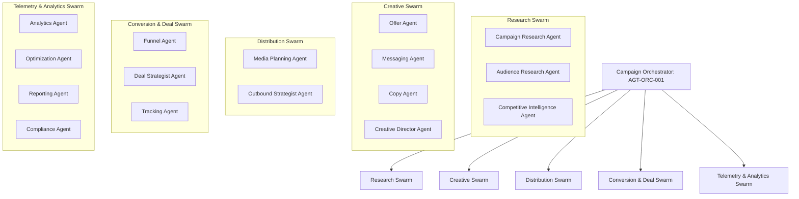

# AI-CAMPAIGNS — Autonomous Multi-Agent Campaign Orchestration

> **Canonical Document ID:** `DOC-AIC-CAM-001`  
> **Authority:** Autonomous Execution & Agent Architecture (CP-016 / CP-019 / CP-027)  
> **Status:** ACTIVE SPECIFICATION

---

## 1. Multi-Agent Architecture for Campaigns

In Company Brain, campaigns are not run by overworked human marketing teams. They are executed autonomously by a coordinated swarm of specialized subagents orchestrated via **Fractal**, **Graft**, and **OmniRoute**:

---

## 2. The 16 Specialized Campaign Agents

1. **`CAMPAIGN-ORCHESTRATOR` (`AGT-ORC-001`):** Master coordinator; enforces state machine transitions, budget ceilings, and kill criteria.
2. **`CAMPAIGN-RESEARCH-AGENT` (`AGT-RES-001`):** Analyzes repository trends and developer discussions.
3. **`AUDIENCE-RESEARCH-AGENT` (`AGT-AUD-001`):** Extracts, verifies, and scrubs prospect lists from Apollo/Crunchbase.
4. **`COMPETITIVE-INTELLIGENCE-AGENT` (`AGT-CMP-001`):** Monitors competitor ad libraries and foundation model pricing shifts.
5. **`OFFER-AGENT` (`AGT-OFF-001`):** Formulates value stacks, guarantees, and pricing structures.
6. **`MESSAGING-AGENT` (`AGT-MSG-001`):** Synthesizes core narratives and contrastive positioning wedges.
7. **`COPY-AGENT` (`AGT-CPY-001`):** Drafts high-conversion, direct-response cold outbound scripts.
8. **`CREATIVE-AGENT` (`AGT-CRT-001`):** Generates technical architecture diagrams, SVG assets, and terminal visual specs.
9. **`MEDIA-PLANNING-AGENT` (`AGT-MED-001`):** Manages flighting schedules, wave sequencing, and send rate limits.
10. **`OUTBOUND-AGENT` (`AGT-OUT-001`):** Orchestrates personalized email sending and inbox warmup.
11. **`FUNNEL-AGENT` (`AGT-FUN-001`):** Monitors Cal.com booking availability and landing page performance.
12. **`DEAL-STRATEGIST-AGENT` (`AGT-DEA-001`):** Generates discovery call briefs, qualification summaries, and custom SOWs.
13. **`TRACKING-AGENT` (`AGT-TRK-001`):** Audits UTM links, webhook delivery, and pixel firing.
14. **`ANALYTICS-AGENT` (`AGT-ANL-001`):** Computes real-time conversion rates, CAC, and ROAS.
15. **`OPTIMIZATION-AGENT` (`AGT-OPT-001`):** Runs statistical significance tests and prunes underperforming variants.
16. **`COMPLIANCE-AGENT` (`AGT-COM-001`):** Scans all outbound copy for regulatory compliance and substantiation.

---

## 3. Master Links

- Master OS: [[CAMPAIGNS/CAMPAIGN-OS]]
- Agent Roles: [[CAMPAIGNS/CAMPAIGN-AGENT-ROLES]]
- Agent Permissions: [[CAMPAIGNS/CAMPAIGN-AGENT-PERMISSIONS]]
- Automation: [[CAMPAIGNS/CAMPAIGN-AUTOMATION]]
