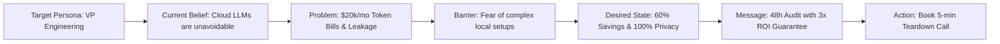

# AUDIENCES — Master Audience System & Market Architecture

> **Canonical Document ID:** `DOC-AUD-CAM-001`  
> **Authority:** Commercial Strategy (CP-006 / CP-026)  
> **Status:** ACTIVE AUDIENCE SPECIFICATION

---

## 1. System Architecture: Beyond Flat Demographics

In legacy marketing, audience definitions are superficial demographic labels (e.g., "Tech professionals aged 25-45"). In Company Brain, an **Audience** is a structured, stateful behavioral graph:

```text
AUDIENCE ──> CURRENT BELIEF ──> PROBLEM ──> BARRIER ──> DESIRED STATE ──> MESSAGE ──> ACTION
```



---

## 2. Master Audience Registry for WorldwideBro (`AUD-001`)

- **Audience Code:** `AUD-001`
- **Designation:** Engineering Leadership at AI-Native & Scaling Software Companies
- **TAM Size:** ~12,500 accounts globally.
- **Serviceable Addressable Market (SAM):** ~2,800 US/Canada/UK venture-backed Series Seed through Series B startups.
- **Core Commonality:** High developer seat count utilizing Claude Code, Cursor, or autonomous agents, with escalating monthly API invoices.

---

## 3. Master Links

- Master OS: [[CAMPAIGNS/CAMPAIGN-OS]]
- Audience Strategy: [[CAMPAIGNS/AUDIENCE-STRATEGY]]
- Segments: [[CAMPAIGNS/SEGMENTS]]
- Personas: [[CAMPAIGNS/PERSONAS]]
- Belief Mapping: [[CAMPAIGNS/BELIEFS]]
