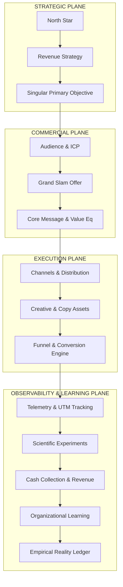

# CAMPAIGN-OS — The Universal Campaign Operating System

> **Canonical Document ID:** `DOC-OS-CAM-001`  
> **Authority:** System Architecture & Commercial Operations (CP-006 / CP-027)  
> **Status:** ACTIVE OPERATING SYSTEM  
> **Core Integration:** Connects `REVENUE-OS`, `MARKETING-OS`, `FUNNEL-OS`, `CONTENT-OS`, `SALES-OS`, and `METRICS-OS`

---

## 1. System Philosophy: The Campaign as a Revenue Execution Layer

In most organizations, a campaign is treated as an isolated marketing artifact—a series of ads, a landing page, or a creative brief that dissolves after ad spend ceases.

In **Company Brain**, **CAMPAIGN-OS** is the sovereign execution bridge. It sits directly at the intersection of business strategy and empirical reality. A campaign is defined as:

$$\text{Campaign} = \langle \text{Objective}, \text{Audience}, \text{Offer}, \text{Message}, \text{Channels}, \text{Budget}, \text{Funnel}, \text{Telemetry}, \text{Experiments}, \text{Stop Rules}, \text{Learning} \rangle$$



---

## 2. The 6-Way OS Interconnect

CAMPAIGN-OS does not operate in a vacuum. It synchronizes across six vital organizational operating systems:

```text
                  ┌───────────────────────────────┐
                  │          REVENUE-OS           │
                  │   (LTV, CAC, Pricing, Cash)   │
                  └──────────────┬────────────────┘
                                 │
         ┌───────────────────────┼───────────────────────┐
         │                       │                       │
┌────────┴────────┐    ┌─────────┴─────────┐   ┌─────────┴────────┐
│  MARKETING-OS   │    │    CAMPAIGN-OS    │   │     SALES-OS     │
│(Brand, Creative,│<──>│  (Coordinated GTM │<─>│  (Pipeline, CRM, │
│  Positioning)   │    │ Execution Engine) │   │ Discovery, SOW)  │
└────────┬────────┘    └─────────┬─────────┘   └─────────┬────────┘
         │                       │                       │
         └───────────────────────┼───────────────────────┘
                                 │
         ┌───────────────────────┴───────────────────────┐
         │                       │                       │
┌────────┴────────┐    ┌─────────┴─────────┐   ┌─────────┴────────┐
│   CONTENT-OS    │    │     FUNNEL-OS     │   │    METRICS-OS    │
│(Media, Articles,│    │ (Landing Pages,   │   │(Telemetry, KPIs, │
│  Social Posts)  │    │  Capture, Handoff)│   │  Grafana, Neo4j) │
└─────────────────┘    └───────────────────┘   └──────────────────┘
```

1. **`REVENUE-OS` Connection:** Defines cash flow targets, payback periods, pricing floors, and allowable CAC thresholds.
2. **`MARKETING-OS` Connection:** Provides the brand envelope, visual design tokens, brand safety guardrails, and category positioning.
3. **`SALES-OS` Connection:** Consumes marketing-qualified leads (MQLs), orchestrates high-touch discovery calls, and reports deal win-loss telemetry back into the campaign.
4. **`CONTENT-OS` Connection:** Supplies authoritative technical write-ups, code demonstrations, video teardowns, and editorial distribution assets.
5. **`FUNNEL-OS` Connection:** Hosts high-speed landing pages, qualification routers, automated calendar schedulers, and payment escrow gateways.
6. **`METRICS-OS` Connection:** Ingests live UTM telemetry, event webhooks, cost pacing, and calculates real-time contribution margin.

---

## 3. The 16-Stage Campaign Operating Loop

Every campaign initiated in Company Brain must traverse the canonical 16-stage state machine:

```text
 1. IDEA          ──> Initial spark or market gap identification
 2. RESEARCH      ──> Empirical TAM, competitor, and customer friction analysis
 3. OPPORTUNITY   ──> Scored business thesis with quantified expected value
 4. BRIEF         ──> Formal architectural contract specifying bounds
 5. STRATEGY      ──> Positioning, core message, value proposition, channel mix
 6. PLANNING      ──> Work breakdown, milestones, budget allocation, RACI
 7. APPROVAL      ──> Executive sign-off, capital authorization, policy check
 8. PRODUCTION    ──> Copywriting, asset rendering, funnel assembly, tracking code
 9. QA            ──> Pre-flight verification (links, forms, pixels, compliance)
10. LAUNCH        ──> Day Zero coordinated deployment across channels
11. DELIVERY      ──> Live media flighting, sequence sending, traffic routing
12. MEASUREMENT   ──> Continuous real-time telemetry and variance analysis
13. OPTIMIZATION  ──> Bid tuning, audience pruning, creative iteration
14. DECISION GATE ──> SCALE / PIVOT / PAUSE / KILL (Automated rule execution)
15. POST-MORTEM   ──> Blameless retrospective, financial reconciliation
16. LEARNING      ──> Ingestion of empirical findings into Knowledge Core
```

---

## 4. Operating Rules for Campaign Management

1. **Measurement Designed Before Flighting:** Never launch a campaign without tracking, conversion event pixels, and automated attribution models fully configured and QA-verified.
2. **Singular Primary Objective:** Every campaign has exactly ONE non-negotiable quantitative metric that determines whether it was a success or failure.
3. **Hard Stop-Rules Bound at Inception:** Every campaign file must specify explicit conditions under which it will be paused or killed automatically to protect company capital.
4. **No Ephemeral Disappearance:** When a campaign concludes, it must produce an executive retrospective and structured records in `_REGISTRIES/CAMPAIGN-RESULT-REGISTRY.json`.
5. **Real-World Grounding:** Never launch speculative campaigns for fictional ventures; all campaigns must anchor in verified capabilities and products.

---

## 5. Master Links & Navigation

- Individual Campaign Specification: [[CAMPAIGNS/CAMPAIGN]]
- Architectural Blueprint: [[CAMPAIGNS/CAMPAIGN-ARCHITECTURE]]
- Lifecycle Protocol: [[CAMPAIGNS/CAMPAIGN-LIFECYCLE]]
- Mathematical Model: [[CAMPAIGNS/CAMPAIGN-MODEL]]
- Master Index: [[INDEX.md]]
- Operating Laws: [[ANTIGRAVITY.md]]
