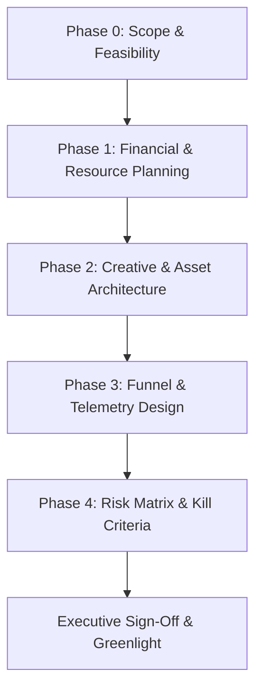

# CAMPAIGN-PLANNING — End-to-End Planning Methodology

> **Canonical Document ID:** `DOC-PLN-CAM-001`  
> **Authority:** Program Management (CP-006 / CP-027)  
> **Status:** ACTIVE STANDARD OPERATING PROCEDURE

---

## 1. The Pre-Flight Planning Framework

Every campaign in Company Brain must undergo structured pre-flight planning before production commences. This prevents resource dissipation and guarantees alignment with budget and revenue gates.

---

## 2. Planning Phases

### Phase 0: Scope & Feasibility
- Define the singular measurable objective (\(O_p\)).
- Quantify the total addressable audience and extract target accounts.
- Verify that required underlying capabilities exist in `_REGISTRIES/CANONICAL/`.

### Phase 1: Financial & Resource Planning
- Allocate capital according to the 5-way budget split: Data, Infrastructure, Creative, Paid Media, Contingency.
- Establish baseline target CAC, expected ROAS, and maximum allowable spend.
- Designate the Single-Threaded Owner (`OWN-001`).

### Phase 2: Creative & Asset Architecture
- Complete the Creative Brief (`DOC-BRF-001`).
- Map the Message Matrix: 3 Angles \(\times\) 2 Personas = 6 Hook Permutations.
- Commission required copy, teardowns, slide decks, and code snippets.

### Phase 3: Funnel & Telemetry Design
- Map the conversion journey from first touch to cash collection.
- Define UTM parameters and event schemas in `_REGISTRIES/CAMPAIGN-UTM-REGISTRY.json`.
- Configure webhook receivers and Cal.com discovery booking links.

### Phase 4: Risk Matrix & Stop-Rules
- Identify top failure modes (deliverability blocks, low response rate, security objections).
- Codify hard stopping rules: at what spend threshold or CPA do we pause or kill the campaign?

---

## 3. Campaign Planning Checklist

- [ ] Single Primary Objective defined and quantified.
- [ ] Audience list extracted, deduped, and verified.
- [ ] Commercial offer document linked with pricing and guarantee.
- [ ] Budget allocated and locked in `_REGISTRIES/CAMPAIGN-BUDGET-REGISTRY.json`.
- [ ] Creative brief approved by Creative Owner.
- [ ] Telemetry and UTM taxonomy registered.
- [ ] Stop-rules and kill criteria signed off by Sovereign Operator.

---

## 4. Master Links

- Master System: [[CAMPAIGNS/CAMPAIGN-OS]]
- Milestones & Schedule: [[CAMPAIGNS/SCHEDULE]]
- Budget Breakdown: [[CAMPAIGNS/BUDGET]]
- Launch Checklist: [[CAMPAIGNS/LAUNCH-CHECKLIST]]
