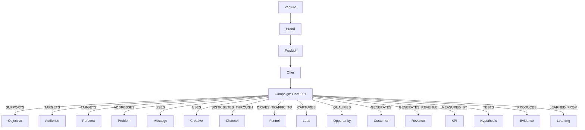

# CAMPAIGN-RELATIONSHIPS — Relational Graph Map & Predicates

> **Canonical Document ID:** `DOC-REL-CAM-002`  
> **Authority:** Knowledge Architecture (CP-008 / CP-027)  
> **Status:** ACTIVE SPECIFICATION  
> **Master Ontology Reference:** [[_RELATIONSHIPS/CAMPAIGN-RELATIONSHIPS.md]]

---

## 1. Graph Architecture

In the Company Brain Neo4j database (`:7687`), the Campaign node serves as the central hub linking strategic vision to operational revenue and learning:

---

## 2. Key Controlled Predicates

See full definitions, examples, and Cypher templates in the master file:
[`_RELATIONSHIPS/CAMPAIGN-RELATIONSHIPS.md`](file:///Users/acebless/Documents/The%20Company/Company%20Brain/_RELATIONSHIPS/CAMPAIGN-RELATIONSHIPS.md).

- **Alignment:** `SUPPORTS`, `ADVANCES`, `ALIGNS_WITH`, `SERVES`
- **Market:** `TARGETS`, `SEGMENTS`, `ADDRESSES`, `SOLVES`
- **Execution:** `PROMOTES`, `USES`, `DELIVERS`, `DISTRIBUTES_THROUGH`, `PUBLISHED_ON`
- **Conversion:** `DRIVES_TRAFFIC_TO`, `CONVERTS_THROUGH`, `CAPTURES`, `QUALIFIES`, `GENERATES`, `GENERATES_REVENUE`
- **Telemetry:** `ATTRIBUTES_TO`, `MEASURED_BY`, `TRACKS`
- **Scientific:** `TESTS`, `VALIDATES`, `CONTRADICTED_BY`, `PRODUCES`, `LEARNED_FROM`
- **Control:** `OPTIMIZES`, `SCALES`, `PAUSES`, `KILLS`, `DEPENDS_ON`, `CONSTRAINED_BY`

---

## 3. Master Links

- Master Graph Registry: [[_RELATIONSHIPS/CAMPAIGN-RELATIONSHIPS.md]]
- Extended Ontology: [[_ONTOLOGY/RELATIONSHIPS_EXTENDED.yaml]]
- Master OS: [[CAMPAIGNS/CAMPAIGN-OS]]
