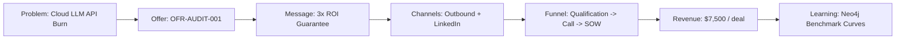

# CAMPAIGN: Local-First AI Infrastructure & Repo Intelligence Audit (CAM-001)

> **Canonical Document ID:** `DOC-CAM-001`  
> **Master Operating Contract:** [[ANTIGRAVITY.md]]  
> **Campaign Operating System:** [[CAMPAIGNS/CAMPAIGN-OS]]  
> **Commercial Offer:** [[COMMERCIAL/OFFERS/OFFER-001-LOCAL-AI-AUDIT|OFR-AUDIT-001]]  
> **Outreach Script Vault:** [[COMMERCIAL/OUTREACH/OUTREACH-001-TARGET-PROSPECTS|DOC-OUT-001]]  
> **Status:** `LIVE` | **Reality Status:** `VERIFIED`

---

## 1. Executive Summary & Context

`CAM-001` is the flagship commercial campaign executing the go-to-market rollout for **WorldwideBro's Local-First AI Infrastructure & Repo Intelligence Audit** ([`OFR-AUDIT-001`](file:///Users/acebless/Documents/The%20Company/Company%20Brain/COMMERCIAL/OFFERS/OFFER-001-LOCAL-AI-AUDIT.md)). 

Historically, corporate campaigns in Company Brain risked collapsing into speculative documentation or abstract strategy notes. In contrast, under the 45 rules of [`ANTIGRAVITY.md`](file:///Users/acebless/Documents/The%20Company/Company%20Brain/ANTIGRAVITY.md) (Rule #1 North Star, Rule #3 No Fake Completion, Rule #4 No Placeholder Architecture), `CAM-001` exists as an active, empirical revenue loop that connects market pain to cash collection and closed-loop organizational learning.



---

## 2. Canonical Identity & Semantic Anchors

- **Internal Canonical ID:** `CAM-001`
- **Program Association:** `CAMP-REV-2026-Q3`
- **External Semantic Reference (Wikidata):**
  - Concept: `Q1761818` ([Advertising campaign](https://www.wikidata.org/wiki/Q1761818))
  - Field: `Q37038` ([Advertising](https://www.wikidata.org/wiki/Q37038))
  - Industry: `Q39809` ([Marketing](https://www.wikidata.org/wiki/Q39809))
  - Discipline: `Q1323528` ([Digital marketing](https://www.wikidata.org/wiki/Q1323528))
- **Wikipedia Human Reference:** [Advertising campaign](https://en.wikipedia.org/wiki/Advertising_campaign)
- **Governing Venture:** [`VEN-001`](file:///Users/acebless/Documents/The%20Company/Company%20Brain/_REGISTRIES/VENTURE_REGISTRY.yaml)

---

## 3. Core Strategy & Objectives

### 3.1 Primary Objective
Generate **5 closed, paid audit engagements ($37,500 USD gross cash)** by **October 15, 2026**, validating enterprise demand for local-first code intelligence and token compression architectures.

### 3.2 Secondary Objectives
1. Build empirical repository intelligence graphs across 20 prospective codebases to feed benchmark datasets into Knowledge Core.
2. Establish baseline conversion benchmarks (Open Rate, Positive Reply Rate, Discovery-to-Close) for WorldwideBro outbound sales operations.

---

## 4. Audience, Problem & Persona Matrix

| Dimension | Specification | Reference |
| :--- | :--- | :--- |
| **Audience Cohort** | Engineering leadership at AI-native venture-backed software companies | [[CAMPAIGNS/AUDIENCES]] |
| **Target Segments** | 1. Fast-scaling AI Agent Startups (15–50 engineers, >$8k/mo token bills)<br>2. Regulated FinTech/HealthTech engineering teams | [[CAMPAIGNS/SEGMENTS]] |
| **Primary Personas** | 1. VP of Engineering / Head of Platform (`PER-001`)<br>2. CTO / Technical Founder (`PER-002`) | [[CAMPAIGNS/PERSONAS]] |
| **Acute Problem** | Uncontrollable cloud LLM inference burn ($5k–$30k/mo) on raw traces, combined with security fears regarding customer code leakage | [[CAMPAIGNS/PAIN-POINTS]] |
| **Belief Transformation** | *From:* "High cloud LLM bills are the unavoidable cost of building AI agents."<br>*To:* "Local-first cascading, AST graph retrieval, and token compression slash bills by 60%+ with zero latency or accuracy penalty." | [[CAMPAIGNS/BELIEFS]] |

---

## 5. The Commercial Offer & Conversion Engine

- **Commercial Offer Document:** [`OFFER-001-LOCAL-AI-AUDIT.md`](file:///Users/acebless/Documents/The%20Company/Company%20Brain/COMMERCIAL/OFFERS/OFFER-001-LOCAL-AI-AUDIT.md)
- **Unit Price:** **$7,500 USD** fixed fee (50% upfront deposit / 50% upon presentation delivery).
- **Core Deliverables:**
  1. *Token Compression & Intelligent Routing Benchmark*: Stacked RTK / Caveman compression analysis.
  2. *Codebase Reality & Knowledge Graph Blueprint*: Neo4j AST relational model eliminating agent hallucinations.
  3. *Local Hardware & On-Premises Inference Strategy*: Apple Silicon M-series sizing and Tailscale private mesh setup.
- **Risk Reversal Guarantee:** **3X ROI Guarantee** — If the audit fails to identify at least $22,500 in annualized infrastructure savings, fee is 100% refunded immediately.

---

## 6. Distribution, Channels & Touchpoints

```text
Target List (Apollo/LinkedIn) 
   ──> Direct Outbound Email (Touch 1: Cost Pain Hook)
   ──> LinkedIn Touch (Touch 2: Local AI Case Study)
   ──> Follow-Up Email (Touch 3: 3x ROI Guarantee Pitch)
   ──> Cal.com Booking (30-min Discovery Call)
   ──> Mutual NDA & 48-Hour Execution Sprint
   ──> Executive Presentation & Upsell to Retainer / Implementation
```

- **Active Channels:**
  - `CHN-OUT-001`: Direct cold email to verified engineering leaders ([[CAMPAIGNS/CHANNELS/OUTBOUND]]).
  - `CHN-LNK-001`: LinkedIn founder-to-founder outreach ([[CAMPAIGNS/CHANNELS/LINKEDIN]]).
  - `CHN-CNT-001`: Technical breakdown whitepapers on local MLX code intelligence ([[CAMPAIGNS/CHANNELS/CONTENT]]).

---

## 7. Budget, Unit Economics & Resource Allocation

- **Total Authorized Budget:** **$2,500 USD** ([`BUD-001`](file:///Users/acebless/Documents/The%20Company/Company%20Brain/_REGISTRIES/CAMPAIGN-BUDGET-REGISTRY.json))
  - Prospect List Enrichment & Verification: $800
  - Dedicated Outbound Domain & Warmup Infrastructure: $400
  - Technical Visualizations & Tear-down Deck Assets: $300
  - Reserve Contingency: $500
  - Paid Test Flighting: $500
- **Expected Economics:**
  - Deals Targeted: 5
  - Gross Recognized Revenue: $37,500 USD
  - Net Profit Contribution: $35,000 USD
  - Target CAC: < $500 USD per closed customer
  - Projected ROAS / ROI: **15.0x**

---

## 8. Experiments & Statistical Testing

- **Active Test `EXP-001`:** Hook Differentiation Testing
  - *Variant A:* Dollar Cost Burn ("Cutting $15k/mo Claude & Cursor bills").
  - *Variant B:* Security & Air-Gapped Codebase Integrity ("Zero-data-leakage agentic coding on internal Apple Silicon").
  - *Sample Size:* 100 verified VPs of Engineering per arm.
  - *Success Metric:* Statistically significant lift in discovery call booking rate (\(p < 0.05\)).

---

## 9. Risk Matrix & Kill Criteria

| Risk Code | Risk Description | Severity | Stopping Rule / Kill Criteria |
| :--- | :--- | :--- | :--- |
| **`RSK-001`** | Prospects refuse codebase inspection due to intellectual property concerns. | High | If >40% of discovery calls stall on security, pivot offer to self-hosted CLI scanner script within 48 hours. |
| **`RSK-002`** | Zero positive responses after 300 delivered executive emails. | Critical | **Hard Stop Rule:** Pause campaign immediately, audit deliverability, and rewrite messaging thesis before spending another dollar. |

---

## 10. Governance & RACI

- **Single-Threaded Campaign Owner (`OWN-001`):** Sovereign Operator (`PPL-001`)
- **Technical Architecture Lead:** System Architecture & Infrastructure Control Plane (CP-027)
- **Sales & Outreach Delivery:** Autonomous Agent Swarm (Outbound Strategist + Deal Strategist)
- **Finance & Escrow Sign-off:** Commercial Escrow Officer (`PPL-001`)

---

## 11. Graph Connections & Cross-Links

- Operating Backbone: [[CAMPAIGNS/CAMPAIGN-OS]]
- Strategic Plane: [[CAMPAIGNS/CAMPAIGN-STRATEGY]]
- Full Taxonomy: [[CAMPAIGNS/CAMPAIGN-TAXONOMY]]
- Relationship Predicates: [[_RELATIONSHIPS/CAMPAIGN-RELATIONSHIPS]]
- Reality Truth Ledger: [[REALITY.md]]
- Master Navigation Legend: [[STARTHERE.md]]
