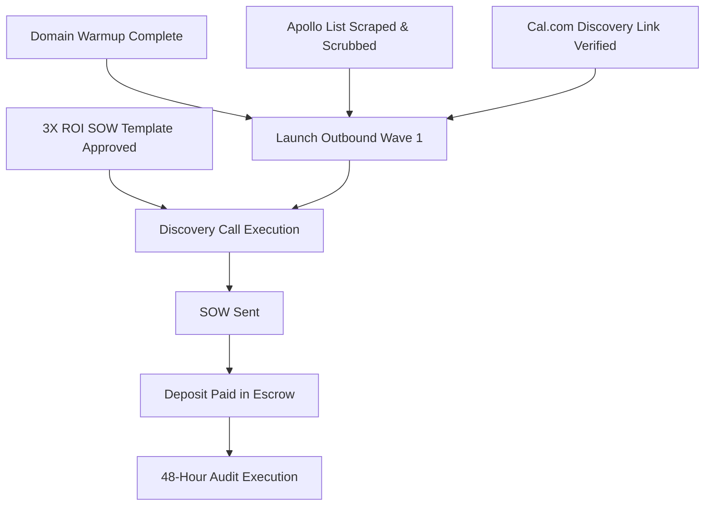

# DEPENDENCIES — Critical Path DAG & Pre-Flight Blockers

> **Canonical Document ID:** `DOC-DEP-CAM-001`  
> **Authority:** Program Architecture (CP-027)  
> **Status:** ACTIVE DEPENDENCY MAP

---

## 1. Critical Path DAG

---

## 2. Master Links

- Timeline: [[CAMPAIGNS/TIMELINE]]
- Launch Checklist: [[CAMPAIGNS/LAUNCH-CHECKLIST]]
