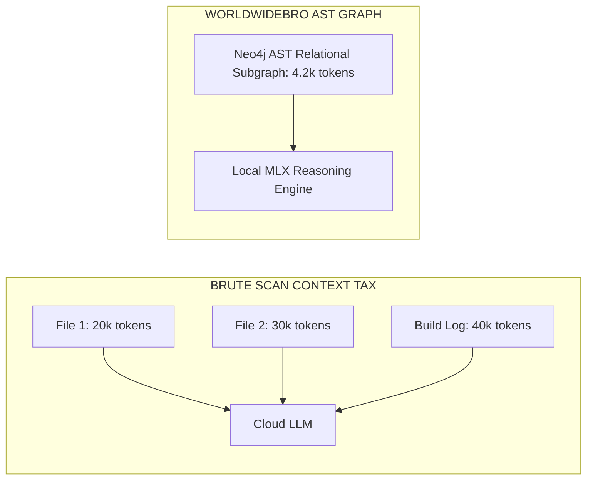

# DESIGN — Visual Design Principles & Technical Graphics

> **Canonical Document ID:** `DOC-DSN-CAM-001`  
> **Authority:** Design Architecture (CP-026)  
> **Status:** ACTIVE SPECIFICATION  
> **Canonical Aliases:** [[CAMPAIGNS/VISUALS.md]], [[CAMPAIGNS/IMAGERY.md]], [[CAMPAIGNS/GRAPHICS.md]]

---

## 1. Visual Token System

- **Background:** Jet Black (`#0A0A0A`) / Carbon Surface (`#141414`).
- **Accent Primary:** Electric Emerald (`#10B981`) for savings metrics; Pure White (`#FFFFFF`) for typography.
- **Typography:** JetBrains Mono for code/metrics; Inter for executive prose.
- **Charts:** High-contrast bar charts showing before/after token spend.

---

## 2. AST Knowledge Graph Visual Architecture

---

## 3. Master Links

- Creative Master: [[CAMPAIGNS/CREATIVE]]
- Assets: [[CAMPAIGNS/CREATIVE-ASSETS]]
