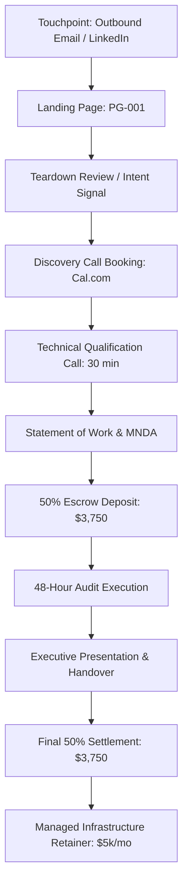

# FUNNELS — Master Funnel Architecture & Conversion Pipeline

> **Canonical Document ID:** `DOC-FUN-CAM-001`  
> **Authority:** Conversion Architecture & Revenue Operations (CP-006 / CP-027)  
> **Status:** ACTIVE SPECIFICATION  
> **Canonical Alias:** [[CAMPAIGNS/FUNNEL-ARCHITECTURE.md]]

---

## 1. The Complete End-to-End Funnel Chain

The campaign conversion pipeline connects directly into Company Brain's commercial core:

```text
IMPRESSION ──> VISITOR ──> ENGAGED VISITOR ──> LEAD (MQL) ──> OPPORTUNITY (SQL)
     │
     └──> DISCOVERY CALL ──> SOW PROPOSAL ──> ESCROW PAYMENT ──> AUDIT EXECUTION
               │
               └──> HANDOFF PRESENTATION ──> EXPANSION RETAINER (LTV)
```



---

## 2. Stage Conversion Target Benchmarks

| Stage Transition | Target Conversion Rate | Failure Threshold | Action on Breach |
| :--- | :--- | :--- | :--- |
| **Email Sent \(\to\) Open** | 60.0% | < 35.0% | Audit domain warmup & subject lines. |
| **Open \(\to\) Positive Reply** | 13.3% (8% of list) | < 5.0% | Rewrite lead hook and value proposition. |
| **Positive Reply \(\to\) Call Booked**| 62.5% | < 30.0% | Shorten booking friction; test async video. |
| **Call Booked \(\to\) Attended** | 85.0% | < 70.0% | Add automated calendar SMS/email reminders. |
| **Call Attended \(\to\) SOW Sent** | 53.3% | < 35.0% | Tighten upstream ICP qualification. |
| **SOW Sent \(\to\) Deposit Paid** | 62.5% | < 40.0% | Emphasize 3X ROI cash-back guarantee. |

---

## 3. Master Links

- Master OS: [[CAMPAIGNS/CAMPAIGN-OS]]
- Landing Pages: [[CAMPAIGNS/LANDING-PAGES]]
- Sales Handoff: [[CAMPAIGNS/SALES-HANDOFF]]
- Conversion Core: [[CAMPAIGNS/CONVERSION]]
