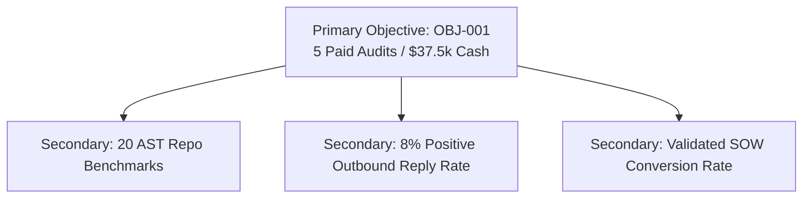

# OBJECTIVES — Master Campaign Objectives Framework

> **Canonical Document ID:** `DOC-OBJ-CAM-001`  
> **Authority:** Executive Strategy (CP-001 / CP-006)  
> **Status:** ACTIVE SPECIFICATION

---

## 1. The Singular Primary Objective Rule

A common failure mode in marketing is the "kitchen sink" objective list (e.g., "Build awareness, grow email subscribers, improve SEO, get Twitter followers, and drive sales"). When a campaign chases five competing goals, it optimizes for none.

**Rule:** Every campaign in Company Brain must have **EXACTLY ONE PRIMARY OBJECTIVE** that is singular, quantified, time-bound, and binary in evaluation.

```text
INCORRECT:
"Increase awareness + get leads + boost social engagement + drive sales"

CANONICAL CORRECT (CAM-001):
"Generate 5 closed, paid Local-First AI Audits ($37,500 USD cash collected) by October 15, 2026."
```

---

## 2. Objective Hierarchy



Secondary outcomes are permitted ONLY as diagnostic constraints or byproducts. They may never override or distract resources from the primary objective.

---

## 3. Master Links

- Master OS: [[CAMPAIGNS/CAMPAIGN-OS]]
- Primary Objective: [[CAMPAIGNS/PRIMARY-OBJECTIVE]]
- Secondary Objectives: [[CAMPAIGNS/SECONDARY-OBJECTIVES]]
- Success Criteria: [[CAMPAIGNS/SUCCESS-CRITERIA]]
- Registry: [[_REGISTRIES/CAMPAIGN-OBJECTIVE-REGISTRY.json]]
