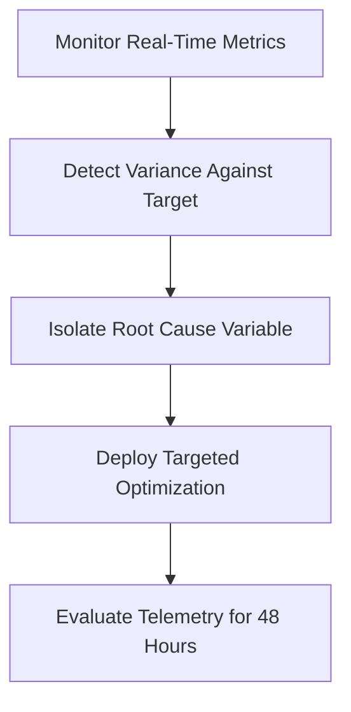

# OPTIMIZATION — Continuous Performance Optimization Engine

> **Canonical Document ID:** `DOC-OPT-CAM-001`  
> **Authority:** Growth Optimization (CP-006 / CP-040)  
> **Status:** ACTIVE SPECIFICATION  
> **Canonical Alias:** [[CAMPAIGNS/PERFORMANCE.md]]

---

## 1. Closed-Loop Optimization Engine

Optimization is not periodic guesswork; it is a systematic closed loop:

---

## 2. Optimization Domains

- **Budget Optimization:** Automatically shifting capital to lowest-CPA channels.
- **Audience Optimization:** Pruning unresponsive SIC codes and non-technical founder titles.
- **Creative Optimization:** Rotating copy variants every 14 days to prevent fatigue.
- **Funnel Optimization:** Removing form fields and reducing calendar booking latency.

---

## 3. Master Links

- Master OS: [[CAMPAIGNS/CAMPAIGN-OS]]
- Pacing: [[CAMPAIGNS/PACING]]
- Budget Optimization: [[CAMPAIGNS/BUDGET-OPTIMIZATION]]
