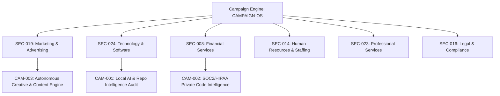

# SECTOR-TAXONOMY-MAPPING — Integration with the 35 Company Brain Sectors

> **Canonical Document ID:** `DOC-SEC-CAM-001`  
> **Authority:** Sector Governance & Commercial Architecture (CP-006 / CP-027)  
> **Master Sector Index:** [[SECTOR_INDEX.md]]  
> **Status:** ACTIVE INTEGRATION SPECIFICATION

---

## 1. Overview: How Campaigns Map to Sectors

In Company Brain, campaigns are not generic marketing blasts; they are targeted commercial interventions anchored in the **35-Sector Taxonomy** defined in [[SECTOR_INDEX.md]].

Each operating sector represents an addressable market vertical with its own Ideal Customer Profile (ICP), regulatory constraints, and tailored value proposition.

---

## 2. Sector Mapping Matrix for Company Brain Campaigns

| Sector Code | Sector Name | OpCo Link | Governing Campaign | Primary Wedge & Proposition |
| :--- | :--- | :--- | :--- | :--- |
| **`SEC-024`** | **Technology & Software** | [[00-CONSTITUTION/opcos/OpCo-024\|OpCo-024]] | **`CAM-001` (Active)** | 48-Hour Local-First AI & Repo Intelligence Audit (`OFR-AUDIT-001`). Slashes 60%+ of Claude/Cursor API burn. |
| **`SEC-008`** | **Financial Services** | [[00-CONSTITUTION/opcos/OpCo-008\|OpCo-008]] | **`CAM-002` (Planned)** | Zero-data-leakage coding agents for SOC2/PCI-regulated FinTech engineering orgs. |
| **`SEC-019`** | **Marketing & Advertising** | [[00-CONSTITUTION/opcos/OpCo-019\|OpCo-019]] | **`CAM-003` (Planned)** | Autonomous multi-agent campaign orchestration engine and content generation flywheel. |
| **`SEC-014`** | **Human Resources & Staffing**| [[00-CONSTITUTION/opcos/OpCo-014\|OpCo-014]] | **`CAM-004` (Backlog)** | Technical developer recruitment intelligence and automated codebase onboarding audits. |
| **`SEC-016`** | **Legal & Compliance** | [[00-CONSTITUTION/opcos/OpCo-016\|OpCo-016]] | **`CAM-005` (Backlog)** | AI IP protection, claim substantiation auditing, and air-gapped contractual compliance. |
| **`SEC-023`** | **Professional Services** | [[00-CONSTITUTION/opcos/OpCo-023\|OpCo-023]] | **`CAM-006` (Backlog)** | Multi-repo context caching and hardware cluster sizing for dev agencies and consultancies. |

---

## 3. Sector Cross-Links & Registries

- Master Sector Index: [[SECTOR_INDEX.md]]
- Ventures by Sector: [[_REGISTRIES/ventures-by-sector.yaml]]
- Repositories by Sector: [[_REGISTRIES/repositories-by-sector.yaml]]
- Capabilities by Sector: [[_REGISTRIES/capabilities-by-sector.yaml]]
- Control Planes by Sector: [[_REGISTRIES/control-planes-by-sector.yaml]]
- Master OS: [[CAMPAIGNS/CAMPAIGN-OS]]
