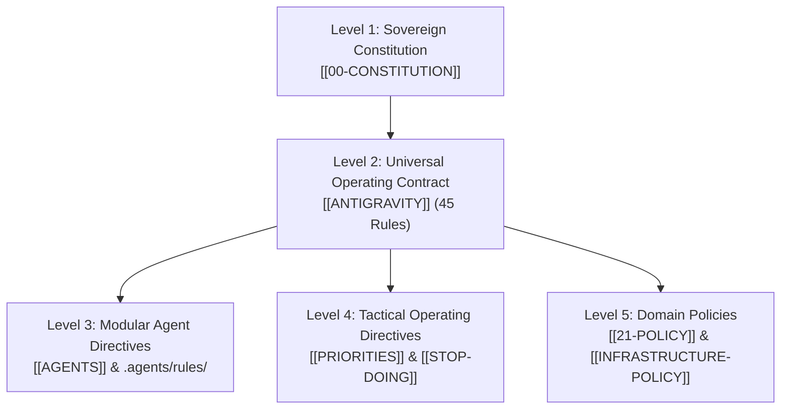

[[STARTHERE]] | [[REALITY]] | [[ANTIGRAVITY]] | [[AGENTS]] | [[00-CONSTITUTION]] | [[21-POLICY]]

# DIRECTIVES — Company Brain Directives Portal

> **Authority:** Sovereign Operator & Executive Governance (CP-001 / CP-027)  
> **Purpose:** Master aggregation gateway for all immutable, modular, and operational directives governing AI agents, human operators, and system infrastructure.

---

## 1. Directive Hierarchy & Authority

---

## 2. Master Directives Directory

### Level 1: Sovereign Constitution & Ontological Authority
- [[00-CONSTITUTION/00-CONSTITUTION|00-CONSTITUTION]]: Foundational legal and structural charter of the Company Brain.
- [[00-CONSTITUTION/SECTOR-TAXONOMY-MASTER|SECTOR-TAXONOMY-MASTER]]: 35 canonical economic sectors governing all ventures.

### Level 2: Universal Operating Contract (The 45 Rules)
- [[ANTIGRAVITY]]: Master operating contract defining zero-placeholder execution, proof-of-work protocols, and git safety invariants.

### Level 3: Modular AI Agent Directives (`.agents/rules/`)
- [[.agents/rules/architecture|Architecture Directives]]: Reusability, single-source-of-truth, and modular encapsulation rules.
- [[.agents/rules/coding-standards|Coding Standards Directives]]: Polyglot engineering standards, type-safety, and test coverage requirements.
- [[.agents/rules/git|Git Safety Directives]]: Commit hygiene, non-destructive branching, and zero-data-loss protocol.
- [[.agents/rules/security|Security Directives]]: Zero-trust credential handling, ephemeral Bitwarden secrets, and AST dependency validation.
- [[AGENTS]]: Universal portable agent orientation contract.

### Level 4: Tactical Operating Directives & Focus Filters
- [[PRIORITIES]]: Ranked tactical execution tiers (Tier 1: Commercial Traction, Tier 2: Infrastructure Stabilization, Tier 3: Registry Synchronization).
- [[STOP-DOING]]: Hard prohibitions preventing distraction, low-leverage side-quests, and fake infrastructure building.
- [[KILL-LIST]]: Explicit decommission ledger for deprecated services, unviable ventures, and orphaned repositories.

### Level 5: Infrastructure & Operational Policies
- [[56-ENGINEERING/INFRASTRUCTURE/01_CORE/INFRASTRUCTURE-POLICY|INFRASTRUCTURE-POLICY]]: Hardware governance, zero-ingress public security, and baseline compliance.
- [[56-ENGINEERING/INFRASTRUCTURE/11_RESILIENCE/BACKUP-POLICY|BACKUP-POLICY]]: 3-2-1 backup mandate, daily SQL/graph snapshots, and off-device mirrors.
- [[_MEMORY/MEMORY-POLICY|MEMORY-POLICY]]: Epistemic retention, agent memory privacy, and token compaction directives.
- [[21-POLICY/21-POLICY|21-POLICY]]: Corporate and domain operational compliance.

---

## 3. Quick Links
- Root Navigation: [[STARTHERE]]
- Executive Truth: [[REALITY]]
- Infrastructure State: [[CLAUDE]]
- Domain Master Index: [[INDEX-DOMAINS-COMPLETE]]
