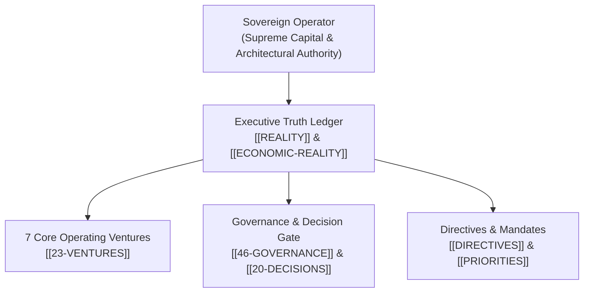

[[STARTHERE]] | [[REALITY]] | [[01-IDENTITY]] | [[46-GOVERNANCE]] | [[52-PEOPLE]]

# EXECUTIVES — Company Brain Executive Governance Portal

> **Authority:** Sovereign Operator & Executive Governance (CP-001 / CP-006 / CP-027)  
> **Purpose:** Master aggregation gateway for sovereign leadership, executive truth ledgers, strategic decision records, and operational accountability across all 35 sectors and 722 ventures.

---

## 1. Executive Control Architecture

---

## 2. Authoritative Executive Ledgers

### The Executive Truth Substrate
- [[REALITY]]: The master 30-section live reality ledger separating deployed facts from aspirational plans.
- [[ECONOMIC-REALITY]]: Verified zero-dollar operational balance sheet, burn rate audit, and commercial monetization roadmap.
- [[NORTH-STAR]]: The overarching mission: `GOAL -> PLAN -> REQUIREMENTS -> ARCHITECTURE -> IMPLEMENTATION -> TESTING -> DEPLOYMENT -> OBSERVABILITY -> FEEDBACK -> IMPROVEMENT -> BUSINESS OUTCOME`.
- [[KILL-LIST]]: The verified registry of eliminated redundant services and deprioritized projects.
- [[UPDATE]]: Real-time executive session log and state deltas.

### Corporate Identity & Governance
- [[01-IDENTITY/01-IDENTITY|01-IDENTITY]]: WorldwideBro foundational charter, trademark holdings, and legal structure.
- [[46-GOVERNANCE/46-GOVERNANCE|46-GOVERNANCE]]: Board-level policy, audit gates, and constitutional authority (`OPS-044`).
- [[20-DECISIONS/20-DECISIONS|20-DECISIONS]]: Architectural Decision Records (ADRs) and executive ruling log.
- [[52-PEOPLE/Executive|Executive Role]]: Archetype profile and authority specifications for executive roles.

---

## 3. Executive Action Portals
- Commercial Offers: [[COMMERCIAL/OFFERS/OFFER-001-LOCAL-AI-AUDIT|Local AI Audit ($7,500 turnkey offer)]]
- Priority Objectives: [[PRIORITIES]]
- Sector Taxonomy: [[00-CONSTITUTION/SECTOR-TAXONOMY-MASTER|35 Canonical Sectors]]
