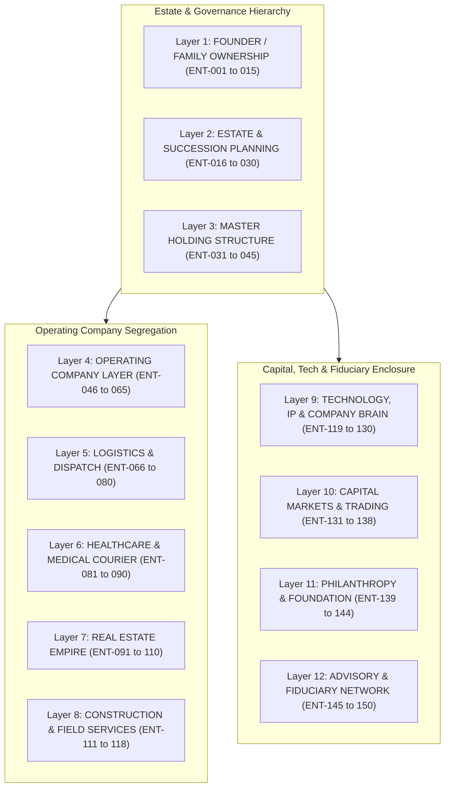

# Canonical Ecosystem Layer Alignment Master
**The Unified Rosetta Stone: Estate Ownership, Executive Divisions, Business Sectors, Ventures, and Graph Substrate**

> **Canonical Document ID:** `DOC-ECO-ALIGN-001`  
> **Authority:** Sovereign Operator & Executive Governance (CP-001 / CP-027)  
> **Status:** RATIFIED CANONICAL DOCTRINE  
> **Repository:** `_REGISTRIES/CANONICAL/ECOSYSTEM_LAYER_ALIGNMENT_MASTER.md`  
> **Date:** September 2026  
> **Formula:** $\mathbf{Ownership\;Graph} \;+\; \mathbf{Enterprise\;Graph} \;+\; \mathbf{Intelligence\;Graph} \;=\; \mathbf{Company\;Brain}$

---

## 1. Executive Summary & Core Principle

In a complex multi-entity ecosystem spanning **150 legal/holding nodes, 12 executive divisions, 36 business sectors, 789 ventures, 928 starred repositories, and 96 Vercel deployments**, system clarity requires a strict vertical crosswalk.

We resolve the fundamental confusion between *holding wealth* and *operating a business*:

* **The Estate (Ownership Graph):** *How ownership, assets, entities, people, advisors, capital, obligations, and succession are coordinated and preserved across generations.*
* **The Enterprise (Venture Graph):** *How operating businesses acquire customers, deliver value, and generate recurring gross margin.*
* **The Intelligence Substrate (Technology Graph):** *How code repositories, autonomous agents, MCP servers, and recurring loops automate execution without human friction.*

```text
┌─────────────────────────────────────────────────────────────────────────────────────────┐
│                                 THE 5-TIER VERTICAL STACK                               │
└─────────────────────────────────────────────────────────────────────────────────────────┘

  TIER 1: OWNERSHIP GRAPH (The Estate)
  └── 12 Institutional Layers | 150 Entities (Family Trust → WorldwideBro Holdings → Assets)

  TIER 2: EXECUTIVE DIVISIONS (Corporate Capabilities)
  └── 12 Executive Divisions | 80 Departments (Governance, Finance, Legal, Tech, Ops, Rev)

  TIER 3: SECTOR TAXONOMY (Industry Verticals)
  └── 36 Business Sectors (SEC-001 Beauty through SEC-037 Quantitative Trading)

  TIER 4: OPERATING VENTURES & FRONT DOORS
  └── 789 Ventures (Anchored by Tier-0: OPS-001, LT-005, CALLCENTER, CON-001, RE-001, LT-011)
  └── 83 Live Vercel Deployments (Validated 200 OK edge front doors)

  TIER 5: KNOWLEDGE GRAPH, FILES & TOOLING SUBSTRATE
  └── Neo4j (:7687) + gbrain (PGLite) + graphify (Wiki) + graft (AST Code Map)
  └── BUSINESS-CAPITAL-DATA-ROOM/ (22 Domains) + 928 Starred GitHub Repositories
```

---

## 2. Tier 1: The 12 Institutional Layers of the Estate (150 Entities)

The 150 nodes registered in [`_REGISTRIES/CANONICAL/ECOSYSTEM_150_ENTITY_REGISTRY.json`](file:///Users/acebless/Documents/The%20Company/Company%20Brain/_REGISTRIES/CANONICAL/ECOSYSTEM_150_ENTITY_REGISTRY.json) and displayed on `/holdings/ecosystem` are partitioned across **12 institutional layers**:



### Detailed Layer Specifications:

| Layer # | Layer Name | Entity ID Range | Core Fiduciary & Operating Purpose | Flagship Operating Entities |
| :---: | :--- | :---: | :--- | :--- |
| **01** | **Founder / Family Ownership** | `ENT-001`–`015` | Ultimate beneficiary interest, voting power, family covenants, private office. | • Sovereign Principal (`ENT-001`)<br>• Family Office Co (`ENT-002`) |
| **02** | **Estate & Succession** | `ENT-016`–`030` | Generation-skipping trusts, irrevocable trust structures, asset protection. | • Dynastic Trust (`ENT-016`)<br>• Asset Protection Trust (`ENT-017`) |
| **03** | **Master Holding Structure** | `ENT-031`–`045` | Parent LLC umbrella; capital consolidation; equity ownership of all OpCos. | • Worldwidebro Holdings LLC (`ENT-031`)<br>• WWB Business Holdings (`ENT-032`)<br>• WWB Real Estate Holdings (`ENT-034`) |
| **04** | **Operating Company Layer** | `ENT-046`–`065` | General services, staffing, call center, commercial operational hubs. | • **`OPS-001`** Staffing OpCo (`ENT-048`)<br>• **`CALLCENTER`** Dispatch OpCo (`ENT-050`) |
| **05** | **Logistics & Dispatch** | `ENT-066`–`080` | Motor carrier authorities, freight brokerage, route optimization, fleet leasing. | • **`LT-011`** Dispatch Core (`ENT-067`)<br>• Freight Brokerage OpCo (`ENT-068`) |
| **06** | **Healthcare & Medical Courier** | `ENT-081`–`090` | HIPAA/OSHA-compliant cold-chain lab specimen transport; hospital routing. | • **`LT-005`** HealthRoute Courier LLC (`ENT-081`)<br>• Medical Specimen Logistics (`ENT-083`) |
| **07** | **Real Estate Empire** | `ENT-091`–`110` | Real property ownership; land holdings; commercial warehouses; SPV series. | • **`RE-001`** WorldwideBro Holdings (`ENT-091`)<br>• Industrial Warehouse SPV (`ENT-095`) |
| **08** | **Construction & Field Services** | `ENT-111`–`118` | General contracting, tenant improvement, MEP trades, equipment yard. | • **`CON-001`** ACE Construction Holdings (`ENT-111`)<br>• Ace Construction OpCo (`ENT-112`) |
| **09** | **Technology, IP & Company Brain** | `ENT-119`–`130` | Sovereign AI infrastructure, trademark/patent holding, software IP, data graphs. | • Company Brain IP (`ENT-120`)<br>• VEX Venture OS (`ENT-121`)<br>• OmniRoute AI Cluster (`ENT-122`) |
| **10** | **Capital Markets & Trading** | `ENT-131`–`138` | Quantitative statistical arbitrage, treasury yield, liquidity buffer. | • **`FIN-037`** Trading Systems LLC (`ENT-131`)<br>• Public Securities Portfolio (`ENT-137`) |
| **11** | **Philanthropy & Foundation** | `ENT-139`–`144` | 501(c)(3) charitable endowment, community trade grants, workforce scholarships. | • WorldwideBro Foundation (`ENT-139`)<br>• Community Trade Trust (`ENT-140`) |
| **12** | **Advisory & Fiduciary Network** | `ENT-145`–`150` | Retained legal counsel, CPA tax practice, banking officers, insurance brokers. | • Corporate Legal Counsel (`ENT-145`)<br>• Primary CPA & Tax Group (`ENT-146`)<br>• Commercial Banking Desk (`ENT-147`) |

---

## 3. Tier 2: The 12 Executive Divisions (Capabilities & 80 Departments)

Every operating entity is managed through **12 Executive Divisions**, which provide standardized operational capabilities across all businesses:

```text
1. GOVERNANCE          → Board, CEO, Chief of Staff, Strategy, Fiduciary Oversight, Internal Audit
2. FINANCE & CAPITAL    → Treasury, Accounting, FP&A, Tax Planning, Banking, M&A
3. LEGAL & RISK         → Contracts, Regulatory Compliance, Insurance, IP, Entity Filings
4. PEOPLE               → Talent Acquisition, Recruiting, HR, Payroll, Workforce Development
5. TECHNOLOGY           → Software Engineering, Local AI/ML, Cloud Edge, Cybersecurity, IAM
6. PRODUCT & INNOVATION → UI/UX Systems, Product Specs, R&D, Design Standards
7. OPERATIONS           → Supply Chain, Logistics, Dispatch, Fleet Safety, Quality Assurance
8. REVENUE              → Sales, Enterprise B2B, Account Management, CRM, Customer Success
9. MARKETING            → Lead Generation, Brand, SEO, Local Scrapers, Content Syndication
10. ASSETS & INVESTMENTS→ Commercial Real Estate, Construction, Equipment, Portfolio Review
11. PUBLIC/INSTITUTIONAL→ Government Contracting, Municipal Grants, Civic Partnerships
12. INTELLIGENCE & BRAIN→ Neo4j Knowledge Graph, gbrain, Decision Engine, Agent Swarm
```

---

## 4. Tier 3 & 4: The 36 Business Sectors & Top Anchor Ventures

Each of the 789 ventures belongs to exactly one **Business Sector**. Below is the complete crosswalk of all **36 Canonical Sectors**, showing how each sector connects to its **OpCo, Flagship Venture, Live Vercel Front Door, and Primary Starred Tool:**

| Sector ID | Sector Vertical | OpCo | Flagship Venture | Live Vercel Front Door | Attached Starred Repository |
| :--- | :--- | :--- | :--- | :--- | :--- |
| **SEC-001** | Beauty & Wellness | OpCo-001 | **BEAUTY-001** | `beauty-wellness.vercel.app` | `twentyhq/twenty` + `Stripe` |
| **SEC-002** | Construction & Infra | OpCo-002 | **CON-001** | `constructionos-dashboard.vercel.app` | `typesense/typesense` + `gstack` |
| **SEC-003** | Consumer Hardware | OpCo-003 | **ELEC-001** | `elec-hardware.vercel.app` | `openobserve/openobserve` |
| **SEC-004** | Content & Media | OpCo-004 | **MEDIA-001** | `media-network.vercel.app` | `mutonby/openshorts` |
| **SEC-005** | Education & Training | OpCo-005 | **ET-011** | `trade-academy.vercel.app` | `n8n-io/n8n` |
| **SEC-006** | Energy & Utilities | OpCo-006 | **ENERGY-001** | `energy-fleet.vercel.app` | `openobserve/openobserve` |
| **SEC-007** | Environmental Services| OpCo-007 | **ENV-001** | `env-medical-waste.vercel.app` | `LT-011 Dispatch Engine` |
| **SEC-008** | Financial Services | OpCo-008 | **FIN-001** | `genixbank-hero-site.vercel.app` | `firefly-iii` / `maybe-finance` |
| **SEC-009** | Food & Agriculture | OpCo-009 | **FOOD-001** | `food-freight.vercel.app` | `n8n-io/n8n` |
| **SEC-010** | Food Service & Rest. | OpCo-010 | **REST-001** | `cloud-kitchens.vercel.app` | `LT-011 Dispatch Engine` |
| **SEC-011** | Gaming & Entertainment| OpCo-011 | **EC-111** | `ec-111-miss-toys.vercel.app` | `MengTo/threeui` |
| **SEC-012** | Healthcare & Biotech | OpCo-012 | **HC-001** | `hc-diagnostics.vercel.app` | `opendatalab/MinerU` |
| **SEC-013** | Hospitality & Travel | OpCo-013 | **HOSP-001** | `hosp-housing.vercel.app` | `CloakHQ/CloakBrowser` |
| **SEC-014** | HR & Staffing | OpCo-014 | **OPS-001** | `ops-staff-001-staffing...vercel.app`| `ever-co/ever-gauzy` |
| **SEC-015** | Insurance | OpCo-015 | **INS-001** | `ins-commercial.vercel.app` | `jsvine/pdfplumber` |
| **SEC-016** | Legal & Compliance | OpCo-016 | **LEGAL-001** | `legal-compliance.vercel.app` | `documenso/documenso` |
| **SEC-017** | Logistics & Transport | OpCo-017 | **LT-005** | `healthroute-courier.vercel.app` | `Mahanaicoach/google-maps-scraper-kit` |
| **SEC-018** | Manufacturing & Eng. | OpCo-018 | **MFG-001** | `mfg-enclosures.vercel.app` | `FreeCAD / Blender tools` |
| **SEC-019** | Marketing & Ads | OpCo-019 | **MKTG-001** | `mktg-b2b.vercel.app` | `Jakeschincariol/linkedin-agent-skill` |
| **SEC-020** | Real Estate & Property| OpCo-020 | **RE-001** | `re-001-worldwidebro-holdings.vercel.app`| `CloakHQ/CloakBrowser` + `gstack` |
| **SEC-021** | Retail & E-Commerce | OpCo-021 | **COMM-001** | `comm-storefront.vercel.app` | `v0` + `Vercel Edge` |
| **SEC-022** | Telecommunications | OpCo-022 | **TELECOM-001**| `telecom-mesh.vercel.app` | `Tailscale WireGuard` |
| **SEC-023** | Professional Services| OpCo-023 | **PROF-001** | `prof-advisory.vercel.app` | `Noisyxl/brier` |
| **SEC-024** | Tech & Software | OpCo-024 | **TECH-040** | `vex-hero-site-sigma.vercel.app` | `Vite` + `React` + `Tailwind` |
| **SEC-025** | Automotive & Mobility | OpCo-025 | **AUTO-001** | `auto-fleet-lease.vercel.app` | `LT-011 Fleet Engine` |
| **SEC-026** | Utilities & Municipal | OpCo-026 | **UTIL-001** | `util-municipal.vercel.app` | `Stirling-Tools/Stirling-PDF` |
| **SEC-027** | VC & Incubation | OpCo-027 | **VC-001** | `vc-incubator.vercel.app` | `garrytan/gstack` |
| **SEC-028** | B2B Enterprise SaaS | OpCo-028 | **ENT-001** | `lt-011-dispatch-software.vercel.app` | `LT-011 Core` |
| **SEC-029** | Marketplaces | OpCo-029 | **PLAT-001** | `courier-shift-exchange.vercel.app` | `PostgreSQL / Gauzy ATS` |
| **SEC-030** | Fintech & Payments | OpCo-030 | **FINTECH-001**| `arbitrage-gateway.vercel.app` | `Open-Finance-Lab/AgenticTrading` |
| **SEC-031** | Climate & ESG | OpCo-031 | **CLIMATE-001**| `climate-carbon.vercel.app` | `openobserve/openobserve` |
| **SEC-032** | AI & Machine Learning | OpCo-032 | **AI-001** | `mac-studio-local.local:20128` | `diegosouzapw/OmniRoute` + `exo` |
| **SEC-033** | Cybersecurity | OpCo-033 | **CYBER-001** | `cyber-shield.vercel.app` | `Infisical` + `Vault` |
| **SEC-034** | Decentralized & Web3 | OpCo-034 | **WEB3-001** | `web3-registry.vercel.app` | `PGLite Immutable Graph` |
| **SEC-035** | [Discovery / Stealth] | OpCo-035 | **DISC-001** | `stealth-lab.vercel.app` | `gbrain discovery` |
| **SEC-037** | Quant Trading Systems | OpCo-030 | **FIN-037** | `fin-037-trading.vercel.app` | `Python MLX Engine` |

---

## 5. Tier 5: The Four-Pillar Knowledge Graph & Code Intelligence Stack

The system relies on four distinct, complementary graph engines that execute without conflicting:

```text
┌─────────────────────────────────────────────────────────────────────────────────────────┐
│                                 THE FOUR GRAPH ENGINES                                  │
└─────────────────────────────────────────────────────────────────────────────────────────┘

  1. NEO4J (:7687 / :7474) — Relational Entity & Ownership Graph
     • What it maps: Principal → Trust → HoldCo → 150 Entities → 36 Sectors → 789 Ventures.
     • Primary query: Cypher MATCH (t:Trust)-[:OWNS]->(h:HoldCo)-[:CONTROLS]->(v:Venture)

  2. GBRAIN (scripts/gbrain) — Vector & BM25 Knowledge Retrieval Engine
     • What it maps: Markdown dossiers, 22-domain data rooms, financial models, ADRs.
     • Primary query: scripts/gbrain query "<underwriting question>"

  3. GRAPHIFY (graphify-out/) — Documentation & System Wiki Graph
     • What it maps: Internal markdown files, rule files, and orientation cross-references.
     • Primary query: graphify query "<concept>" / graphify path "<A>" "<B>"

  4. GRAFT (/opt/homebrew/bin/graft) — Zero-Token AST Code Intelligence Graph
     • What it maps: TypeScript, React, and Python codebase ASTs, imports, and callers.
     • Primary query: graft callers <symbol> / graft ask "<coding task>"
```

---

## 6. Tier 5 (Data Room): The 22 Canonical Business Domains

Every venture maintained in [`BUSINESS-CAPITAL-DATA-ROOM/`](file:///Users/acebless/Documents/The%20Company/Company%20Brain/BUSINESS-CAPITAL-DATA-ROOM) follows the 22-domain institutional filing structure:

```text
BUSINESS-CAPITAL-DATA-ROOM/<VENTURE_ID>/
├── 01_IDENTITY    → Mission, vision, core values, brand positioning, logos
├── 02_STRATEGY    → Strategic plan, competitive advantage, OKRs, gstack office-hours
├── 03_LEGAL       → Articles of Organization, Operating Agreement, Certificates of Good Standing
├── 04_OWNERSHIP   → Cap table, equity split, member register, voting rights
├── 05_FINANCIAL   → Balance sheets, cash flow models, revenue projections (.xlsx + .pdf)
├── 06_MARKET      → TAM/SAM/SOM, ICP customer profiles, competitor matrix
├── 07_PRODUCT     → Product roadmap, system architecture, engineering specs
├── 08_REVENUE     → Pricing tiers, revenue streams, sales pipeline, unit economics
├── 09_OPERATIONS  → Standard Operating Procedures (SOPs), supply chain, dispatch workflows
├── 10_PEOPLE      → Org chart, key personnel biographies, staffing requirements
├── 11_ASSETS      → Physical, IP, software, domain names, and fleet inventories
├── 12_COMPLIANCE  → Regulatory permits, OSHA/HIPAA compliance, DOT/MC authorities
├── 13_RISK        → Risk register, insurance policies, mitigation protocols
├── 14_FUNDING     → Sources & uses of capital, capital requirement history
├── 15_GRANTS      → Grant applications, public awards, compliance reporting
├── 16_LOANS       → Promissory notes, debt schedules, amortization tables
├── 17_INVESTORS   → Pitch decks (16:9 vector PDF decks), investor update memos
├── 18_CONTRACTS   → Customer MSAs, vendor SLAs, partnership agreements, NDAs
├── 19_EVIDENCE    → Customer testimonials, banking letters, verified delivery receipts
├── 20_DATA_ROOM   → Due diligence checklist, master index, investor access log
├── 21_REPORTS     → Monthly, quarterly, and annual operational reviews
└── 22_SYSTEM      → Architecture Decision Records (ADRs), test matrices, deployment contracts
```

---

## 7. The Vital Reflex: The 16-Step Money Flow Arc

Departments and technical repositories do **not** exist for administrative overhead. Every entity in the system is governed by the 16-step cash generation loop:

$$\text{Market} \rightarrow \text{Lead} \rightarrow \text{Marketing} \rightarrow \text{Sales} \rightarrow \text{Deal} \rightarrow \text{Contract} \rightarrow \text{Finance} \rightarrow \text{Operations} \rightarrow \text{Delivery} \rightarrow \text{Customer} \rightarrow \text{Invoice} \rightarrow \text{Collection} \rightarrow \text{Profit} \rightarrow \text{Capital} \rightarrow \text{Investment} \rightarrow \text{New Venture}$$

### Concrete End-to-End Walkthrough (HealthRoute Courier `LT-005`):
1. **Market:** Charlotte medical laboratory & diagnostic health system sector.
2. **Lead:** `Marketing` uses `Mahanaicoach/google-maps-scraper-kit` to extract 150 local hospital labs.
3. **Marketing:** `Jakeschincariol/linkedin-agent-skill` messages lab logistics coordinators.
4. **Sales:** Inbound inquiry received via `chatwoot` omnichannel inbox on `healthroute-courier.vercel.app`.
5. **Deal:** `Revenue` qualifies account in `twenty` CRM ($15,000/mo STAT contract).
6. **Contract:** `Legal` issues standard BAA and courier agreement via `documenso/documenso`.
7. **Finance:** Account sets up ACH automated billing via Stripe/Plaid.
8. **Operations:** `LT-011 Dispatch Engine` assigns incoming STAT pickup to certified driver.
9. **Delivery:** Driver executes specimen transport under temperature-monitored cold chain.
10. **Customer:** Lab receives automated digital proof-of-delivery generated via `Stirling-PDF`.
11. **Invoice:** Net-30 invoice generated automatically via `firefly-iii` / accounting module.
12. **Collection:** Funds settle in HealthRoute Courier Operating Account at Genixbank.
13. **Profit:** Operating costs deducted; 38% net margin realized.
14. **Capital:** Net profits transferred to `WorldwideBro Holdings LLC` (`ENT-031`).
15. **Investment:** Capital allocated: 50% reserved for `RE-001` commercial warehouse acquisition, 50% reinvested into `OPS-001` driver staffing.
16. **New Venture:** Operating model replicated into adjacent market or vertical.
