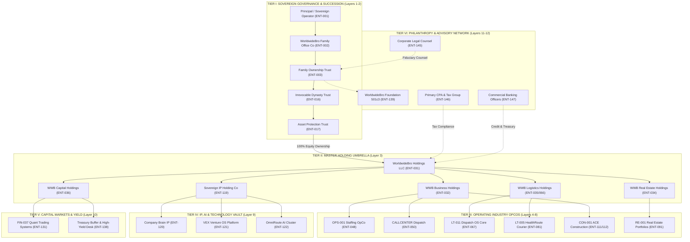

# Family Office Ecosystem Alignment Master
**The Sovereign Architecture: Asset Ring-Fencing, Intercompany Capital Flows, 36-Sector Venture Rollup, and Dynastic Succession**

> **Canonical Document ID:** `DOC-FAM-OFFICE-001`  
> **Authority:** Sovereign Operator & Executive Governance (CP-001 / CP-027)  
> **Status:** RATIFIED CANONICAL DOCTRINE  
> **Source Repository:** `_REGISTRIES/CANONICAL/FAMILY_OFFICE_ECOSYSTEM_ALIGNMENT_MASTER.md`  
> **Formula:** $\mathbf{Family\;Office} = \frac{\mathbf{Enterprise\;Operating\;Margin} \;\times\; \mathbf{Intercompany\;Asset\;Shielding}}{\mathbf{Dynastic\;Capital\;Allocation\;(Reinvest\;/\;Preserve\;/\;Distribute)}}$

---

## 1. Executive Fiduciary Thesis

A family office does not operate businesses day-to-day. **The Family Office coordinates capital allocation, asset ring-fencing, tax optimization, liability isolation, and generational wealth compounding.**

```text
┌────────────────────────────────────────────────────────────────────────────────────────┐
│                              THE CORE DUALITY OF THE SYSTEM                            │
├────────────────────────────────────────────────────────────────────────────────────────┤
│  THE ENTERPRISE GRAPH (Venture Operating System)                                       │
│  └── Objective: Make money. (Market → Leads → Sales → Operations → Margin)             │
│  └── Risk Profile: High liability (customers, employees, accidents, contracts).       │
│                                                                                        │
│  THE FAMILY OFFICE GRAPH (Estate & Ownership Ecosystem)                                │
│  └── Objective: Preserve, compound, and shield wealth across generations.              │
│  └── Risk Profile: Zero operating liability (insulated holding shells, trusts, deeds). │
└────────────────────────────────────────────────────────────────────────────────────────┘
```

The 789 ventures and 36 sectors represent the **productive engine**; the 150-Node Family Office represents the **dynastic fortress** that captures and compounds the fruit of that labor.

---

## 2. The 12-Layer Family Office Hierarchy (Mapping the 150 Nodes)

The 150 entities in [`_REGISTRIES/CANONICAL/ECOSYSTEM_150_ENTITY_REGISTRY.json`](file:///Users/acebless/Documents/The%20Company/Company%20Brain/_REGISTRIES/CANONICAL/ECOSYSTEM_150_ENTITY_REGISTRY.json) are organized into **6 Strategic Tiers across 12 Institutional Layers**:



---

## 3. The 36-Sector Venture Rollup Architecture

The **789 ventures** do not create administrative chaos because they roll up strictly through their parent Holding Companies:

```text
┌─────────────────────────────────────────────────────────────────────────────────────────────────┐
│                           36-SECTOR TO FAMILY OFFICE ROLLUP CROSSWALK                           │
├─────────────────────────────────────────────────────────────────────────────────────────────────┤
│ 1. WWB BUSINESS HOLDINGS LLC (ENT-032)                                                          │
│    ├── SEC-001: Beauty & Wellness (51 ventures / OpCo-001)                                      │
│    ├── SEC-002: Construction & Infrastructure (6 ventures / CON-001 / OpCo-002)                │
│    ├── SEC-004: Content & Media (38 ventures / OpCo-004)                                        │
│    ├── SEC-005: Education & Training (36 ventures / ET-011 / OpCo-005)                           │
│    ├── SEC-009: Food & Agriculture (OpCo-009)                                                   │
│    ├── SEC-010: Food Service & Restaurants (5 ventures / OpCo-010)                              │
│    ├── SEC-013: Hospitality & Travel (25 ventures / OpCo-013)                                   │
│    ├── SEC-014: Human Resources & Staffing (22 ventures / OPS-001 / OpCo-014)                   │
│    ├── SEC-018: Manufacturing & Engineering (OpCo-018)                                          │
│    ├── SEC-021: Retail & E-commerce (11 ventures / COMM-001 / OpCo-021)                         │
│    └── SEC-023: Professional Services (7 ventures / OpCo-023)                                   │
│                                                                                                 │
│ 2. WWB LOGISTICS & DISPATCH HOLDINGS LLC (ENT-035 / ENT-066)                                    │
│    ├── SEC-017: Logistics & Transportation (19 ventures / LT-005 & LT-011 / OpCo-017)           │
│    ├── SEC-025: Automotive & Mobility (3 ventures / Fleet Leasing / OpCo-025)                   │
│    └── SEC-029: Marketplace & Courier Exchange (19 ventures / OpCo-029)                        │
│                                                                                                 │
│ 3. WWB REAL ESTATE HOLDINGS LLC (ENT-034)                                                       │
│    ├── SEC-020: Real Estate & Property (1 master hub: RE-001 / OpCo-020)                         │
│    │   ├── 18 Commercial Warehouses, Industrial Yards & Multifamily SPVs (ENT-092 to ENT-110)   │
│    └── SEC-026: Utilities & Municipal Facility Leases (OpCo-026)                                │
│                                                                                                 │
│ 4. SOVEREIGN IP & TECHNOLOGY HOLDING CO (ENT-119)                                               │
│    ├── SEC-024: Technology & Software (33 ventures / VEX Venture OS / OpCo-024)                 │
│    ├── SEC-028: B2B Enterprise Software (2 ventures / CALLCENTER / OpCo-028)                    │
│    ├── SEC-032: Artificial Intelligence & Machine Learning (428 ventures / OmniRoute / OpCo-032)│
│    └── SEC-033: Cybersecurity & Zero-Trust Infrastructure (3 ventures / OpCo-033)               │
│                                                                                                 │
│ 5. WWB CAPITAL & FINANCIAL HOLDINGS LLC (ENT-036)                                               │
│    ├── SEC-008: Financial Services (40 ventures / Genixbank / OpCo-008)                         │
│    ├── SEC-015: Captive Insurance & Inland Marine (OpCo-015)                                    │
│    ├── SEC-030: Fintech & Arbitrage Settlements (OpCo-030)                                      │
│    ├── SEC-034: Decentralized & Web3 Asset Registry (8 ventures / OpCo-034)                     │
│    └── SEC-037: Capital & Quantitative Trading Systems (2 ventures / FIN-037 / OpCo-030)        │
│                                                                                                 │
│ 6. EXECUTIVE STRATEGY & DISCOVERY INCUBATOR (ENT-041)                                           │
│    ├── SEC-016: Legal & Compliance Automation (4 ventures / OpCo-016)                           │
│    ├── SEC-022: Telecommunications & Mesh Overlay (OpCo-022)                                    │
│    ├── SEC-027: Venture Capital & Equity Incubation (OpCo-027)                                  │
│    ├── SEC-031: Climate & Fleet Emission Offsets (OpCo-031)                                     │
│    └── SEC-035: [Reserved Discovery & Stealth Lab] (OpCo-035)                                   │
└─────────────────────────────────────────────────────────────────────────────────────────────────┘
```

---

## 4. The Intercompany Asset Shielding Engine (Profit Stripping)

To ensure that commercial liabilities in the operating businesses (e.g., driver accidents, staffing disputes, construction liens) **never breach the family's assets**, we enforce strict arm's-length intercompany contracts:

```mermaid
flowchart LR
    Customer(["Commercial Customers & Clients"])
    
    subgraph HighRisk["HIGH-RISK OPERATING LAYER (Shielded OpCos)"]
        OpCo["Operating Company LLC (LT-005 / OPS-001 / CON-001)"]
    end
    
    subgraph LowRisk["ZERO-RISK ASSET & IP HOLDINGS (Dynastic Vaults)"]
        IPCo["Sovereign IP Holding Co (ENT-119)<br/>Owns VEX, Code, Patents, Trademarks"]
        RECo["WWB Real Estate Holdings (ENT-034)<br/>Owns Warehouses, Land, Depots"]
        Treasury["Treasury & Capital Holding (ENT-045)<br/>Central Consolidated Banking"]
    end
    
    Customer -->|1. Customer Invoices & Gross Revenue| OpCo
    OpCo -->|2. Software Licensing Fees (Arm's Length)| IPCo
    OpCo -->|3. Commercial Lease / Facility Rent| RECo
    OpCo -->|4. Net Operating Profits Distribution| Treasury
    
    classDef high fill:#fee2e2,stroke:#ef4444,stroke-width:2px;
    classDef low fill:#dcfce7,stroke:#22c55e,stroke-width:2px;
    class OpCo high;
    class IPCo,RECo,Treasury low;
```

1. **Software Licensing:** `LT-005` (HealthRoute) and `LT-011` pay software usage fees to `Sovereign IP Holding Co` (`ENT-119`) for using the DispatchOS platform.
2. **Facility & Fleet Leases:** Operating companies lease warehouse space and yard storage from `WWB Real Estate Holdings` (`ENT-034`).
3. **Equipment Leases:** Machinery and vehicles are owned by specialized equipment SPVs (`ENT-116`) and leased back to the operating LLCs.
4. **Result:** The operating LLCs run on lean, working-capital margins with minimal equity exposure. All accumulated enterprise value sits protected inside asset-holding entities.

---

## 5. The 3-Bucket Family Office Capital Allocation Reflex

Whenever gross cash is received and stripped of operating expenses, the Family Office routes net profit through the **Three-Bucket Capital Allocation Reflex**:

$$\text{Net Operating Cash Flow} \longrightarrow \begin{cases} \mathbf{40\%\;Reinvest} & \text{(Tier-0 Cash Generators \& Software IP)} \\ \mathbf{50\%\;Preserve} & \text{(Commercial Real Estate, Land \& High-Yield Treasury)} \\ \mathbf{10\%\;Distribute} & \text{(Family Trust Security \& Foundation Community Grants)} \end{cases}$$

```text
┌────────────────────────────────────────────────────────────────────────────────────────┐
│                        THE CAPITAL ALLOCATION DISCIPLINE                               │
├────────────────────────────────────────────────────────────────────────────────────────┤
│ BUCKET 1: REINVEST (40% — The Growth Engine)                                           │
│ └── Injected directly into Horizon-1 Tier-0 ventures (OPS-001 recruiter marketing,      │
│     LT-005 courier driver recruitment, CON-001 bonding capital, and OmniRoute models).  │
│                                                                                        │
│ BUCKET 2: PRESERVE & RESERVE (50% — The Dynastic Fortress)                            │
│ └── Swept into RE-001 Real Estate SPVs for commercial warehouse purchases, land         │
│     parcels, and high-yield short-term Treasury bills (ENT-138 Liquidity Buffer).       │
│                                                                                        │
│ BUCKET 3: DISTRIBUTE & ENDOW (10% — Family Security & Legacy)                          │
│ └── 5% distributed to Irrevocable Dynasty Trust (ENT-016) for family living expenses.  │
│ └── 5% granted to WorldwideBro Foundation (ENT-139) for trade workforce scholarships.  │
└────────────────────────────────────────────────────────────────────────────────────────┘
```

---

## 6. The Advisory & Fiduciary Command Matrix

The Family Office enforces professional oversight across all entities so that the Sovereign Operator never acts without legal and financial backing:

| Advisory Node | Legal Entity ID | Primary Retained Duty | Backing Tooling & Repos | Governed Data Room Domain |
| :--- | :---: | :--- | :--- | :---: |
| **Corporate Legal Counsel** | `ENT-145` | Articles of Organization, Operating Agreements, Series LLC filings, Contract enforcement. | `documenso/documenso`, `opendatalab/MinerU` | `03_LEGAL`, `18_CONTRACTS` |
| **Primary CPA & Tax Desk** | `ENT-146` | Annual Form 1065 / 1120S filings, K-1 generation, state nexus review, depreciation schedules. | `firefly-iii`, `jsvine/pdfplumber` | `05_FINANCIAL`, `12_COMPLIANCE` |
| **Commercial Banking Desk** | `ENT-147` | Treasury cash management, commercial credit lines, letters of credit, payroll sweep accounts. | `Plaid / Stripe`, `Firefly Treasury` | `05_FINANCIAL`, `16_LOANS` |
| **Fiduciary Trustee** | `ENT-148` | Trust administration, beneficiary reporting, generation-skipping transfer governance. | `Noisyxl/brier` (Decision receipts) | `04_OWNERSHIP`, `20_DATA_ROOM` |
| **Insurance Risk Broker** | `ENT-149` | Commercial general liability, inland marine cargo, umbrella policies, workers' comp audits. | `pdfplumber`, `Risk Register Engine` | `13_RISK`, `12_COMPLIANCE` |

---

## 7. The Unified Graph Traversal: Answering Any Estate Question

Because the **Ownership Graph**, **Enterprise Graph**, and **Intelligence Graph** are unified, the system answers complex family office queries in a single query:

```text
Executive Query: "What happens if a delivery van in LT-005 gets into an accident?"

Traversing the Unified Graph:
  1. [Enterprise Graph]:
     • Identifies LT-005 Courier LLC as the operating entity.
     • Determines the driver was on a STAT lab route dispatched via healthroute-courier.vercel.app.
  2. [Ownership Graph]:
     • Confirms that LT-005 Courier LLC is an isolated operating subsidiary of WWB Logistics Holdings (ENT-066).
     • Verifies the delivery van is leased from Fleet Lease SPV (ENT-069) and NOT owned by LT-005.
     • Confirms the warehouse and intellectual property are owned by ENT-034 and ENT-119, completely insulated from liability.
  3. [Intelligence Graph]:
     • MinerU pulls the Commercial Cargo & Auto Liability policy (ENT-149) from BUSINESS-CAPITAL-DATA-ROOM/LT-005/13_RISK/.
     • Automatically drafts the insurance claim notice and routes it to Retained Legal Counsel (ENT-145).
  4. [Fiduciary Result]:
     • Maximum exposure is capped at the operating entity's working balance; zero risk to the Family Trust, Real Estate, or Holding Company.
```
