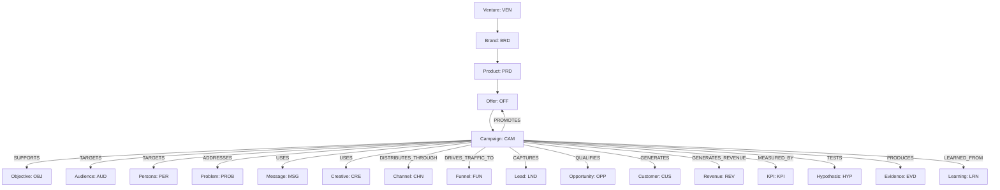

# CAMPAIGN RELATIONSHIPS ONTOLOGY

> **Canonical Document ID:** `DOC-REL-CAM-001`  
> **Authority:** System Architecture & Knowledge Core (CP-008 / CP-027)  
> **Schema Version:** `1.0.0`  
> **Last Verified:** `2026-09-05`  
> **Target Graph Database:** Neo4j Enterprise (`:7687` / `:7474`)

---

## 1. Overview & Architectural Role

In Company Brain, a **Campaign** is not an ephemeral marketing document; it is a first-class, graph-native operational node. The predicates defined in this registry govern how campaigns connect to strategic objectives, commercial offers, audience personas, channels, funnels, revenue transactions, empirical evidence, and organizational learning.



---

## 2. Controlled Predicate Catalog (38 Graph Relationships)

### Strategic & Alignment Predicates

| Predicate | Source Types | Target Types | Description | Cypher Example |
| :--- | :--- | :--- | :--- | :--- |
| **`SUPPORTS`** | `CAM`, `CAMP` | `STR`, `PRI`, `OBJ` | Directly advances a declared corporate strategy or quarterly priority. | `(c:Campaign)-[:SUPPORTS]->(s:Strategy)` |
| **`ADVANCES`** | `CAM`, `WFL` | `OBJ`, `KPI` | Drives measurable progression toward an objective threshold. | `(c:Campaign)-[:ADVANCES]->(o:Objective)` |
| **`ALIGNS_WITH`** | `CAM` | `NORTH_STAR`, `CON` | Demonstrates constitutional fidelity with the master North Star. | `(c:Campaign)-[:ALIGNS_WITH]->(n:NorthStar)` |
| **`SERVES`** | `CAM` | `BUS_GOAL` | Directly fulfills an operational or economic business goal. | `(c:Campaign)-[:SERVES]->(b:BusinessGoal)` |

### Market & Audience Predicates

| Predicate | Source Types | Target Types | Description | Cypher Example |
| :--- | :--- | :--- | :--- | :--- |
| **`TARGETS`** | `CAM`, `MSG`, `OFF` | `AUD`, `SEG`, `PER` | Designates specific recipient demographic or firmographic entity. | `(c:Campaign)-[:TARGETS]->(p:Persona)` |
| **`SEGMENTS`** | `AUD` | `SEG` | Partitions a broader market audience into distinct sub-cohorts. | `(a:Audience)-[:SEGMENTS]->(s:Segment)` |
| **`ADDRESSES`** | `CAM`, `OFF`, `MSG` | `PROB`, `PAIN` | Solves a documented acute friction or operational problem. | `(c:Campaign)-[:ADDRESSES]->(p:Problem)` |
| **`SOLVES`** | `OFF`, `PRD` | `PROB` | Provides concrete technical or operational remediation for an issue. | `(o:Offer)-[:SOLVES]->(p:Problem)` |

### Commercial & Conversion Predicates

| Predicate | Source Types | Target Types | Description | Cypher Example |
| :--- | :--- | :--- | :--- | :--- |
| **`PROMOTES`** | `CAM`, `CRE` | `PRD`, `SVC`, `OFF` | Features a commercial product, service, or structured offer. | `(c:Campaign)-[:PROMOTES]->(o:Offer)` |
| **`USES`** | `CAM`, `AGT` | `MSG`, `CRE`, `TOL` | Deploys a specific messaging angle, creative asset, or tool. | `(c:Campaign)-[:USES]->(m:Message)` |
| **`DELIVERS`** | `CAM`, `CHN` | `AST`, `OFF` | Transmits an asset or commercial proposition to the market. | `(c:Campaign)-[:DELIVERS]->(a:Asset)` |
| **`DISTRIBUTES_THROUGH`** | `CAM`, `CNT` | `CHN`, `MED` | Deploys communication via specific media or distribution channels. | `(c:Campaign)-[:DISTRIBUTES_THROUGH]->(ch:Channel)` |
| **`PUBLISHED_ON`** | `CRE`, `CNT` | `SITE`, `CHN` | Live placement on an owned, earned, or paid digital destination. | `(c:Creative)-[:PUBLISHED_ON]->(s:Site)` |
| **`DRIVES_TRAFFIC_TO`** | `CAM`, `CHN` | `PG`, `FUN`, `SITE` | Directs user traffic to a destination landing page or entry point. | `(c:Campaign)-[:DRIVES_TRAFFIC_TO]->(p:Page)` |
| **`CONVERTS_THROUGH`** | `CAM`, `LND` | `FUN`, `FORM` | Channels prospective customers through an automated conversion flow. | `(c:Campaign)-[:CONVERTS_THROUGH]->(f:Funnel)` |
| **`CAPTURES`** | `FUN`, `PG` | `LND` | Captures authenticated identity or intent telemetry from visitor. | `(f:Funnel)-[:CAPTURES]->(l:Lead)` |
| **`QUALIFIES`** | `WFL`, `AGT` | `OPP`, `LND` | Validates ICP criteria, budget, and timing to create an opportunity. | `(a:Agent)-[:QUALIFIES]->(o:Opportunity)` |
| **`GENERATES`** | `CAM`, `OPP` | `CUS`, `ORD`, `REV` | Creates commercial enterprise outcomes (customers, orders, revenue).| `(c:Campaign)-[:GENERATES]->(cu:Customer)` |
| **`GENERATES_REVENUE`** | `CAM`, `ORD` | `REV` | Directly results in recognized cash or booked top-line revenue. | `(c:Campaign)-[:GENERATES_REVENUE]->(r:Revenue)` |

### Attribution & Telemetry Predicates

| Predicate | Source Types | Target Types | Description | Cypher Example |
| :--- | :--- | :--- | :--- | :--- |
| **`ATTRIBUTES_TO`** | `REV`, `CUS`, `OPP`| `CAM`, `CHN`, `CRE` | Multi-touch or algorithmic attribution credit allocation. | `(r:Revenue)-[:ATTRIBUTES_TO]->(c:Campaign)` |
| **`MEASURED_BY`** | `CAM`, `CHN` | `KPI`, `MET` | Bound to quantitative indicators determining success or failure. | `(c:Campaign)-[:MEASURED_BY]->(k:KPI)` |
| **`TRACKS`** | `CAM`, `UTM` | `EVT`, `TLM` | Observes user events, telemetry milestones, and state transitions. | `(c:Campaign)-[:TRACKS]->(e:Event)` |

### Scientific Experimentation Predicates

| Predicate | Source Types | Target Types | Description | Cypher Example |
| :--- | :--- | :--- | :--- | :--- |
| **`TESTS`** | `CAM`, `EXP` | `HYP` | Submits a falsifiable proposition to empirical market testing. | `(e:Experiment)-[:TESTS]->(h:Hypothesis)` |
| **`VALIDATES`** | `EXP`, `RES` | `HYP`, `ASM` | Statistically confirms the predictive accuracy of a hypothesis. | `(r:Result)-[:VALIDATES]->(h:Hypothesis)` |
| **`CONTRADICTED_BY`** | `HYP`, `ASM` | `EVD`, `RES` | Empirical proof that falsifies or disproves an operating assumption. | `(h:Hypothesis)-[:CONTRADICTED_BY]->(e:Evidence)` |
| **`PRODUCES`** | `CAM`, `EXP` | `EVD`, `RES` | Generates reproducible experimental data points and evidence. | `(c:Campaign)-[:PRODUCES]->(e:Evidence)` |
| **`LEARNED_FROM`** | `CAM`, `ORG` | `LRN`, `INS` | Ingests structural knowledge into Company Brain from campaign run. | `(c:Campaign)-[:LEARNED_FROM]->(l:Learning)` |

### Optimization & Execution Control Predicates

| Predicate | Source Types | Target Types | Description | Cypher Example |
| :--- | :--- | :--- | :--- | :--- |
| **`OPTIMIZES`** | `AGT`, `WFL` | `CAM`, `CRE`, `BUD` | Applies continuous tuning to parameters based on performance signals. | `(a:Agent)-[:OPTIMIZES]->(c:Campaign)` |
| **`SCALES`** | `PPL`, `AGT` | `CAM`, `BUD` | Multiplies capital or channel reach following verified success criteria. | `(p:Person)-[:SCALES]->(c:Campaign)` |
| **`PAUSES`** | `PPL`, `AGT` | `CAM`, `CHN` | Temporarily suspends media delivery pending review or creative refresh. | `(p:Person)-[:PAUSES]->(c:Campaign)` |
| **`KILLS`** | `PPL`, `AGT` | `CAM`, `CRE` | Permanently terminates campaign under explicit stop-rules or kill-criteria. | `(p:Person)-[:KILLS]->(c:Campaign)` |
| **`DEPENDS_ON`** | `CAM`, `AST` | `SVC`, `INF`, `AST` | Strict operational dependency required prior to flighting. | `(c:Campaign)-[:DEPENDS_ON]->(a:Asset)` |
| **`CONSTRAINED_BY`** | `CAM` | `RSK`, `POL`, `REG`| Bound by legal regulations, safety policies, or risk thresholds. | `(c:Campaign)-[:CONSTRAINED_BY]->(p:Policy)` |

### Governance, Cost & Competitive Predicates

| Predicate | Source Types | Target Types | Description | Cypher Example |
| :--- | :--- | :--- | :--- | :--- |
| **`OWNED_BY`** | `CAM` | `PER`, `ROL`, `TEA`| Designates single-threaded owner held accountable for ROI. | `(c:Campaign)-[:OWNED_BY]->(p:Person)` |
| **`APPROVED_BY`** | `CAM`, `BUD` | `PER`, `ROL` | Authorized executive sign-off allowing capital commitment. | `(c:Campaign)-[:APPROVED_BY]->(p:Person)` |
| **`GOVERNED_BY`** | `CAM` | `POL`, `CON` | Regulatory policy and corporate constitution oversight. | `(c:Campaign)-[:GOVERNED_BY]->(p:Policy)` |
| **`FUNDED_BY`** | `CAM` | `BUD`, `VEN` | Financial allocation originating from venture or balance sheet. | `(c:Campaign)-[:FUNDED_BY]->(b:Budget)` |
| **`COSTS`** | `CAM` | `SPN`, `CAP` | Realized financial capital or compute resources consumed. | `(c:Campaign)-[:COSTS]->(s:Spend)` |
| **`COMPETES_WITH`** | `CAM`, `OFF` | `CMP` | Direct market confrontation with rival offering or messaging. | `(c:Campaign)-[:COMPETES_WITH]->(co:Competitor)` |
| **`DIFFERENTIATES_FROM`**| `POS`, `OFF` | `CMP` | Explicit strategic contrast highlighting unique advantages. | `(p:Positioning)-[:DIFFERENTIATES_FROM]->(co:Competitor)` |
| **`INSPIRED_BY`** | `CRE`, `MSG` | `AST`, `SRC` | Provenance link to ad swipe file, benchmark, or historical precedent.| `(c:Creative)-[:INSPIRED_BY]->(s:Source)` |
| **`SUPPORTED_BY`** | `EVD` | `SRC` | Originating telemetry, API response, or audited document citation. | `(e:Evidence)-[:SUPPORTED_BY]->(s:Source)` |
| **`EVIDENCED_BY`** | `CAM`, `CLM` | `EVD` | Empirical validation establishing truth of campaign claims or metrics. | `(c:Campaign)-[:EVIDENCED_BY]->(e:Evidence)` |

---

## 3. Neo4j Cypher Constraints & Indices

```cypher
CREATE CONSTRAINT campaign_id_unique IF NOT EXISTS
FOR (c:Campaign) REQUIRE c.id IS UNIQUE;

CREATE CONSTRAINT campaign_slug_unique IF NOT EXISTS
FOR (c:Campaign) REQUIRE c.slug IS UNIQUE;

CREATE CONSTRAINT objective_id_unique IF NOT EXISTS
FOR (o:Objective) REQUIRE o.id IS UNIQUE;

CREATE CONSTRAINT audience_id_unique IF NOT EXISTS
FOR (a:Audience) REQUIRE a.id IS UNIQUE;

CREATE CONSTRAINT channel_id_unique IF NOT EXISTS
FOR (ch:Channel) REQUIRE ch.id IS UNIQUE;

CREATE CONSTRAINT offer_id_unique IF NOT EXISTS
FOR (o:Offer) REQUIRE o.id IS UNIQUE;
```

---

## 4. Exemplar Ingestion for CAM-001

```cypher
MERGE (c:Campaign {id: "CAM-001"})
SET c.name = "Local-First AI Infrastructure & Repo Intelligence Audit Launch",
    c.slug = "local-ai-audit-q3-2026",
    c.status = "LIVE",
    c.reality_status = "VERIFIED",
    c.planned_spend = 2500,
    c.actual_spend = 0,
    c.expected_revenue = 37500,
    c.created_at = "2026-09-05T00:00:00Z";

MERGE (v:Venture {id: "VEN-001"})
MERGE (b:Brand {id: "BRD-001"})
MERGE (p:Product {id: "PRD-001"})
MERGE (o:Offer {id: "OFF-001"})
SET o.code = "OFR-AUDIT-001", o.price = 7500;

MERGE (c)-[:PROMOTES]->(o);
MERGE (o)-[:OFFERED_BY]->(p);
MERGE (p)-[:OWNED_BY]->(v);

MERGE (obj:Objective {id: "OBJ-001"})
SET obj.name = "Close 5 Paid Local-First AI Audits ($37.5k Net Cash)",
    obj.primary = true,
    obj.target = 5,
    obj.target_revenue = 37500;
MERGE (c)-[:SUPPORTS]->(obj);

MERGE (ch1:Channel {id: "CHN-OUT-001", type: "OUTBOUND", name: "Direct Executive Cold Email"})
MERGE (ch2:Channel {id: "CHN-LNK-001", type: "LINKEDIN", name: "LinkedIn Direct InMail"})
MERGE (c)-[:DISTRIBUTES_THROUGH]->(ch1);
MERGE (c)-[:DISTRIBUTES_THROUGH]->(ch2);

MERGE (wd1:ExternalEntity {id: "EXT-WD-Q1761818", source: "wikidata", qid: "Q1761818", label: "advertising campaign"})
MERGE (wd2:ExternalEntity {id: "EXT-WD-Q37038", source: "wikidata", qid: "Q37038", label: "advertising"})
MERGE (wd3:ExternalEntity {id: "EXT-WD-Q39809", source: "wikidata", qid: "Q39809", label: "marketing"})
MERGE (wd4:ExternalEntity {id: "EXT-WD-Q1323528", source: "wikidata", qid: "Q1323528", label: "digital marketing"})

MERGE (c)-[:SEMANTICALLY_RELATED_TO]->(wd1);
MERGE (c)-[:RELATED_TO]->(wd2);
MERGE (c)-[:RELATED_TO]->(wd3);
MERGE (c)-[:RELATED_TO]->(wd4);
```

---

## 5. Related Files & Master Links

- Master Operating Contract: [[ANTIGRAVITY.md]]
- Campaign Operating System: [[CAMPAIGNS/CAMPAIGN-OS]]
- Canonical Campaign Record: [[CAMPAIGNS/CAMPAIGN]]
- Universal Relationships: [[_ONTOLOGY/RELATIONSHIPS_EXTENDED.yaml]]
- Evidence Standards: [[_ONTOLOGY/EVIDENCE_STANDARDS.md]]
