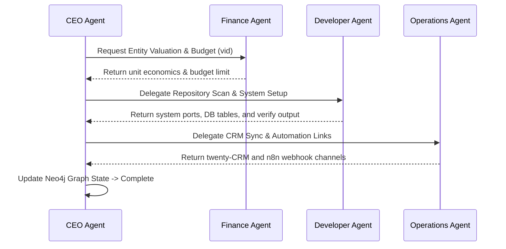

# Agent Workforces & Communication — Trading Stack

Venture ID: FIN-TBD
Sector: FIN

---
execution_metadata:
  venture_id: "FIN-TBD"
  agent_completed: "AG-CTO"
  department: "Operations & Logistics"
  node: "HW-AIR-01"
  database_link: "DB-POSTGRES:PT-5433"
references:
  - [[FIN-TBD-DEPARTMENTS-AND-ECOSYSTEM]]
  - [[FIN-TBD-CAPABILITY-STATEMENT]]
  - [[AGENT-COMMUNICATION-PROTOCOLS]]
---

# Agent Collaboration & Communication Protocols

This document defines the interface schemas, channels, and workflow sequences used by corporate agents (`CEO`, `Finance`, `Developer`, `Operations`) to execute no-code business actions across the portfolio.

---

## 1. COMMUNICATION CHANNELS & INFRASTRUCTURE

Agents communicate asynchronously using two primary channels:
1.  **Shared Database (PostgreSQL - `twenty` / `iza_os_ventures`)**: Used to log long-term tasks, lead states, and execution histories.
2.  **Model Context Protocol (MCP) Message Gateway**: Agents query Neo4j for registry lookups and command execution logs.

---

## 2. COLLABORATION INTERFACE SCHEMAS (JSON)

When an agent triggers another agent or logs progress, they MUST write a structured payload.

### Handoff Payload (Task Delegation)
```json
{
  "sender_agent": "CEO Agent",
  "recipient_agent": "Developer Agent",
  "timestamp": "2026-07-19T21:10:00Z",
  "action": "SPAWN_VENTURE",
  "parameters": {
    "venture_id": "ECO-111",
    "venture_name": "Miss Toys",
    "capabilities": ["storefront", "payments", "inventory"]
  },
  "priority": "HIGH",
  "callback_endpoint": "/api/agent/callback"
}
```

### Execution Status Update
```json
{
  "task_id": "task-spawner-111",
  "agent": "Developer Agent",
  "status": "SUCCESS",
  "timestamp": "2026-07-19T21:10:05Z",
  "output_log_uri": "file:///Users/acebless/.../logs/task-111.log",
  "metrics": {
    "token_usage": 450,
    "execution_time_ms": 3200
  }
}
```

---

## 3. MULTI-AGENT WORKFLOW SEQUENCES



---

## 4. DEPARTMENTAL BOUNDARIES
*   **CEO Agent**: General strategy, milestone validation, and subagent orchestration.
*   **Finance Agent**: Ledger accounting, tax preparation, and Plaid API reconciliation.
*   **Developer Agent**: Code graph scans, database schema builds, and Vercel deployments.
*   **Operations Agent**: n8n automated loops, Twilio dispatch channels, and Twenty CRM leads mapping.

