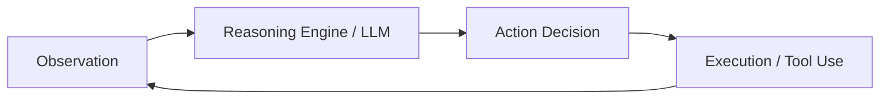

# WHAT IS AN AGENT
## Purpose
Define the fundamental building block of autonomous software: the Agent. Establish how it differs from traditional programs by using independent action loops rather than static input-output paths.

## Core Concept
An **Agent** is an autonomous entity that processes environmental observations through an LLM reasoning engine, decides on actions, and uses tools to execute those actions to achieve a long-horizon goal.



## Technical Details
Unlike structured code that follows:
`Input -> If/Else -> Output`
An agent operates on:
`Goal -> Sense -> Plan -> Act -> Reflect -> Loop`
Key properties of a true agent:
1. **Autonomy**: It controls its own execution path.
2. **Statefulness**: It remembers past attempts and context.
3. **Goal-Driven**: It evaluates outcomes against a target criteria.

## Examples/Reference
```python
# A simple agent loop conceptualization
class SimpleAgent:
    def __init__(self, model, tools, goal):
        self.model = model
        self.tools = tools
        self.goal = goal
        self.memory = []

    def run(self, initial_observation):
        obs = initial_observation
        while not self.is_goal_met(obs):
            self.memory.append(obs)
            plan = self.model.generate_plan(self.goal, self.memory)
            action = self.model.choose_action(plan, self.tools)
            obs = self.tools[action.name].execute(action.args)
        return "Goal Met"
```

## Relations
- Part of [[01-FUNDAMENTALS/AGENT-LOOP.md]]
- Distinct from [[01-FUNDAMENTALS/AGENT-VS-WORKFLOW.md]]
